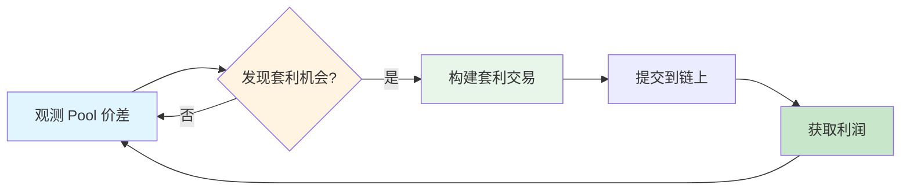
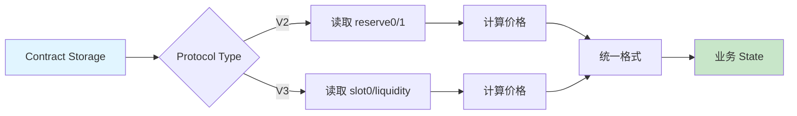
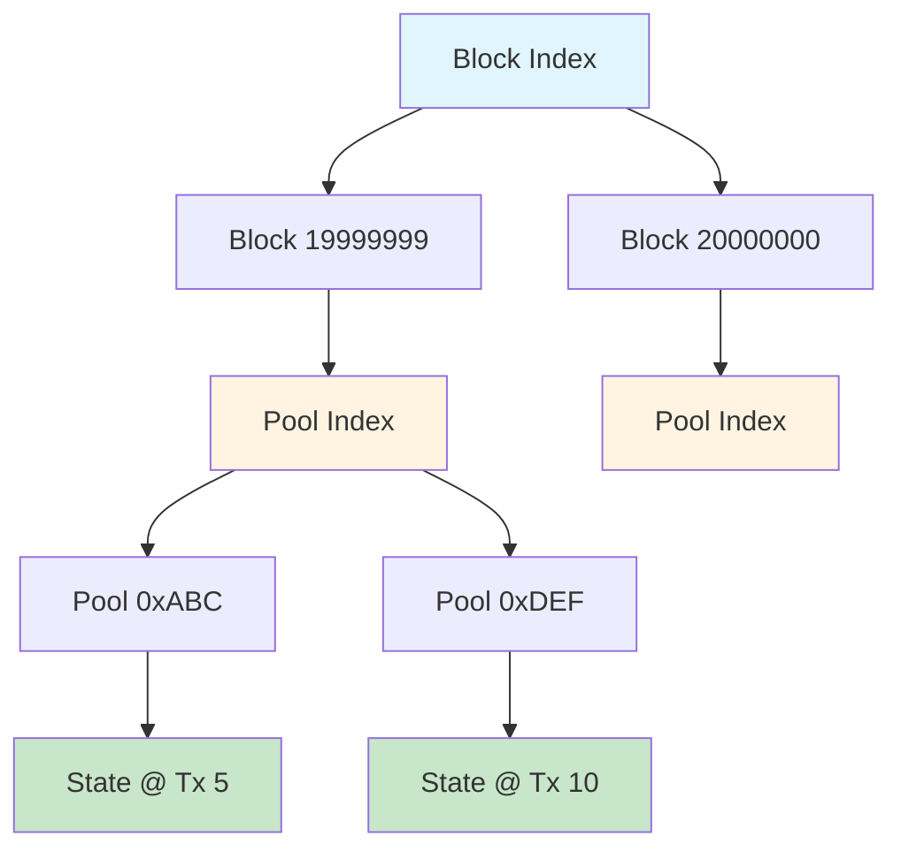
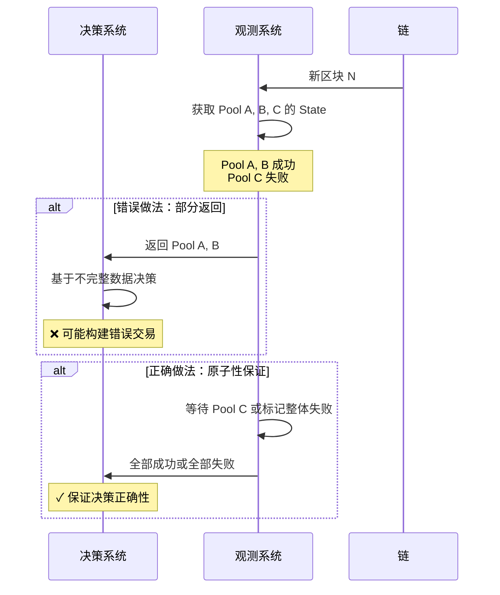
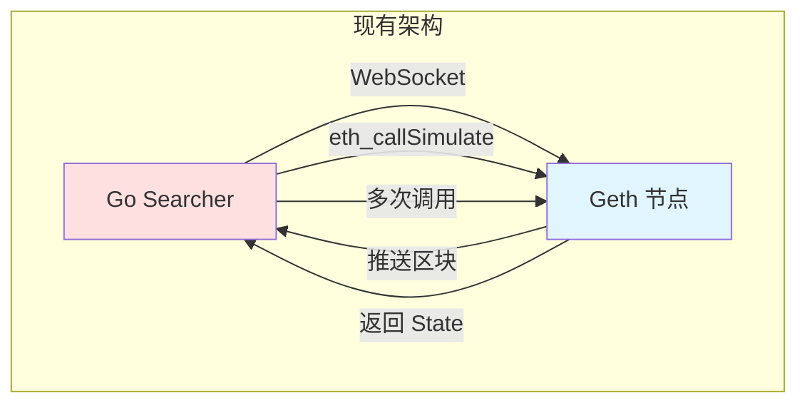
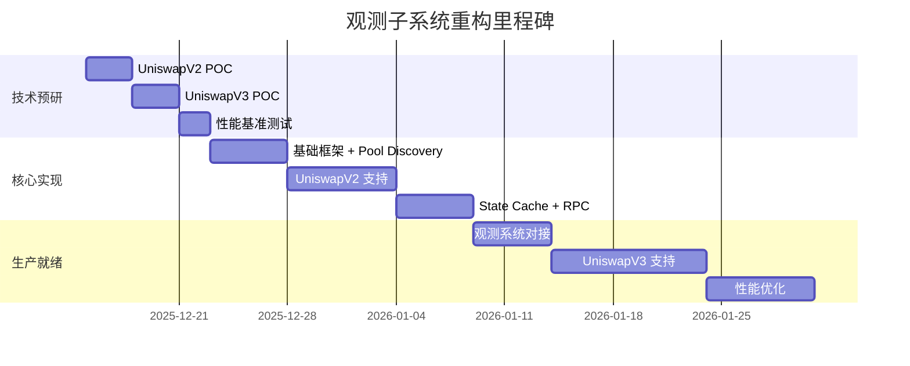

# 需求分析文档

## 文档元信息

| 项目 | 内容 |
|------|------|
| 文档版本 | v1.0 |
| 创建日期 | 2025-12-12 |
| 最后更新 | 2025-12-12 |
| 文档状态 | 草稿 |
| 责任人 | 架构组 |

## 1. 业务背景

### 1.1 业务目标

MEV Searcher 是一个在以太坊区块链上执行**无风险套利**的自动化系统。其核心业务逻辑是：



**观测子系统**是整个 MEV Searcher 的"眼睛"，负责提供：

1. **全面**：无遗漏地发现所有可能的套利机会
2. **准确**：提供正确的 Pool State，避免构建失败的交易
3. **快速**：在套利窗口关闭前完成决策

### 1.2 业务价值

| 指标 | 影响 |
|------|------|
| **观测准确性** | 直接影响交易成功率（当前验证失败率 60%+） |
| **观测速度** | 决定能否抢先竞争对手 |
| **观测全面性** | 决定发现机会的数量 |

**核心矛盾**：当前系统无法在 1 秒内完成全流程（观测 → 决策 → 提交），导致大量套利机会流失。

## 2. 功能需求

### 2.1 功能概览

观测子系统需要支持两类核心功能：

```mermaid
graph TB
    subgraph 功能1：Onchain State 观测
        A[监听新区块] --> B[发现涉及的 Pools]
        B --> C[获取 Pool State]
        C --> D[转换为业务格式]
        D --> E[验证 State 正确性]
        E --> F[缓存已验证 State]
    end
    
    subgraph 功能2：Pending Tx 模拟
        G[监听 Pending Txs] --> H[识别影响的 Pools]
        H --> I[基于 Onchain State 模拟]
        I --> J[计算模拟后 State]
        J --> K[验证模拟结果]
        K --> L[提供给决策系统]
    end
    
    F -.依赖.-> I
    
    style A fill:#e1f5ff
    style G fill:#e1f5ff
    style F fill:#c8e6c9
    style L fill:#c8e6c9
```

### 2.2 功能 1：Onchain State 观测

#### 2.2.1 自动发现 Pool

**需求描述**：系统必须自动发现新创建的 Uniswap Pool，无需人工维护白名单。

**输入**：
- 新区块的交易列表
- Factory 合约地址列表（UniswapV2/V3）

**输出**：
- 新发现的 Pool 地址列表
- Pool 的元数据（token0, token1, fee, protocol）

**业务规则**：
| 规则 | 描述 | 优先级 |
|------|------|--------|
| 无误报 | 识别的 Pool 必须是有效的 DEX Pool | P0 |
| 无漏报 | 不能遗漏任何新创建的 Pool | P0 |
| 增量发现 | 仅处理新区块中的新 Pool | P1 |

#### 2.2.2 获取 Pool State

**需求描述**：在每个新区块确认后，获取所有相关 Pool 的最新状态。

**输入**：
- 区块号（Block Number）
- Pool 地址列表
- Protocol 类型（UniswapV2/V3/其他）

**输出**：
- Pool State（包含储备量、价格、流动性等）
- State 对应的区块位置（Block Number + Tx Index）

**性能要求**：

| Pool 数量 | 延迟上限（P99） | 备注 |
|----------|----------------|------|
| 10 个 | 50ms | 单次套利场景 |
| 100 个 | 200ms | 多路径套利场景 |
| 1000 个 | 1000ms | 全市场扫描 |

**数据结构要求**（表格形式，非代码）：

| 字段 | UniswapV2 | UniswapV3 | 必选 | 说明 |
|------|-----------|-----------|------|------|
| Pool ID | ✓ | ✓ | ✓ | Pool 合约地址 |
| Block Number | ✓ | ✓ | ✓ | 状态对应的区块号 |
| Reserve0 | ✓ | - | ✓ | V2 储备量 Token0 |
| Reserve1 | ✓ | - | ✓ | V2 储备量 Token1 |
| Sqrt Price X96 | - | ✓ | ✓ | V3 当前价格 |
| Liquidity | - | ✓ | ✓ | V3 当前流动性 |
| Tick | - | ✓ | ✓ | V3 当前 Tick |
| Fee | ✓ | ✓ | ✓ | 手续费率 |

#### 2.2.3 State 转换

**需求描述**：将底层 Storage 数据转换为业务系统可用的标准格式。

**转换规则**：



**正确性要求**：
- 转换算法必须与链上合约逻辑完全一致
- 浮点数精度必须满足业务要求（避免套利计算误差）

#### 2.2.4 State 验证

**需求描述**：验证获取的 State 是否可用于套利计算。

**验证维度**：

| 验证项 | 验证方法 | 失败处理 |
|--------|---------|---------|
| 数据完整性 | 检查必填字段 | 标记为不可用 |
| 逻辑一致性 | 与链上 eth_call 对比 | 标记为不可用 |
| 计算可行性 | 尝试模拟 swap | 标记为不可用 |

**业务约束**：
- **验证是强制性的**：未验证的 State 不允许进入决策系统
- **60%+ 失败率是正常的**：很多 Pool 流动性不足、已暂停、或有特殊限制

**快速失败规则设计需求**：

系统需要在验证前应用轻量级规则，快速过滤掉明显不可用的 Pool，避免浪费验证资源：

| 规则类型 | 示例 | 预期过滤比例 |
|---------|------|------------|
| 流动性阈值 | Liquidity < 1000 USD | 30% |
| 价格异常 | 价格偏离市场价 > 50% | 10% |
| 黑名单 Pool | 已知有问题的 Pool | 5% |

#### 2.2.5 State 缓存

**需求描述**：缓存已验证的 Pool State，支持高效查询。

**查询场景**：

| 场景 | 查询条件 | 频率 |
|------|---------|------|
| 场景 1 | 给定 Block Number，查询所有 Pool State | 中等 |
| 场景 2 | 给定 Pool ID，查询最新 State | 高 |
| 场景 3 | 给定 Pool ID + Block，查询历史 State | 低 |

**索引设计需求**：支持三层索引



### 2.3 功能 2：Pending Tx 模拟

**需求描述**：模拟 Pending Tx 对 Pool State 的影响，预测未来状态。

**输入**：
- Pending Tx 列表
- 当前 Onchain State（来自缓存）

**输出**：
- 模拟后的 Pool State
- 影响的 Pool 列表

**性能要求**：

| Pending Tx 数量 | 延迟上限 | 备注 |
|----------------|---------|------|
| 1 个 Tx | 10ms | 实时决策 |
| 10 个 Tx（批量） | 50ms | 批量分析 |

**依赖关系**：
- 依赖 Onchain State 的准确性
- 优先级低于 Onchain State（资源冲突时可降级）

## 3. 非功能需求

### 3.1 三大评价指标详细定义

#### 3.1.1 全面性（Completeness）

**定义**：系统能够发现并观测所有潜在的套利机会。

**量化指标**：

| 指标 | 目标值 | 测量方法 |
|------|--------|---------|
| 新 Pool 发现延迟 | < 1 个区块 | 对比链上 Factory 事件 |
| Pool 覆盖率 | 99.9% | 定期扫描对比 |
| 漏报率 | < 0.1% | 事后审计 |

**业务影响**：
- 漏报 1 个活跃 Pool → 可能丢失日均 10+ 次套利机会

#### 3.1.2 准确性（Accuracy）

**定义**：提供的 Pool State 与链上实际状态完全一致。

**量化指标**：

| 指标 | 目标值 | 测量方法 |
|------|--------|---------|
| State 验证通过率 | 100%（对验证通过的） | 与 eth_call 对比 |
| 区块位置准确性 | 100% | 区块 Hash 验证 |
| 价格计算误差 | < 0.01% | 数学验证 |

**业务约束**：
- **验证失败 ≠ 系统错误**：60%+ 的 Pool 本身不可用于套利
- **未验证数据禁止使用**：宁可丢失机会，不可产生错误交易

#### 3.1.3 快速性（Speed）

**定义**：从区块确认到 State 可用的端到端延迟。

**延迟预算分配（目标：1 秒内）**：

| 阶段 | 延迟预算 | 备注 |
|------|---------|------|
| 区块同步 | 100ms | 依赖节点性能 |
| Pool 发现 | 50ms | 事件解析 |
| State 读取 | 300ms | Storage 读取（100 Pools） |
| State 转换 | 100ms | 计算转换 |
| State 验证 | 400ms | eth_call 验证 |
| State 缓存 | 50ms | 内存写入 |
| **总计** | **1000ms** | **端到端延迟** |

**极端情况分析**：

| 场景 | Pool 数量 | 延迟上限 | 应对策略 |
|------|----------|---------|---------|
| 正常区块 | 10-50 | 1s | 标准流程 |
| 热门 Pool 更新 | 100-200 | 2s | 批量优化 |
| 市场剧烈波动 | 1000+ | 10s | 优先级队列 + 降级 |

### 3.2 状态规模和性能要求

#### 3.2.1 状态规模估算

| 维度 | 数量级 | 说明 |
|------|--------|------|
| 总 Pool 数量 | 10 万+ | 以太坊上所有 Uniswap Pools |
| 活跃 Pool 数量 | 1 万+ | 每天有交易的 Pools |
| 热门 Pool 数量 | 100-500 | 高频套利涉及的 Pools |
| 缓存 Block 深度 | 64 | 应对 Reorg |
| 缓存 State 总数 | 64 万 | 10k Pools × 64 Blocks |

#### 3.2.2 内存占用估算

**单个 Pool State 大小**：

| Protocol | 字段数 | 估算大小 | 备注 |
|----------|--------|---------|------|
| UniswapV2 | 8 | 200 bytes | 基础字段 + 元数据 |
| UniswapV3 | 15 | 500 bytes | 包含部分 Tick 数据 |
| UniswapV3（完整） | 100+ | 5KB+ | 包含所有 Tick 数据 |

**总内存占用（最坏情况）**：

```
缓存内存 = 10,000 Pools × 64 Blocks × 500 bytes = 320 MB
索引开销 = 320 MB × 30% = 96 MB
总计 ≈ 416 MB
```

**内存压力应对策略**：
1. **LRU 淘汰**：优先淘汰冷门 Pool 的历史 State
2. **分级缓存**：热门 Pool 全缓存，普通 Pool 仅缓存最新
3. **持久化**：超过阈值后写入磁盘

### 3.3 原子性和一致性要求

#### 3.3.1 State 原子性

**定义**：同一 Block 或 Pending Tx List 中的所有 Pool State 必须作为原子单元。

**业务场景**：



#### 3.3.2 Reorg 一致性

**需求描述**：当区块链发生重组时，系统必须回滚到一致状态。

**Reorg 处理流程**：

```mermaid
stateDiagram-v2
    [*] --> Normal: 正常运行
    Normal --> ReorgDetected: 检测到 Reorg
    ReorgDetected --> RollbackCache: 回滚缓存
    RollbackCache --> ReplayBlocks: 重放正确分支
    ReplayBlocks --> Normal: 恢复正常
    
    state ReorgDetected {
        [*] --> 对比 ParentHash
        对比 ParentHash --> 定位分叉点
    }
    
    state RollbackCache {
        [*] --> 删除无效 Block
        删除无效 Block --> 删除关联 State
    }
```

**一致性保证**：
- Reorg 操作必须原子化：全部回滚或全部保留
- 决策系统在 Reorg 期间不能访问缓存
- Reorg 完成后广播通知

### 3.4 优先级和资源分配

#### 3.4.1 功能优先级

| 功能 | 优先级 | 资源分配 | 降级策略 |
|------|--------|---------|---------|
| Onchain State | P0 | CPU 70%, 内存 80% | 无（不可降级） |
| Pending Tx 模拟 | P1 | CPU 30%, 内存 20% | 可暂停或限流 |
| 历史数据查询 | P2 | 按需分配 | 可降级到磁盘 |

#### 3.4.2 Pool 优先级

| Pool 类型 | 优先级 | 特征 | 处理策略 |
|----------|--------|------|---------|
| 热门 Pool | P0 | 日交易量 > 1M USD | 始终保持最新 |
| 活跃 Pool | P1 | 日交易量 > 10K USD | 正常更新 |
| 冷门 Pool | P2 | 日交易量 < 10K USD | 按需更新或延迟 |

### 3.5 可扩展性要求

#### 3.5.1 Protocol 扩展

系统设计必须支持新增 DEX Protocol，而无需修改核心架构：

| 当前支持 | 计划支持 | 扩展要求 |
|---------|---------|---------|
| UniswapV2, V3 | SushiSwap, Curve, Balancer | 插件化设计 |

#### 3.5.2 性能扩展

| 扩展维度 | 当前目标 | 未来目标 | 扩展方式 |
|---------|---------|---------|---------|
| Pool 数量 | 1 万 | 10 万 | 分片缓存 |
| 并发请求 | 10 QPS | 100 QPS | 多实例部署 |

## 4. 约束条件

### 4.1 技术约束

| 约束项 | 描述 | 影响 |
|-------|------|------|
| 节点性能 | 依赖 Reth 节点的 Storage 读取速度 | 决定 State 读取延迟 |
| 网络延迟 | 节点与观测系统在同一台机器 | 最小化网络开销 |
| 内存限制 | 单机内存 16GB | 限制缓存 Block 深度 |
| Rust 技能 | 团队无 Rust 经验，需与 AI 协作 | 影响迭代速度 |

### 4.2 团队约束

| 约束项 | 描述 | 应对策略 |
|-------|------|---------|
| Rust 经验 | 团队主要掌握 Go | 详细的实现指南 + AI 辅助 |
| 测试能力 | 需要自动化测试保证质量 | 每个迭代包含验收脚本 |
| 运维经验 | 需要监控和故障处理能力 | 完整的运维手册 |

### 4.3 业务约束

| 约束项 | 描述 | 影响 |
|-------|------|------|
| 7x24 运行 | 系统不能停机 | 需要灰度升级方案 |
| 零错误容忍 | 错误交易会造成资金损失 | 强制验证，快速失败 |
| 实时性要求 | 套利窗口通常 < 10 秒 | 性能是核心需求 |

## 5. 现有系统能力边界

### 5.1 当前系统架构



### 5.2 已知问题

| 问题 | 现象 | 根因 |
|------|------|------|
| 延迟过高 | 获取 5 个 V3 Pool State 需要 500ms-2s | 多次跨进程 IO + RPC 序列化开销 |
| 延迟不可控 | 偶尔延迟飙升到 5s+ | 被动等待推送，依赖节点负载 |
| 验证成本高 | 验证每个 Pool 需要 50ms+ | eth_call 开销 |
| 内存占用高 | 缓存策略不合理 | 缓存未验证数据 |

### 5.3 能力评估

| 能力项 | 当前水平 | 目标水平 | 差距 |
|-------|---------|---------|------|
| 全面性 | 80%（手动维护 Pool 列表） | 99.9%（自动发现） | 需要 Pool Discovery |
| 准确性 | 40%（验证通过率） | 100%（验证通过的） | 需要快速失败规则 |
| 快速性 | 2-5s（P99） | 1s（P99） | 需要架构重构 |

## 6. 验收标准

### 6.1 功能验收

| 功能 | 验收标准 |
|------|---------|
| Pool Discovery | 与链上 Factory 事件对比，漏报率 < 0.1% |
| State 获取 | 100 个 Pool 在 200ms 内完成（P99） |
| State 验证 | 验证通过的 State 与 eth_call 100% 一致 |
| State 缓存 | 支持 3 种查询场景，延迟 < 10ms |
| Pending Tx 模拟 | 单 Tx 模拟延迟 < 10ms |

### 6.2 性能验收

| 指标 | 目标值 | 测试方法 |
|------|--------|---------|
| 端到端延迟 | < 1s（P99，100 Pools） | 压力测试 |
| State 读取延迟 | < 300ms（P99，100 Pools） | 单元测试 |
| 验证延迟 | < 400ms（P99，100 Pools） | 集成测试 |
| 内存占用 | < 500MB（10k Pools，64 Blocks） | 长时间运行测试 |

### 6.3 质量验收

| 质量指标 | 目标值 | 测试方法 |
|---------|--------|---------|
| 单元测试覆盖率 | > 80% | cargo tarpaulin |
| 集成测试通过率 | 100% | 自动化测试 |
| Reorg 正确性 | 100% | Reorg 模拟测试 |
| 7x24 稳定性 | 无内存泄漏、无 Panic | 72 小时压测 |

## 7. 里程碑和依赖

### 7.1 关键里程碑



### 7.2 外部依赖

| 依赖项 | 依赖内容 | 风险 |
|-------|---------|------|
| Reth 节点 | 提供 ExEx 能力和 Storage 访问 | Reth 版本兼容性 |
| eth_call API | 用于 State 验证 | 节点负载影响延迟 |
| 决策系统 | 消费观测数据 | 接口适配工作量 |

## 8. 风险和假设

### 8.1 关键假设

| 假设 | 验证方法 | 风险 |
|------|---------|------|
| Storage 直读速度足够快 | POC 测试 | 如果不满足，需要降级方案 |
| UniswapV3 Tick 数据可增量更新 | POC 测试 | 如果不可行，性能会下降 |
| Reth ExEx 稳定性满足生产要求 | 长时间测试 | 如果不稳定，需要监控和恢复机制 |

### 8.2 风险清单

| 风险 | 影响 | 缓解措施 |
|------|------|---------|
| POC 验证失败 | 架构方案不可行 | 准备降级方案（继续使用 RPC） |
| Rust 学习曲线陡峭 | 开发进度延迟 | 详细实现指南 + AI 辅助 |
| 验证性能不达标 | 无法满足 1s 延迟 | 快速失败规则 + 并行验证 |
| 内存占用超预期 | OOM 风险 | 分级缓存 + 持久化 |

---

**下一步**：阅读 [02-待改进项分析](./02-improvements.md) 了解现有系统的具体问题
