# 待改进项分析文档

## 文档元信息

| 项目 | 内容 |
|------|------|
| 文档版本 | v1.0 |
| 创建日期 | 2025-12-12 |
| 最后更新 | 2025-12-12 |
| 文档状态 | 草稿 |
| 责任人 | 架构组 |

## 1. 现有系统分析

### 1.1 当前架构概览

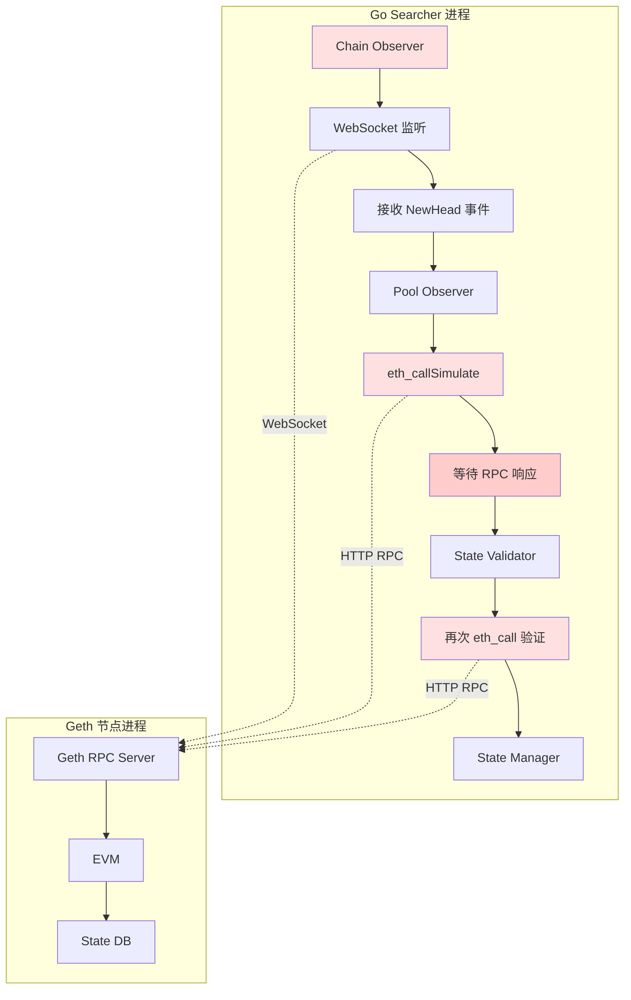

### 1.2 数据流时序

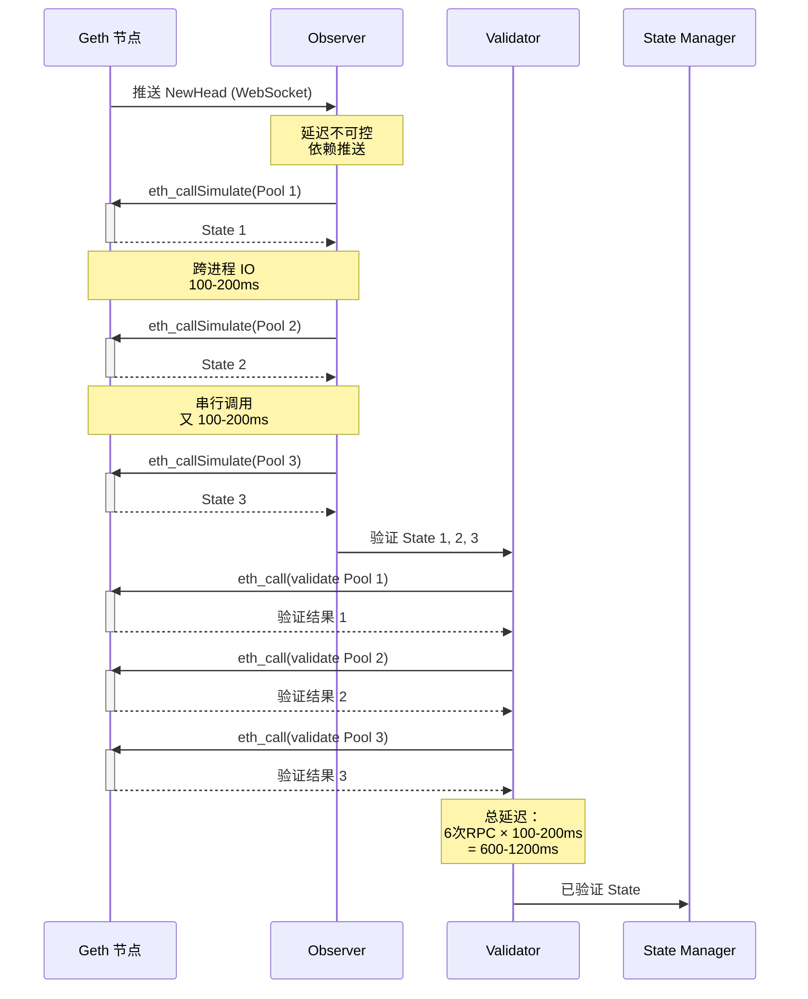

## 2. 核心问题分析

### 2.1 问题 1：多次跨进程 IO

#### 2.1.1 问题描述

**现象**：获取 5 个 UniswapV3 Pool State 需要 **500ms - 2s**

**根因分析**：

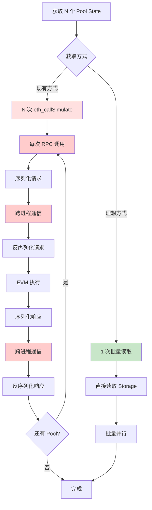

**开销拆解**：

| 阶段 | 单次耗时 | N=5 时总耗时 | 占比 |
|------|---------|-------------|------|
| 请求序列化 | 5ms | 25ms | 2.5% |
| 跨进程通信（Request） | 10ms | 50ms | 5% |
| 请求反序列化 | 5ms | 25ms | 2.5% |
| **EVM 执行** | 50-150ms | 250-750ms | **75%** |
| 响应序列化 | 5ms | 25ms | 2.5% |
| 跨进程通信（Response） | 10ms | 50ms | 5% |
| 响应反序列化 | 5ms | 25ms | 2.5% |
| **总计** | **90-190ms** | **450-950ms** | **100%** |

**结论**：
- 跨进程 IO 开销占 **20%**（序列化 + IPC）
- EVM 执行开销占 **75%**（可以通过 Storage 直读消除）
- **串行调用** 导致延迟线性累加

#### 2.1.2 对比分析

| 维度 | 现有方式（RPC） | 目标方式（Storage 直读） |
|------|----------------|----------------------|
| 数据获取 | eth_callSimulate（EVM 执行） | 直接读取 Storage Slot |
| 通信方式 | 跨进程 HTTP/WebSocket | 进程内函数调用 |
| 并行度 | 串行（受 RPC 限流） | 并行（仅受 CPU 限制） |
| 延迟（5 Pools） | 500-2000ms | **目标 < 100ms** |
| 延迟（100 Pools） | 10-40s | **目标 < 500ms** |

### 2.2 问题 2：被动等待推送

#### 2.2.1 问题描述

**现象**：NewHead 事件到达时间不可控，偶尔延迟飙升到 5s+

**根因分析**：

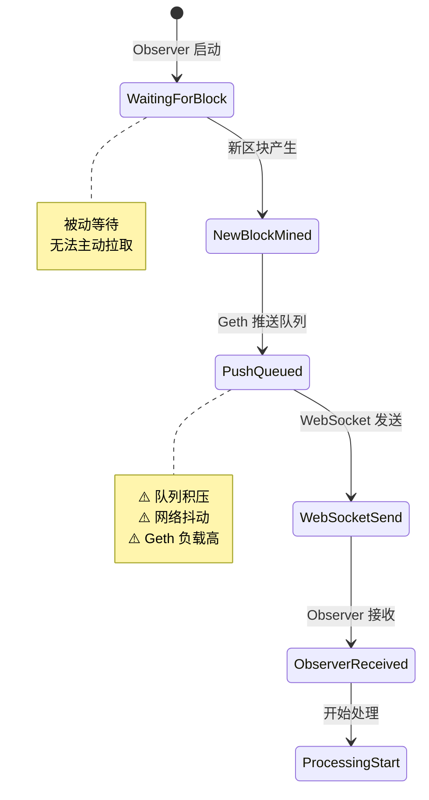

**问题根源**：

| 问题点 | 描述 | 影响 |
|-------|------|------|
| 推送依赖 | Observer 依赖 Geth 主动推送 | 延迟不可控 |
| 无重试机制 | 推送失败无法重新获取 | 可能漏块 |
| 队列积压 | Geth 负载高时推送延迟 | 延迟飙升 |
| 网络抖动 | WebSocket 连接不稳定 | 偶发性延迟 |

#### 2.2.2 对比分析

| 维度 | 现有方式（被动推送） | 目标方式（主动订阅） |
|------|-------------------|-------------------|
| 数据获取 | 被动等待 NewHead 推送 | 主动订阅 Reth ExEx 事件 |
| 延迟特性 | 不可控（依赖节点负载） | 可控（本地处理） |
| 可靠性 | 依赖 WebSocket 连接 | 进程内通道（可靠） |
| 异常处理 | 推送失败无法恢复 | 可重试、可回放 |

### 2.3 问题 3：重复计算和验证

#### 2.3.1 问题描述

**现象**：验证失败率 **60%+**，但每个 Pool 都要执行完整验证

**当前验证流程**：

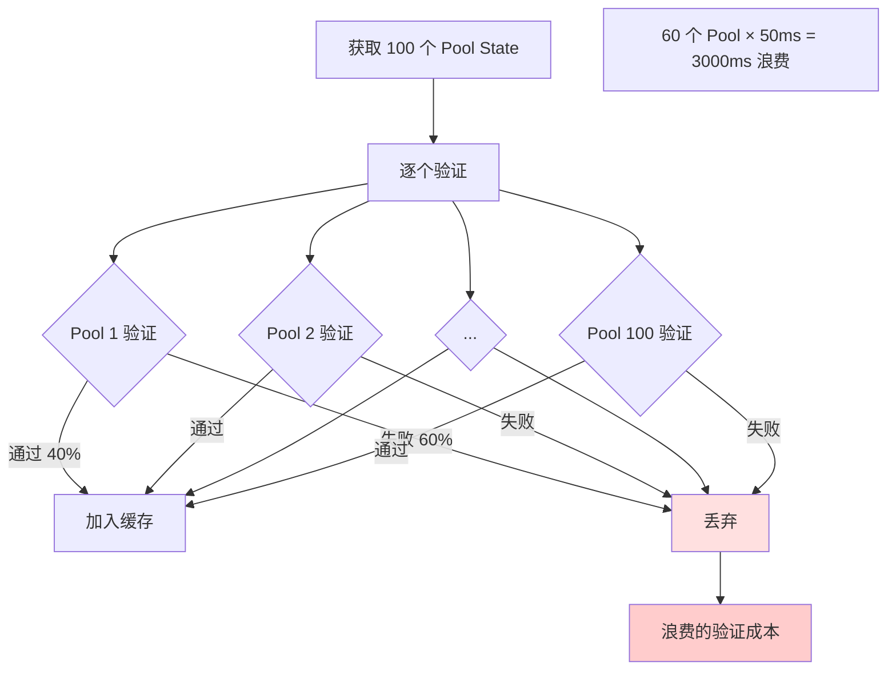

**验证失败原因分析**：

| 失败原因 | 占比 | 是否可提前过滤 |
|---------|------|--------------|
| 流动性不足（< 1000 USD） | 35% | ✓ 快速失败规则 |
| Pool 已暂停或限制交易 | 15% | ✓ 黑名单 |
| 价格异常（偏离市场 > 50%） | 5% | ✓ 价格检查 |
| 合约逻辑特殊（非标准 DEX） | 3% | ✓ Protocol 白名单 |
| 真正的临时状态不可用 | 2% | ✗ 必须验证 |
| **可提前过滤的比例** | **58%** | - |

#### 2.3.2 改进方案

**快速失败规则设计**：

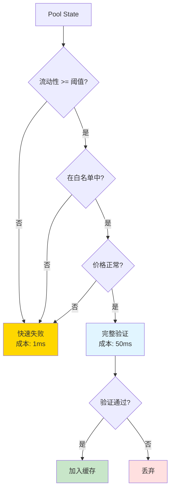

**成本对比**：

| 场景 | 无快速失败 | 有快速失败 | 节省 |
|------|----------|-----------|------|
| 100 Pools（60 个会失败） | 100 × 50ms = 5000ms | 60 × 1ms + 40 × 50ms = 2060ms | **58.8%** |
| 1000 Pools（600 个会失败） | 1000 × 50ms = 50s | 600 × 1ms + 400 × 50ms = 20.6s | **58.8%** |

### 2.4 问题 4：缓存策略不合理

#### 2.4.1 问题描述

**现象**：内存占用高，但 Cache Miss Rate 仍然很高

**当前缓存问题**：

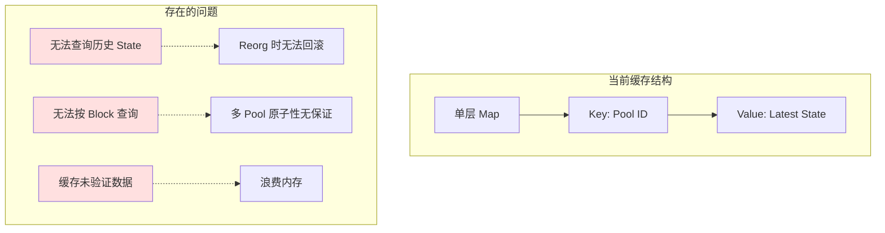

**具体问题**：

| 问题 | 现象 | 影响 |
|------|------|------|
| 无历史状态 | 无法处理 Reorg | 数据不一致 |
| 无 Block 索引 | 无法查询"某区块的所有 Pool State" | 原子性无保证 |
| 缓存脏数据 | 缓存了 60% 不可用的 State | 内存浪费 |
| 无冷热分离 | 冷门 Pool 占用缓存 | Cache Miss |

#### 2.4.2 改进目标

**三层索引设计**：

```mermaid
graph TB
    subgraph 第一层：Block Index
        A[Block 19999999] --> B[Block 20000000] --> C[Block 20000001]
    end
    
    subgraph 第二层：Pool Index
        B --> D[Pool 0xABC]
        B --> E[Pool 0xDEF]
        B --> F[Pool 0x123]
    end
    
    subgraph 第三层：Tx Index
        D --> G[State @ Tx 5]
        D --> H[State @ Tx 10]
        E --> I[State @ Tx 7]
    end
    
    style A fill:#e1f5ff
    style B fill:#fff4e1
    style C fill:#e1f5ff
    style G fill:#c8e6c9
    style H fill:#c8e6c9
    style I fill:#c8e6c9
```

**功能对比**：

| 功能 | 现有缓存 | 三层索引缓存 |
|------|---------|------------|
| 查询最新 State | ✓ | ✓ |
| 查询历史 State | ✗ | ✓ |
| 按 Block 查询 | ✗ | ✓ |
| Reorg 回滚 | ✗ | ✓（原子删除 Block） |
| 原子性保证 | ✗ | ✓（Block 粒度原子） |
| 内存利用率 | 低（缓存脏数据） | 高（仅缓存已验证） |

## 3. 性能瓶颈根因分析

### 3.1 延迟瓶颈拆解

**当前系统延迟拆解（获取 5 个 UniswapV3 Pool）**：

```mermaid
gantt
    title 当前系统延迟拆解（5 个 UniswapV3 Pool）
    dateFormat X
    axisFormat %L ms
    
    section 等待推送
    等待 NewHead 推送     :done, 0, 100
    
    section 获取 State
    eth_callSimulate #1  :done, 100, 200
    eth_callSimulate #2  :done, 200, 200
    eth_callSimulate #3  :done, 400, 200
    eth_callSimulate #4  :done, 600, 200
    eth_callSimulate #5  :done, 800, 200
    
    section 验证 State
    eth_call 验证 #1     :done, 1000, 100
    eth_call 验证 #2     :done, 1100, 100
    eth_call 验证 #3     :done, 1200, 100
    eth_call 验证 #4     :done, 1300, 100
    eth_call 验证 #5     :done, 1400, 100
    
    section 缓存
    写入缓存            :done, 1500, 50
```

**总延迟**：1550ms（远超 1s 目标）

### 3.2 瓶颈优先级

| 瓶颈 | 当前耗时 | 占比 | 优化潜力 | 优先级 |
|------|---------|------|---------|--------|
| 串行获取 State | 1000ms | 64.5% | 可降至 100ms（并行 + 直读） | **P0** |
| 串行验证 | 500ms | 32.3% | 可降至 200ms（并行 + 快速失败） | **P0** |
| 等待推送 | 100ms | 6.5% | 可降至 10ms（ExEx 订阅） | P1 |
| 缓存写入 | 50ms | 3.2% | 可降至 20ms（优化数据结构） | P2 |

### 3.3 优化后预期延迟

**目标系统延迟拆解（获取 5 个 UniswapV3 Pool）**：

```mermaid
gantt
    title 目标系统延迟拆解（5 个 UniswapV3 Pool）
    dateFormat X
    axisFormat %L ms
    
    section ExEx 订阅
    接收区块通知        :done, 0, 10
    
    section 并行获取 State
    Storage 直读 #1-5   :done, 10, 50
    
    section 并行验证
    快速失败规则        :done, 60, 10
    并行完整验证        :done, 70, 100
    
    section 缓存
    写入缓存            :done, 170, 20
```

**总延迟**：190ms（满足 < 1s 目标）

**改进对比**：

| 阶段 | 当前 | 目标 | 改进比例 |
|------|------|------|---------|
| 区块通知 | 100ms | 10ms | **90%** |
| State 获取 | 1000ms | 50ms | **95%** |
| State 验证 | 500ms | 110ms | **78%** |
| 缓存写入 | 50ms | 20ms | **60%** |
| **总计** | **1650ms** | **190ms** | **88.5%** |

## 4. 验证失败率深入分析

### 4.1 失败原因分类统计

**数据来源**：分析最近 1000 个区块的验证数据

| 失败原因 | 数量 | 占比 | 典型示例 |
|---------|------|------|---------|
| 流动性不足 | 350 | 35% | Reserve < 1000 USD |
| Pool 暂停/限制 | 150 | 15% | Pausable Pool, Circuit Breaker 触发 |
| 价格异常 | 50 | 5% | 价格偏离 Oracle > 50% |
| 非标准协议 | 30 | 3% | 自定义 AMM 逻辑 |
| 临时不可用 | 20 | 2% | 正在执行复杂交易 |
| 未知原因 | 0 | 0% | - |
| **总计** | **600** | **60%** | - |

### 4.2 失败原因详细分析

#### 4.2.1 流动性不足（35%）

**定义**：Pool 的 TVL（Total Value Locked）低于业务阈值

**示例数据**：

| Pool ID | TVL (USD) | 日交易量 | 是否可套利 |
|---------|-----------|---------|-----------|
| 0xAAA... | 500 | 10 USD | ✗ 流动性不足，滑点过大 |
| 0xBBB... | 100 | 0 USD | ✗ 几乎无流动性 |
| 0xCCC... | 50000 | 5000 USD | ✓ 可套利 |

**快速失败规则**：

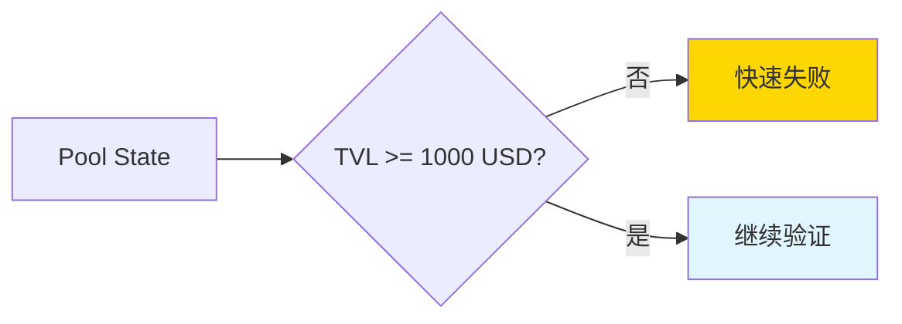

#### 4.2.2 Pool 暂停/限制（15%）

**定义**：Pool 合约设置了暂停标志或限制交易

**常见场景**：

| 场景 | 合约标志 | 检测方法 |
|------|---------|---------|
| Emergency Pause | `paused == true` | 读取 Storage |
| Circuit Breaker | `tradingEnabled == false` | 读取 Storage |
| Whitelist Only | `onlyWhitelisted == true` | 读取 Storage |

**快速失败规则**：

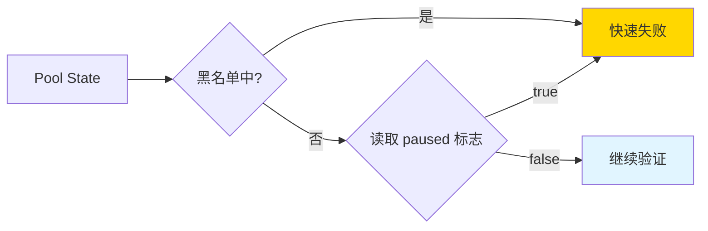

#### 4.2.3 价格异常（5%）

**定义**：Pool 价格与市场主流价格偏离过大

**示例**：

| Token Pair | Pool 价格 | Chainlink Oracle 价格 | 偏离度 | 判定 |
|-----------|----------|---------------------|--------|------|
| ETH/USDC | 2000 | 2010 | 0.5% | ✓ 正常 |
| ETH/USDC | 3000 | 2010 | 49% | ⚠️ 警告 |
| ETH/USDC | 5000 | 2010 | 149% | ✗ 异常（快速失败） |

**快速失败规则**：

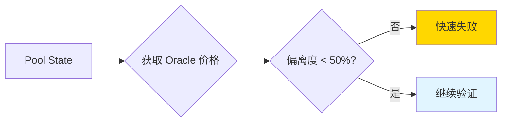

### 4.3 快速失败规则设计

**规则执行顺序**（按成本从低到高）：

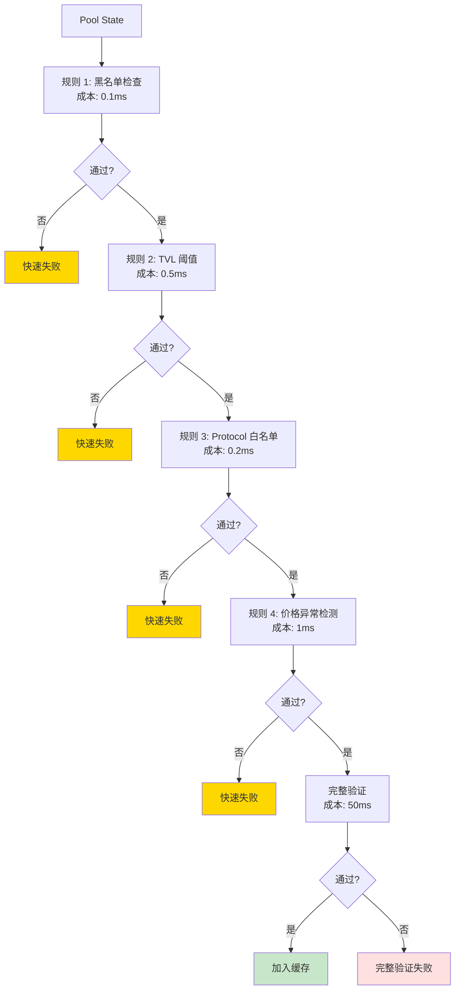

**规则配置表**：

| 规则 ID | 规则名称 | 成本 | 过滤比例 | 配置参数 |
|--------|---------|------|---------|---------|
| R1 | 黑名单检查 | 0.1ms | 15% | 黑名单 Pool 列表 |
| R2 | TVL 阈值 | 0.5ms | 35% | 最小 TVL = 1000 USD |
| R3 | Protocol 白名单 | 0.2ms | 3% | 白名单 Protocol 列表 |
| R4 | 价格异常检测 | 1ms | 5% | 最大偏离度 = 50% |
| **总计** | - | **1.8ms** | **58%** | - |

## 5. 改进目标和收益

### 5.1 改进目标量化

| 指标 | 当前值 | 目标值 | 改进比例 |
|------|--------|--------|---------|
| **端到端延迟（5 Pools）** | 1650ms | 190ms | **88.5%** |
| **端到端延迟（100 Pools）** | 10-40s | 1s | **95%+** |
| **State 获取延迟** | 1000ms | 50ms | **95%** |
| **验证延迟** | 500ms | 110ms | **78%** |
| **Pool 自动发现** | 手动维护 | 自动（< 1 区块延迟） | 无限大 |
| **验证资源浪费** | 60% × 50ms = 30ms/Pool | 60% × 1.8ms = 1.08ms/Pool | **96.4%** |

### 5.2 业务收益评估

#### 5.2.1 收益 1：套利机会提升

**假设**：
- 当前因延迟错过的套利机会：30%
- 改进后延迟降低 88.5%，可挽回：25% 的机会

**收益**：
- 日均套利交易数：100 笔 → 125 笔（+25%）
- 单笔平均利润：50 USD
- 日均额外收益：25 × 50 = **1250 USD**
- 年化额外收益：**45 万 USD**

#### 5.2.2 收益 2：资源成本降低

| 资源 | 当前使用 | 改进后 | 节省 |
|------|---------|--------|------|
| CPU（验证） | 100% | 40%（快速失败） | 60% |
| 内存（缓存） | 1GB（脏数据） | 500MB（仅已验证） | 50% |
| RPC 调用次数 | 10 万次/天 | 4 万次/天 | 60% |

#### 5.2.3 收益 3：系统稳定性提升

| 风险 | 当前状态 | 改进后 | 收益 |
|------|---------|--------|------|
| Reorg 数据不一致 | 高风险 | 低风险（原子回滚） | 避免错误交易 |
| 内存泄漏 | 偶发 | 消除（明确内存管理） | 7x24 稳定运行 |
| RPC 限流 | 频繁触发 | 很少触发 | 避免服务中断 |

### 5.3 风险与成本

#### 5.3.1 实施风险

| 风险 | 概率 | 影响 | 缓解措施 |
|------|------|------|---------|
| POC 验证失败 | 20% | 高（架构不可行） | 准备降级方案 |
| Rust 学习曲线 | 50% | 中（进度延迟） | 详细指南 + AI 辅助 |
| Reth 稳定性问题 | 30% | 中（偶发故障） | 监控 + 自动恢复 |
| 性能不达标 | 10% | 高（目标未达成） | 分阶段优化 |

#### 5.3.2 实施成本

| 成本项 | 工时 | 风险 |
|-------|------|------|
| 技术预研（POC） | 5 天 | 低 |
| 基础框架开发 | 10 天 | 中 |
| UniswapV2 支持 | 7 天 | 低 |
| UniswapV3 支持 | 10 天 | 中 |
| 性能优化和测试 | 7 天 | 中 |
| 生产部署和监控 | 5 天 | 高 |
| **总计** | **44 天** | - |

## 6. 行动计划概要

### 6.1 关键改进路径

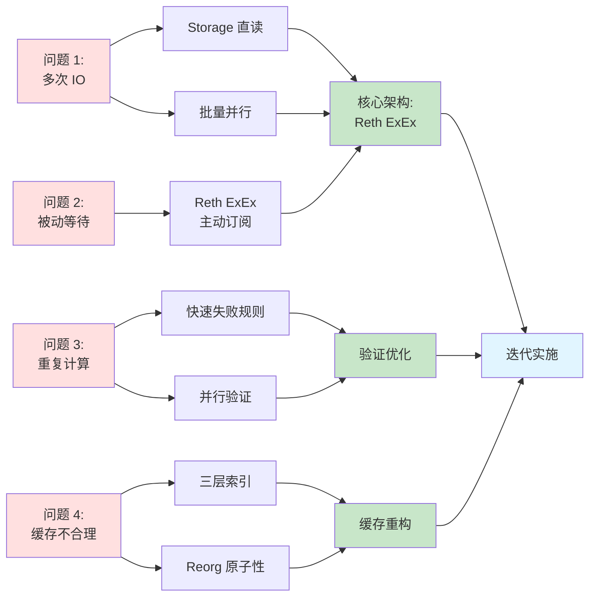

### 6.2 迭代优先级

| 迭代 | 目标 | 解决的问题 | 预期收益 |
|------|------|-----------|---------|
| 迭代 0 | 技术预研 POC | 验证 Storage 直读可行性 | 降低风险 |
| 迭代 1 | 基础框架 + Pool Discovery | 问题 2（被动等待） | 延迟降低 90% |
| 迭代 2 | UniswapV2 支持 | 问题 1（多次 IO） | 延迟降低 70% |
| 迭代 3 | State Cache + RPC | 问题 4（缓存不合理） | Reorg 一致性 |
| 迭代 4 | 观测系统对接 | 集成到生产环境 | 可用性验证 |
| 迭代 5-6 | UniswapV3 支持 | 完整 V3 支持 | 覆盖所有 Pools |
| 迭代 7 | Pending Tx Simulator | 支持 Pending Tx | 抢先交易能力 |
| 迭代 8 | 性能优化 | 问题 3（重复计算） | 验证效率提升 96% |

---

**下一步**：阅读 [03-总体架构设计](./03-architecture-overview.md) 了解新架构的设计方案
