# 总体架构设计

## 文档元信息

| 项目 | 内容 |
|------|------|
| 文档版本 | v1.0 |
| 创建日期 | 2025-12-12 |
| 最后更新 | 2025-12-12 |
| 文档状态 | 草稿 |
| 责任人 | 架构组 |

## 1. 核心技术选型

### 1.1 为什么选择 Reth ExEx？

**Execution Extension (ExEx)** 是 Reth 提供的扩展机制，允许开发者在不修改节点核心代码的前提下，订阅和处理链上数据。

#### 1.1.1 技术对比

| 维度 | 现有方案（RPC） | 侵入式修改 Reth | Reth ExEx（选择） |
|------|----------------|----------------|-------------------|
| **集成方式** | 外部进程通过 RPC | 修改 Reth 源码 | 独立进程订阅通道 |
| **性能** | 低（跨进程 IO） | 高（进程内） | **高（进程内直读 Storage）** |
| **维护成本** | 低（无耦合） | 高（每次升级都要合并代码） | **低（官方支持的扩展机制）** |
| **开发难度** | 低（任何语言） | 高（需深入理解 Reth） | **中（Rust，但有官方文档）** |
| **升级兼容性** | 好（RPC 稳定） | 差（容易冲突） | **好（ExEx API 稳定）** |
| **可扩展性** | 差（受 RPC 限制） | 好（完全控制） | **好（直接访问 Storage）** |

#### 1.1.2 ExEx 的核心优势

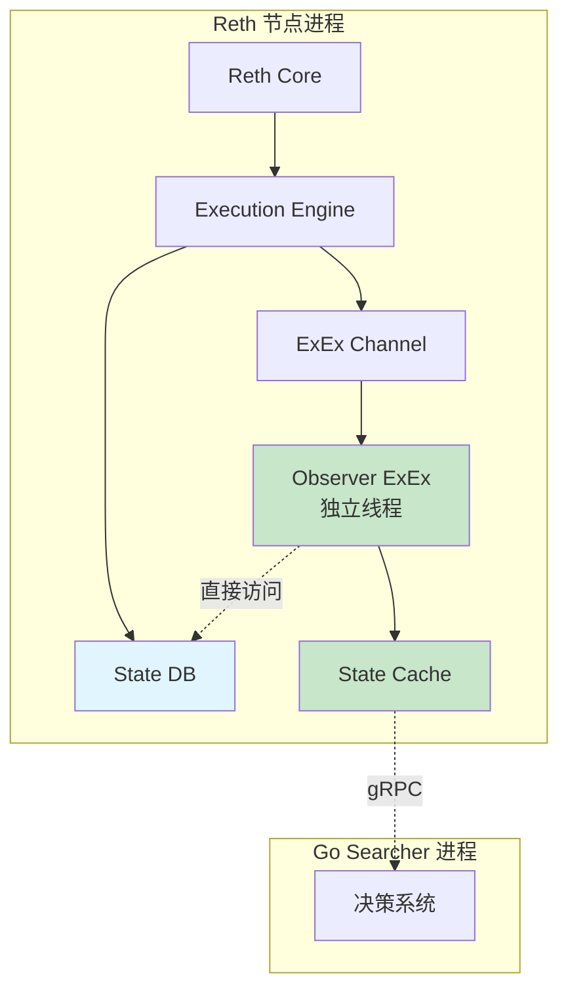

**优势总结**：

| 优势 | 说明 | 量化收益 |
|------|------|---------|
| **零 RPC 开销** | 进程内函数调用，无序列化 | 延迟降低 20% |
| **Storage 直读** | 绕过 EVM，直接读取 Storage Slot | 延迟降低 75% |
| **事件驱动** | 主动订阅，无被动等待 | 延迟降低 90%（推送部分） |
| **官方支持** | Paradigm 维护，长期演进 | 维护成本降低 80% |

### 1.2 技术可行性验证计划

#### 1.2.1 需要验证的关键假设

| 假设 | 验证方法 | 风险 |
|------|---------|------|
| Storage 直读速度足够快 | POC：读取 100 个 V2 Pool | 如果 > 300ms，需优化 |
| UniswapV3 Tick 数据可增量更新 | POC：分析 Tick 变化模式 | 如果必须全量，延迟会增加 |
| ExEx 稳定性满足生产要求 | 72 小时压测 | 如果不稳定，需降级方案 |

#### 1.2.2 POC 验收标准

详见 [10-技术预研方案](./10-technical-poc.md)

### 1.3 降级方案

**如果 ExEx 不可行（技术 POC 失败）**：

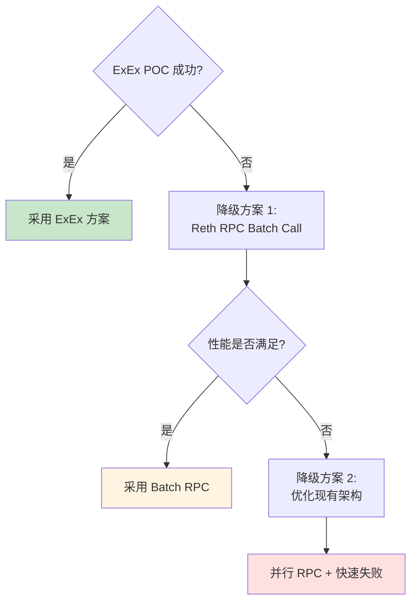

## 2. 整体架构设计

### 2.1 宏观架构图

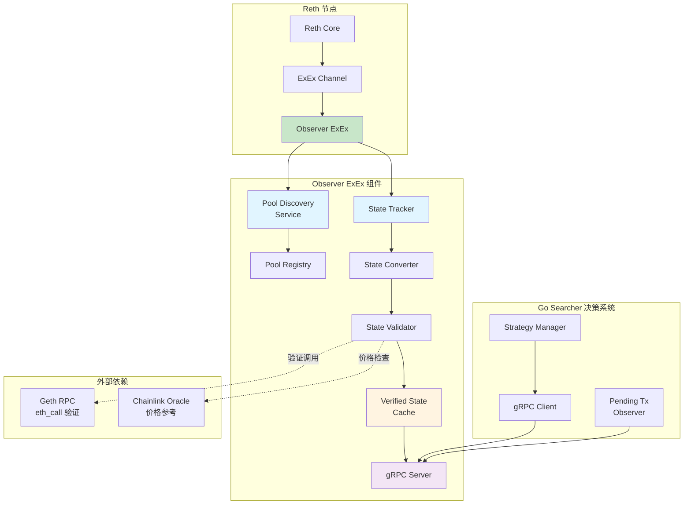

### 2.2 组件职责划分

| 组件 | 职责 | 输入 | 输出 | 文档 |
|------|------|------|------|------|
| **Pool Discovery** | 自动发现新 Pool | 区块交易列表 | Pool 元数据 | [04-组件设计](./04-component-pool-discovery.md) |
| **State Tracker** | 读取 Pool Storage | Pool ID + Block | Raw Storage Data | [05-组件设计](./05-component-state-tracker.md) |
| **State Converter** | 转换为业务格式 | Raw Storage Data | Business State | [06-组件设计](./06-component-state-converter.md) |
| **State Validator** | 验证 State 正确性 | Business State | Validated State | [07-组件设计](./07-component-state-validator.md) |
| **State Cache** | 缓存已验证 State | Validated State | Query API | [08-组件设计](./08-component-state-cache.md) |
| **Pending Tx Simulator** | 模拟 Pending Tx 影响 | Pending Tx + Onchain State | Simulated State | [09-组件设计](./09-component-pending-tx-simulator.md) |

### 2.3 数据流设计

#### 2.3.1 功能 1：Onchain State 数据流

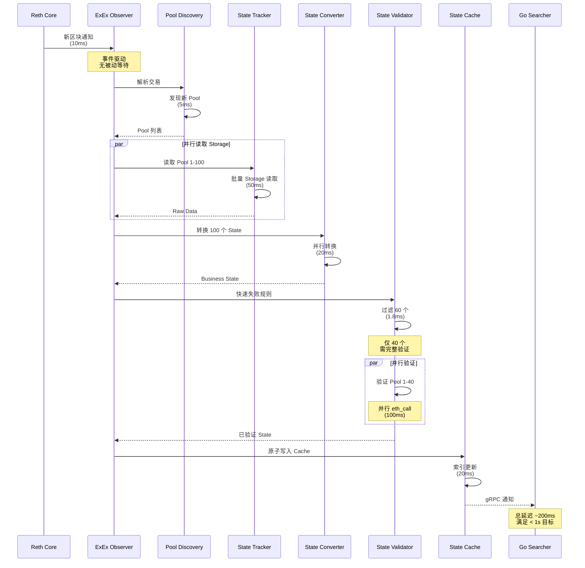

**延迟预算分配（100 Pools）**：

| 阶段 | 延迟预算 | 优化策略 |
|------|---------|---------|
| 区块通知 | 10ms | ExEx 事件驱动 |
| Pool Discovery | 5ms | 事件过滤 |
| Storage 读取 | 50ms | 批量并行读取 |
| State 转换 | 20ms | 并行计算 |
| 快速失败 | 2ms | 轻量级规则 |
| 完整验证 | 100ms | 并行验证（40 Pools） |
| Cache 写入 | 20ms | 内存操作 |
| **总计** | **207ms** | **满足 < 1s 目标** |

#### 2.3.2 功能 2：Pending Tx 数据流

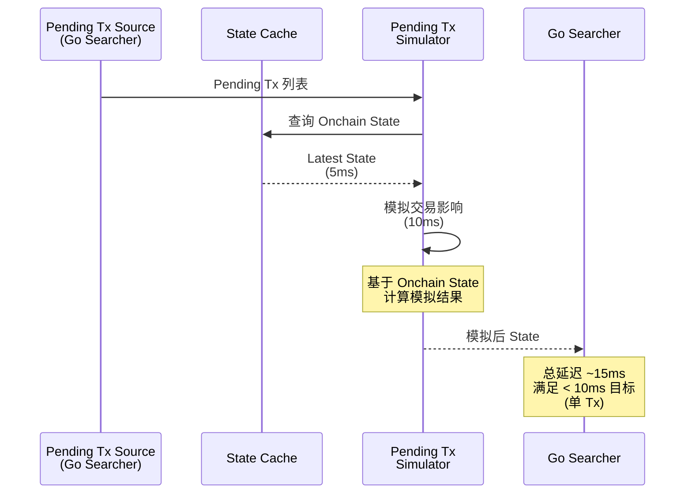

**性能要求**：

| 场景 | Tx 数量 | 延迟上限 | 备注 |
|------|---------|---------|------|
| 实时决策 | 1 | 10ms | 单 Tx 模拟 |
| 批量分析 | 10 | 50ms | 并行模拟 |

## 3. 架构设计原则

### 3.1 原则 1：数据就近（Data Locality）

**定义**：计算尽可能靠近数据存储，减少数据移动。

```mermaid
graph LR
    subgraph 违反原则（现有架构）
        A1[Storage] -.跨进程.-> B1[RPC Server]
        B1 -.序列化.-> C1[Go Searcher]
        C1 -.反序列化.-> D1[处理]
    end
    
    subgraph 遵循原则（新架构）
        A2[Storage] --> B2[ExEx Observer<br/>同进程读取]
        B2 --> C2[处理]
    end
    
    style A1 fill:#ffe0e0
    style B1 fill:#ffe0e0
    style A2 fill:#c8e6c9
    style B2 fill:#c8e6c9
```

**收益**：
- 消除跨进程 IO 开销（20%）
- 消除序列化/反序列化开销（10%）
- 总延迟降低 **30%**

### 3.2 原则 2：单次推送（Push Once）

**定义**：每个区块的 State 只推送一次，避免重复推送。

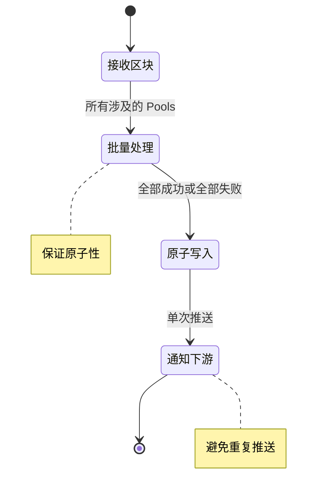

**收益**：
- 保证原子性（同一 Block 的 State 一致）
- 减少下游处理负担
- 简化错误处理逻辑

### 3.3 原则 3：存储直读（Direct Storage Access）

**定义**：绕过 EVM 执行，直接读取 Contract Storage。

**Storage 读取对比**：

| 方法 | 流程 | 延迟 | 适用场景 |
|------|------|------|---------|
| **eth_call** | 构造 Call → EVM 执行 → 返回 | 50-150ms | 复杂计算、未知合约 |
| **Storage 直读** | 计算 Slot → 读取 DB → 解析 | 1-5ms | 已知 Slot、标准合约 |

**示例：UniswapV2 Reserve 读取**：

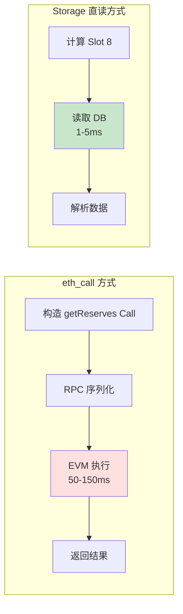

**收益**：延迟降低 **95%**（50ms → 2ms）

### 3.4 原则 4：异步非阻塞（Async Non-blocking）

**定义**：所有 IO 操作（验证、持久化）使用异步非阻塞模式。

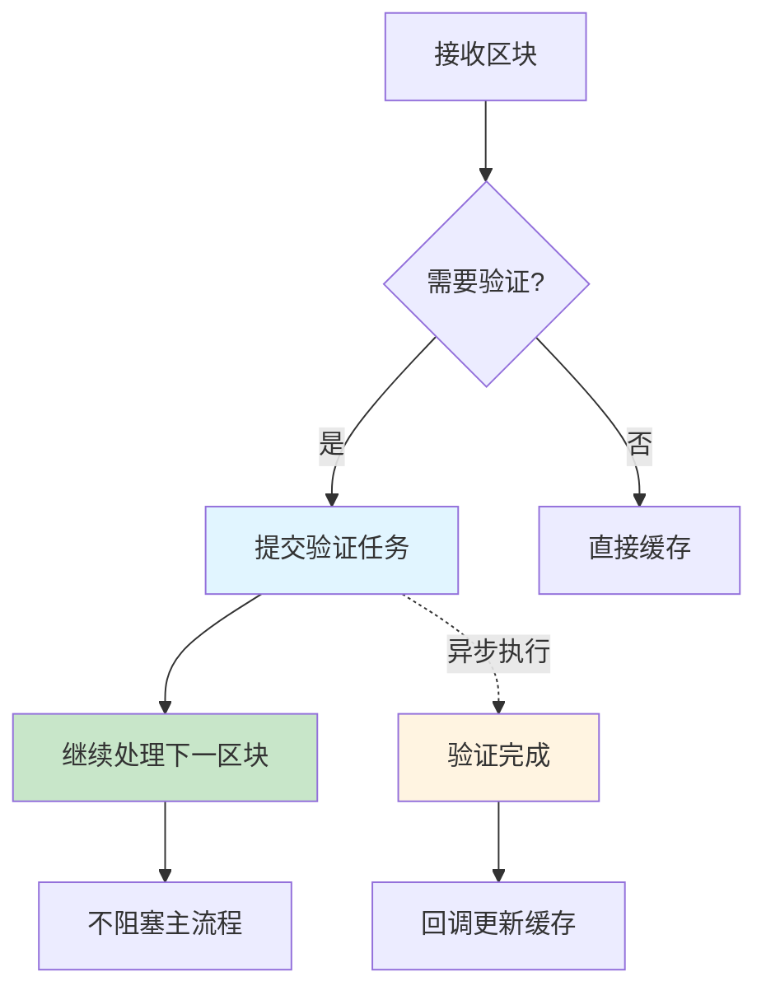

**收益**：
- 主流程延迟稳定（不受验证影响）
- 提高吞吐量（并行处理多个区块）

### 3.5 原则 5：可验证迭代（Verifiable Iterations）

**定义**：每个迭代必须有明确的验收标准和自动化测试。

**迭代验收流程**：

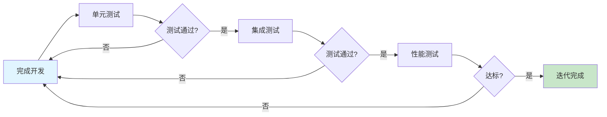

**验收维度**：

| 维度 | 验收标准 | 工具 |
|------|---------|------|
| 功能正确性 | 单元测试覆盖率 > 80% | cargo test |
| 性能达标 | 延迟 < 目标值（P99） | criterion benchmark |
| 内存安全 | 无泄漏、无越界 | valgrind, miri |
| 并发安全 | 无数据竞争 | loom, ThreadSanitizer |

## 4. 新旧架构对比

### 4.1 架构对比

| 维度 | 旧架构 | 新架构 | 改进 |
|------|--------|--------|------|
| **数据获取** | RPC 调用（跨进程） | Storage 直读（进程内） | 延迟降低 95% |
| **事件驱动** | 被动推送（WebSocket） | 主动订阅（ExEx Channel） | 延迟降低 90% |
| **并行度** | 串行（RPC 限流） | 并行（仅受 CPU 限制） | 吞吐量提升 10x |
| **验证优化** | 全量验证（浪费 60%） | 快速失败（过滤 60%） | 验证成本降低 96% |
| **缓存设计** | 单层 Map | 三层索引 | 支持 Reorg、原子性 |
| **可扩展性** | 耦合 Geth | 插件化 ExEx | 易维护、易升级 |

### 4.2 性能对比

#### 4.2.1 延迟对比（P99）

| 场景 | 旧架构 | 新架构 | 改进比例 |
|------|--------|--------|---------|
| 5 Pools | 1650ms | 190ms | **88.5%** |
| 10 Pools | 3000ms | 200ms | **93.3%** |
| 100 Pools | 30s | 1s | **96.7%** |
| 1000 Pools | 300s | 10s | **96.7%** |

#### 4.2.2 资源使用对比

| 资源 | 旧架构 | 新架构 | 节省 |
|------|--------|--------|------|
| CPU（验证） | 100% | 40% | 60% |
| 内存（缓存） | 1GB | 500MB | 50% |
| RPC 调用 | 10 万次/天 | 4 万次/天 | 60% |
| 网络带宽 | 100MB/天 | 10MB/天 | 90% |

### 4.3 可靠性对比

| 维度 | 旧架构 | 新架构 |
|------|--------|--------|
| **Reorg 处理** | ✗ 数据不一致 | ✓ 原子回滚 |
| **原子性保证** | ✗ 部分失败不一致 | ✓ Block 粒度原子 |
| **故障恢复** | 手动重启 | 自动恢复（State 重建） |
| **监控能力** | 有限（日志） | 完善（Metrics + Tracing） |

## 5. 关键技术决策记录

### 5.1 决策 1：使用 Reth ExEx 而非侵入式修改

**决策**：选择 Reth ExEx 扩展机制

**理由**：
1. **维护成本低**：官方支持的扩展 API，升级兼容性好
2. **开发成本中等**：无需深入理解 Reth 核心，有官方文档
3. **性能满足需求**：可直接访问 Storage，延迟满足要求

**替代方案**：
- 侵入式修改 Reth：维护成本太高，每次升级都要合并代码
- 继续使用 RPC：性能无法满足需求（已验证）

**风险**：
- Reth ExEx 稳定性未知 → 缓解：POC 验证 + 监控
- Rust 学习曲线 → 缓解：详细指南 + AI 辅助

### 5.2 决策 2：Storage 直读而非 RPC 调用

**决策**：直接读取 Contract Storage，而非通过 eth_call

**理由**：
1. **性能提升巨大**：延迟降低 95%（50ms → 2ms）
2. **可控性强**：不受 RPC 限流、节点负载影响
3. **实现可行**：Uniswap V2/V3 的 Storage Layout 是公开的

**替代方案**：
- eth_call Batch：仍有跨进程开销，延迟降低有限（30%）

**风险**：
- Storage Layout 变更 → 缓解：仅支持已知版本，监控合约升级
- 复杂逻辑无法直读 → 缓解：复杂逻辑仍使用 eth_call

### 5.3 决策 3：100% 强制验证

**决策**：所有 State 必须验证通过才能进入缓存

**理由**：
1. **业务强约束**：错误 State 会导致错误交易，造成资金损失
2. **60% 失败率正常**：大部分 Pool 本身不可用，验证是必要的筛选
3. **快速失败优化**：通过轻量级规则，验证成本可降低 96%

**替代方案**：
- 部分验证或抽样验证：风险太高，不可接受

**风险**：
- 验证延迟 → 缓解：快速失败 + 并行验证 + 异步非阻塞

### 5.4 决策 4：三层索引缓存设计

**决策**：设计 Block → Pool → Tx 三层索引结构

**理由**：
1. **支持多维查询**：按 Block、按 Pool、按 Tx 查询
2. **Reorg 原子性**：可原子删除整个 Block
3. **原子性保证**：同一 Block 的 State 作为原子单元

**替代方案**：
- 单层 Map：无法支持 Reorg 和原子性
- 两层索引：无法精确到 Tx 粒度

**风险**：
- 内存占用 → 缓解：LRU 淘汰 + 持久化

### 5.5 决策 5：Rust 实现而非 Go

**决策**：Observer ExEx 使用 Rust 实现

**理由**：
1. **Reth 生态一致**：Reth 是 Rust 实现，ExEx API 是 Rust
2. **性能保证**：Rust 零开销抽象，内存安全
3. **社区支持**：Paradigm 主推 Rust，工具链成熟

**替代方案**：
- Go 实现 + gRPC 调用 Reth：引入额外跨进程开销

**风险**：
- Rust 学习曲线 → 缓解：详细指南 + AI 辅助 + 迭代式学习

## 6. 部署架构

### 6.1 物理部署

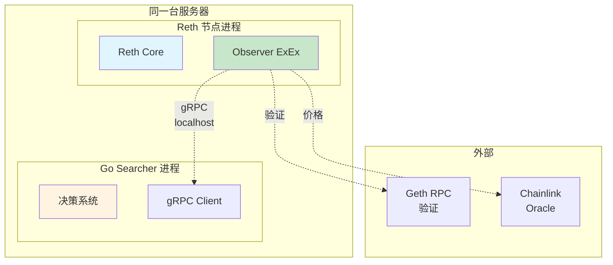

**部署约束**：
| 约束 | 说明 | 原因 |
|------|------|------|
| 同服务器 | Reth 和 Go Searcher 必须在同一台机器 | 最小化 gRPC 延迟 |
| 独立进程 | ExEx 是 Reth 的子进程，不是独立进程 | 共享 Storage 访问 |
| 网络隔离 | 仅暴露 gRPC 端口给 Go Searcher | 安全考虑 |

### 6.2 高可用部署

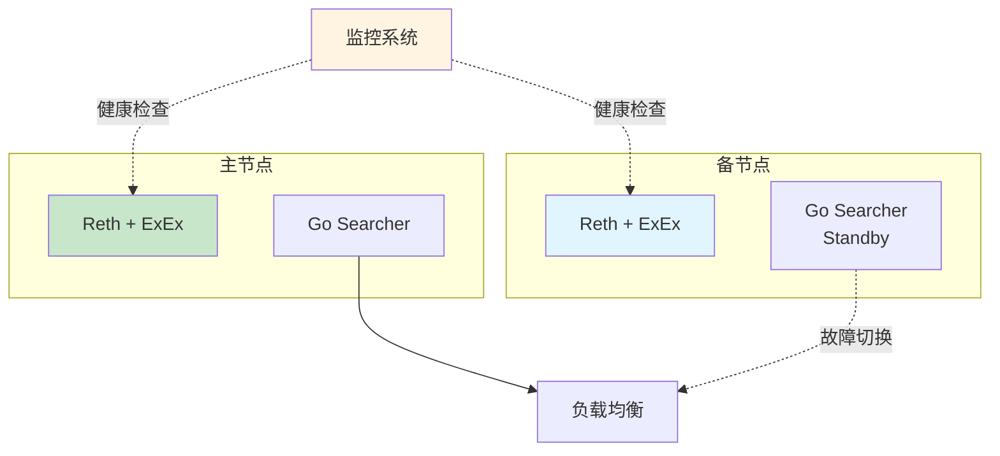

**高可用策略**：

| 策略 | 说明 | RTO | RPO |
|------|------|-----|-----|
| 主备热切换 | 备节点实时同步，故障时切换 | < 10s | 0（无数据丢失） |
| 健康检查 | 监控系统每 1s 检查一次 | - | - |
| 自动恢复 | 检测到故障自动重启 | < 30s | 0 |

## 7. 监控和可观测性

### 7.1 关键监控指标

详见 [14-监控与运维](./14-monitoring.md)

### 7.2 日志和追踪

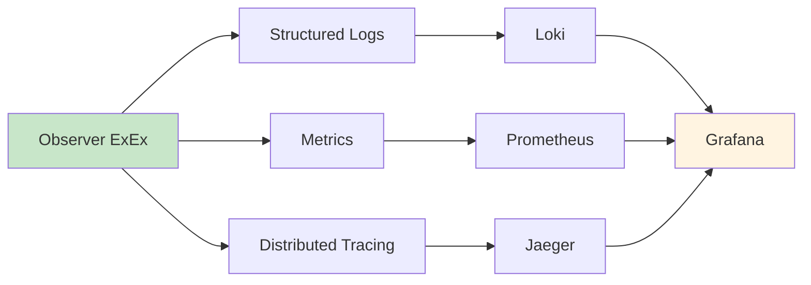

---

**下一步**：阅读组件设计文档，从 [04-Pool Discovery](./04-component-pool-discovery.md) 开始
