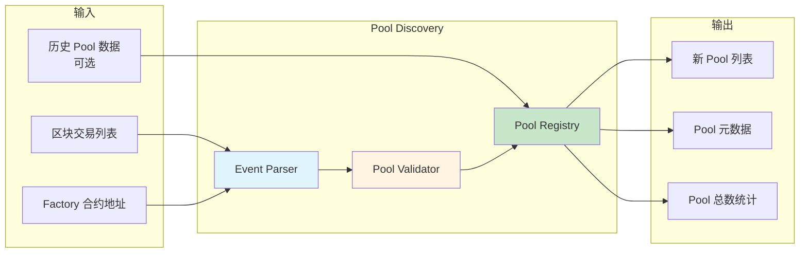
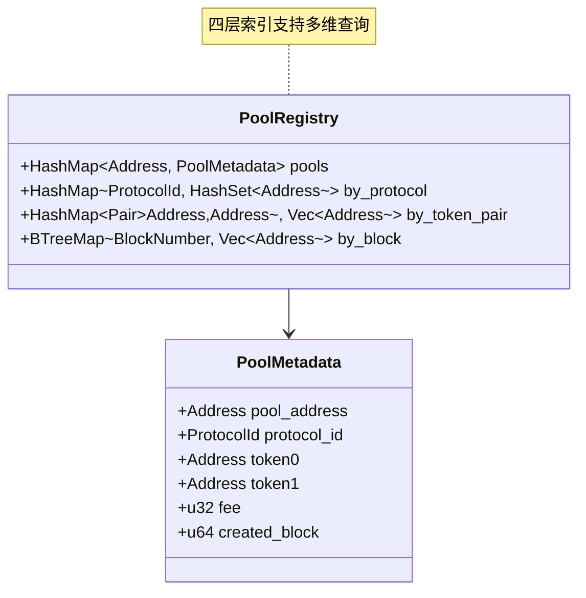
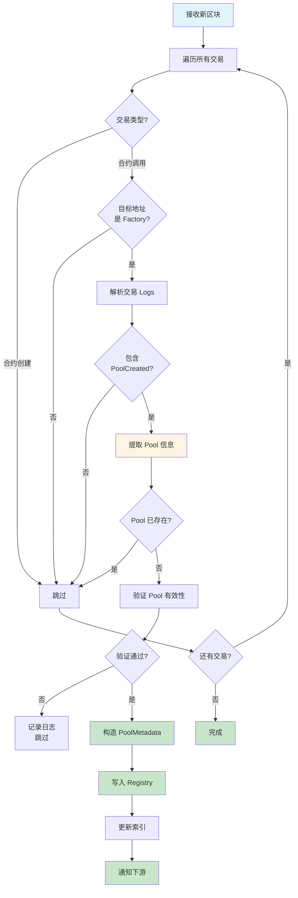
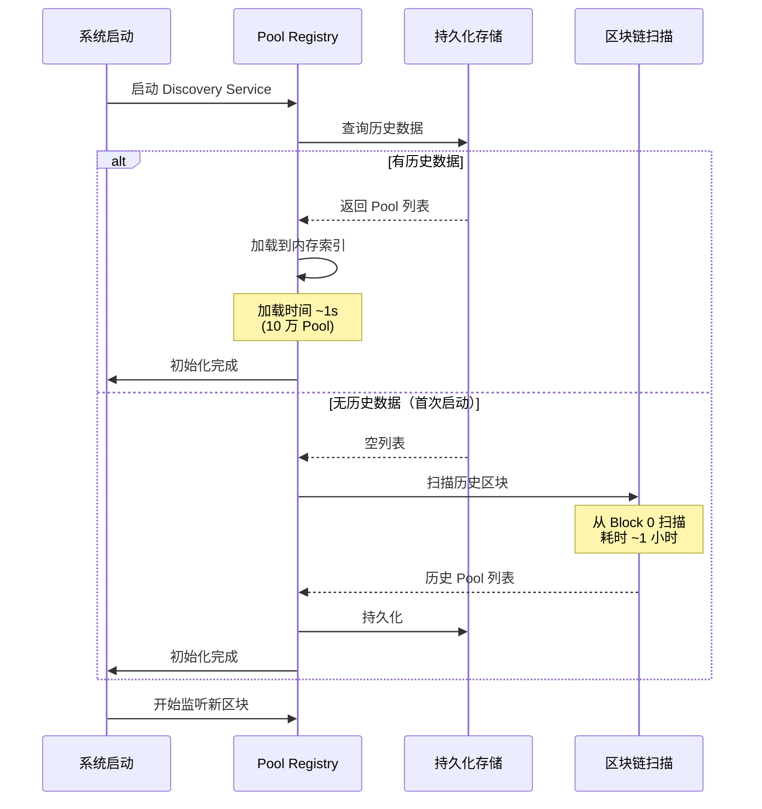
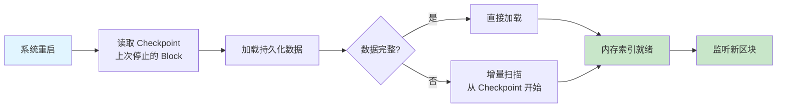
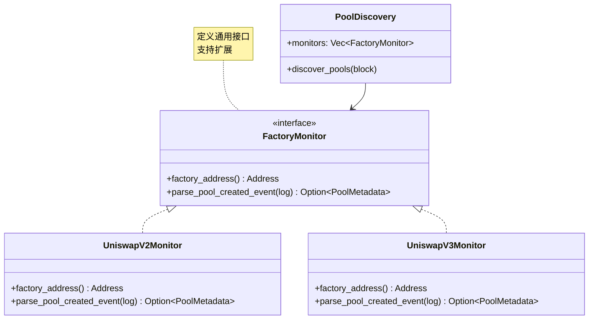
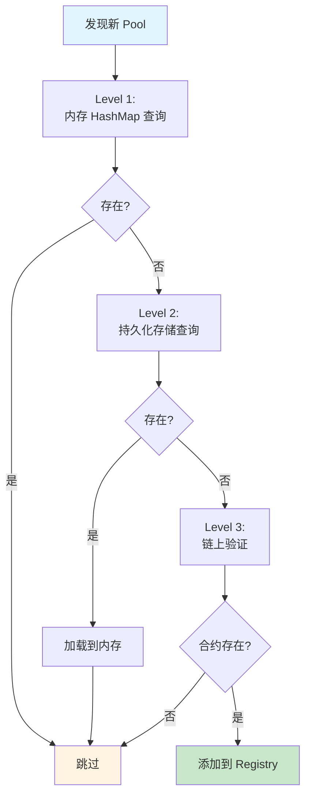
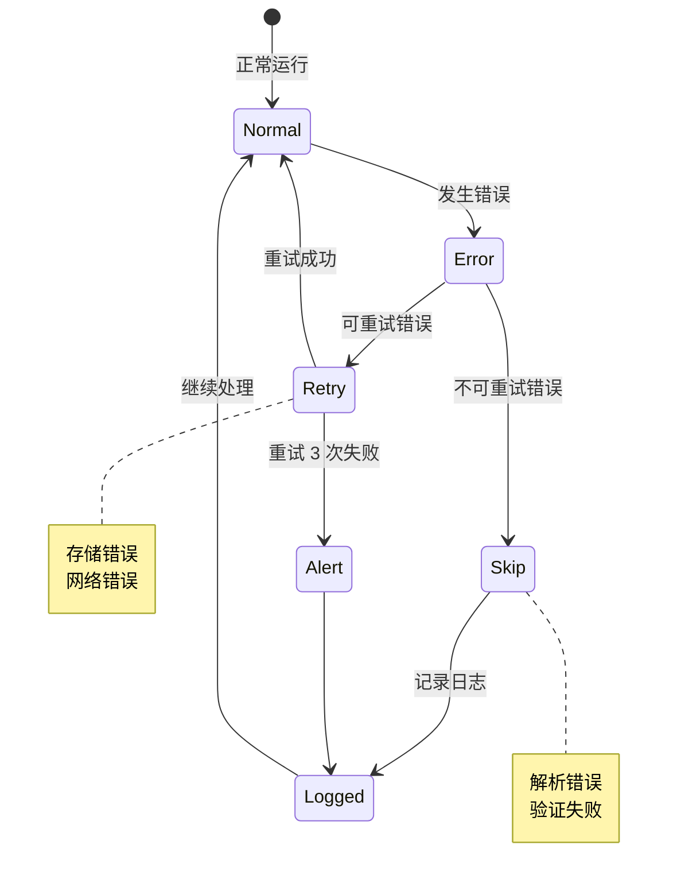
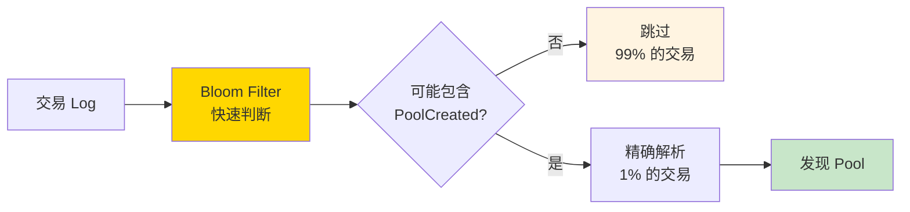

# 组件设计：Pool Discovery Service

## 文档元信息

| 项目 | 内容 |
|------|------|
| 组件名称 | Pool Discovery Service |
| 文档版本 | v1.0 |
| 创建日期 | 2025-12-12 |
| 最后更新 | 2025-12-12 |
| 文档状态 | 草稿 |
| 责任人 | 架构组 |

## 1. 组件概述

### 1.1 职责定义

Pool Discovery Service 负责**自动发现**区块链上新创建的 DEX Pool，无需人工维护白名单。

**核心职责**：

| 职责 | 说明 | 优先级 |
|------|------|--------|
| 监听 Factory 事件 | 监听 UniswapV2/V3 Factory 的 PoolCreated 事件 | P0 |
| 解析 Pool 元数据 | 提取 token0, token1, fee 等信息 | P0 |
| 去重和验证 | 确保 Pool 唯一性和有效性 | P0 |
| 维护 Pool Registry | 持久化 Pool 列表，支持查询 | P1 |
| 初始化导入 | 启动时导入历史 Pool 数据 | P1 |

### 1.2 输入输出



### 1.3 接口定义

**核心接口表格**：

| 接口名称 | 输入参数 | 输出 | 用途 |
|---------|---------|------|------|
| `DiscoverPools` | block_number, transactions | Vec\<PoolMetadata\> | 从区块中发现新 Pool |
| `GetPoolMetadata` | pool_address | PoolMetadata | 查询 Pool 元数据 |
| `ListAllPools` | protocol_filter (可选) | Vec\<PoolAddress\> | 列出所有已知 Pool |
| `ImportHistoricalPools` | pool_list | Result | 导入历史数据 |
| `GetPoolCount` | protocol_filter (可选) | usize | 获取 Pool 总数 |

## 2. 数据结构设计

### 2.1 Pool Metadata

**表格定义**：

| 字段名 | 类型 | 必选 | 说明 | 示例 |
|-------|------|------|------|------|
| pool_address | Address (20 bytes) | ✓ | Pool 合约地址 | 0x1234...5678 |
| protocol_id | Enum (V2, V3) | ✓ | DEX 协议类型 | UniswapV3 |
| factory_address | Address | ✓ | 创建此 Pool 的 Factory 地址 | 0xabcd...ef00 |
| token0 | Address | ✓ | Token0 地址（按地址排序） | 0x0000...（WETH） |
| token1 | Address | ✓ | Token1 地址 | 0xA0b8...（USDC） |
| fee | u32 | ✓ | 手续费率（单位：bps 或 V3 的 fee tier） | 3000（0.3%） |
| tick_spacing | i32 | V3 必选 | V3 Tick 间隔 | 60 |
| created_block | u64 | ✓ | Pool 创建的区块号 | 12345678 |
| created_tx_index | u32 | ✓ | Pool 创建的交易索引 | 5 |
| discovered_at | Timestamp | ✓ | 发现时间（用于审计） | 1638360000 |

### 2.2 Factory Configuration

**支持的 Factory 合约**：

| Protocol | Factory 地址 | PoolCreated 事件签名 | 优先级 |
|----------|-------------|-------------------|--------|
| UniswapV2 | 0x5C69bEe701ef814a2B6a3EDD4B1652CB9cc5aA6f | `PairCreated(address,address,address,uint)` | P0 |
| UniswapV3 | 0x1F98431c8aD98523631AE4a59f267346ea31F984 | `PoolCreated(address,address,uint24,int24,address)` | P0 |
| SushiSwap | 0xC0AEe478e3658e2610c5F7A4A2E1777cE9e4f2Ac | 同 V2 | P1 |
| Future DEX | TBD | TBD | P2 |

### 2.3 Pool Registry 存储结构

**内存索引**：



**持久化存储**：

| 存储层 | 技术选型 | 用途 |
|-------|---------|------|
| 内存索引 | HashMap + BTreeMap | 快速查询（< 1ms） |
| 持久化存储 | RocksDB 或 SQLite | 启动时加载历史数据 |
| 冷数据归档 | 可选，文件系统 | 长期审计 |

## 3. 工作流程设计

### 3.1 运行时发现流程



**关键设计点**：

| 设计点 | 说明 | 原因 |
|-------|------|------|
| 遍历所有交易 | 而非仅监听特定地址 | 避免漏报（Factory 可能升级） |
| 去重检查 | 查询 Registry 避免重复添加 | 保证唯一性 |
| 异步验证 | 验证不阻塞主流程 | 保证发现延迟稳定 |
| 批量通知 | 每个 Block 通知一次 | 减少下游处理次数 |

### 3.2 验证流程

```mermaid
flowchart TD
    A[待验证 Pool] --> B{地址合法?}
    B -->|否| Z[验证失败]
    B -->|是| C{token0 < token1?}
    
    C -->|否| Z
    C -->|是| D{合约代码存在?}
    
    D -->|否| Z
    D -->|是| E{合约符合<br/>Pool 接口?}
    
    E -->|否| Z
    E -->|是| F[验证通过]
    
    style A fill:#e1f5ff
    style F fill:#c8e6c9
    style Z fill:#ffe0e0
    
    note right of C: UniswapV2/V3 约定<br/>token0 地址小于 token1
    note right of E: 检查 getReserves<br/>或 slot0 函数
```

**验证规则表**：

| 验证项 | 规则 | 失败处理 |
|-------|------|---------|
| 地址有效性 | 非零地址，20 字节 | 记录日志，跳过 |
| Token 排序 | token0 < token1（地址字典序） | 记录日志，跳过 |
| 合约存在性 | 合约代码非空 | 记录日志，跳过 |
| 接口兼容性 | 支持标准 Pool 接口 | 记录日志，跳过 |

## 4. 初始化导入流程

### 4.1 冷启动流程



### 4.2 增量导入流程

**场景**：系统重启，加载最近 7 天的数据



**性能目标**：

| 数据量 | 加载时间 | 方法 |
|-------|---------|------|
| 1 万 Pool | < 100ms | 内存加载 |
| 10 万 Pool | < 1s | 内存加载 |
| 100 万 Pool | < 10s | 分批加载 |

### 4.3 历史数据来源

**优先级排序**：

| 数据源 | 优先级 | 获取方式 | 覆盖范围 |
|-------|--------|---------|---------|
| 持久化存储 | P0 | 本地 RocksDB | 系统已发现的 Pool |
| Etherscan API | P1 | HTTP API | 公开的 Pool 列表 |
| The Graph | P2 | GraphQL | Uniswap Subgraph |
| 区块链扫描 | P3 | 自行扫描历史区块 | 完整但最慢 |

## 5. 关键设计点

### 5.1 设计点 1：多 Factory 支持

**问题**：如何支持多个 DEX Protocol 的 Factory？

**解决方案**：插件化设计



**扩展步骤**：

1. 实现 `FactoryMonitor` 接口
2. 注册到 `PoolDiscovery.monitors`
3. 配置 Factory 地址和事件签名

### 5.2 设计点 2：去重策略

**问题**：如何避免重复添加同一个 Pool？

**解决方案**：多层去重



**去重层级**：

| 层级 | 方法 | 延迟 | 准确性 |
|------|------|------|--------|
| Level 1 | 内存 HashMap | < 0.1ms | 99.9% |
| Level 2 | 持久化存储 | < 1ms | 99.99% |
| Level 3 | 链上验证 | 10-50ms | 100% |

### 5.3 设计点 3：错误处理

**错误分类**：

| 错误类型 | 原因 | 处理策略 |
|---------|------|---------|
| 解析错误 | Event Log 格式不符 | 记录日志，跳过该 Pool |
| 验证失败 | 合约不存在或接口不符 | 记录日志，跳过该 Pool |
| 存储错误 | RocksDB 写入失败 | 重试 3 次，失败则告警 |
| Factory 未知 | 新的 Factory 地址 | 记录日志，人工审核后添加 |

**错误恢复流程**：



### 5.4 设计点 4：性能优化

**优化策略**：

| 优化项 | 方法 | 收益 |
|-------|------|------|
| 批量处理 | 每个 Block 批量发现 | 减少通知次数 |
| 内存索引 | HashMap + BTreeMap | 查询 < 1ms |
| 异步验证 | 验证不阻塞主流程 | 发现延迟稳定 |
| 事件过滤 | Bloom Filter 快速判断 | CPU 降低 50% |

**Bloom Filter 应用**：



### 5.5 设计点 5：监控和审计

**监控指标**：

| 指标 | 说明 | 告警阈值 |
|------|------|---------|
| pools_discovered_total | 累计发现的 Pool 数量 | 无 |
| pools_discovered_rate | 每小时新发现的 Pool 数量 | < 1（异常低） |
| pool_validation_failures | 验证失败的次数 | > 10/小时 |
| registry_size | Registry 中的 Pool 总数 | > 100 万（内存压力） |
| discovery_latency | 从区块到发现的延迟 | > 100ms（P99） |

**审计日志**：

| 日志类型 | 内容 | 保留时长 |
|---------|------|---------|
| 新 Pool 发现 | Pool 地址、元数据、区块号 | 永久 |
| 验证失败 | Pool 地址、失败原因、区块号 | 30 天 |
| 去重跳过 | Pool 地址、首次发现时间 | 7 天 |

## 6. 接口示例

### 6.1 查询接口

**接口表格**：

| 接口 | HTTP 方法 | 路径 | 参数 | 返回 |
|------|----------|------|------|------|
| 查询 Pool 元数据 | GET | `/pool/{address}` | address | PoolMetadata JSON |
| 列出所有 Pool | GET | `/pools` | protocol (可选), limit, offset | Pool 地址列表 |
| 查询 Pool 数量 | GET | `/pools/count` | protocol (可选) | 数量 |
| 查询新 Pool | GET | `/pools/recent` | since_block, limit | Pool 列表 |

### 6.2 管理接口

| 接口 | HTTP 方法 | 路径 | 参数 | 用途 |
|------|----------|------|------|------|
| 导入历史 Pool | POST | `/admin/import` | Pool 列表 JSON | 批量导入 |
| 重建索引 | POST | `/admin/reindex` | 无 | 重建内存索引 |
| 健康检查 | GET | `/health` | 无 | 服务状态 |

## 7. 测试策略

### 7.1 单元测试

| 测试用例 | 输入 | 预期输出 |
|---------|------|---------|
| 解析 V2 PoolCreated | 标准 V2 Event Log | 正确的 PoolMetadata |
| 解析 V3 PoolCreated | 标准 V3 Event Log | 正确的 PoolMetadata |
| 去重检测 | 已存在的 Pool | 跳过添加 |
| 验证失败处理 | 无效的 Pool 地址 | 返回错误，记录日志 |

### 7.2 集成测试

| 测试场景 | 描述 | 验收标准 |
|---------|------|---------|
| 冷启动导入 | 从空白 Registry 导入 1 万 Pool | 全部导入，耗时 < 1s |
| 实时发现 | 处理包含 PoolCreated 的区块 | 正确发现，延迟 < 50ms |
| Reorg 处理 | 模拟区块链重组 | 正确回滚，无重复 Pool |

### 7.3 性能测试

| 指标 | 目标值 | 测试方法 |
|------|--------|---------|
| 发现延迟 | < 50ms (P99) | 压测 1000 区块 |
| 查询延迟 | < 1ms (P99) | 并发查询 10k QPS |
| 内存占用 | < 100MB (10 万 Pool) | 加载测试 |

---

**下一步**：阅读 [05-State Tracker](./05-component-state-tracker.md) 了解如何读取 Pool State
