# 组件设计：Pool State Tracker

> **实现状态**: ✅ 已实现（基础版本）  
> **实现位置**: `crates/exex/mev-pool-state-tracker/`  
> **实现日期**: 2025-12-16  
> **支持协议**: UniswapV2 ✅ | UniswapV3 🚧（接口已保留）

## 文档元信息

| 项目 | 内容 |
|------|------|
| 组件名称 | Pool State Tracker |
| 文档版本 | v1.1 |
| 创建日期 | 2025-12-12 |
| 最后更新 | 2025-12-16 |
| 文档状态 | 已实现 |
| 责任人 | 架构组 |

## 1. 组件概述

### 1.1 职责定义

Pool State Tracker 负责从区块链 Storage 层**直接读取** Pool 的原始状态数据，绕过 EVM 执行。

**核心职责**：

| 职责 | 说明 | 优先级 |
|------|------|--------|
| Storage Slot 计算 | 根据 Pool 合约地址和协议类型计算 Storage Slot | P0 |
| 批量读取 Storage | 并行读取多个 Pool 的 Storage 数据 | P0 |
| 数据解析 | 将原始 bytes 解析为结构化数据 | P0 |
| 变化检测 | 识别哪些 Pool 在区块中发生了变化 | P1 |
| 错误处理 | 处理读取失败、数据损坏等异常 | P1 |

### 1.2 输入输出

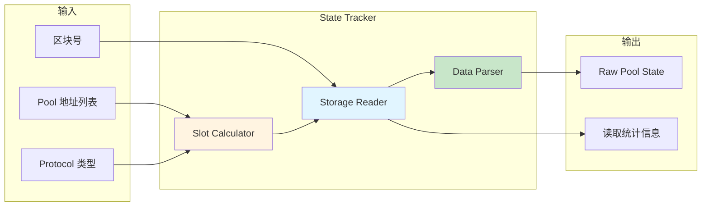

### 1.3 接口定义

**核心接口表格**：

| 接口名称 | 输入参数 | 输出 | 用途 |
|---------|---------|------|------|
| `TrackPoolState` | pool_address, block_number, protocol | RawPoolState | 读取单个 Pool 的 State |
| `TrackMultipleStates` | Vec\<pool_address\>, block_number | Vec\<RawPoolState\> | 批量读取多个 Pool |
| `DetectChangedPools` | block_number, pool_list | Vec\<pool_address\> | 识别发生变化的 Pool |
| `GetStorageSlot` | pool_address, protocol, slot_name | H256 | 计算 Storage Slot 地址 |

## 2. 数据结构设计

### 2.1 RawPoolState

**UniswapV2 原始状态**：

| 字段名 | 类型 | Storage Slot | 说明 |
|-------|------|--------------|------|
| pool_address | Address | - | Pool 合约地址 |
| block_number | u64 | - | 状态对应的区块号 |
| reserve0 | U256 | Slot 8（前 112 bits） | Token0 储备量 |
| reserve1 | U256 | Slot 8（中 112 bits） | Token1 储备量 |
| block_timestamp_last | u32 | Slot 8（后 32 bits） | 最后更新时间戳 |

**UniswapV3 原始状态**：

| 字段名 | 类型 | Storage Slot | 说明 |
|-------|------|--------------|------|
| pool_address | Address | - | Pool 合约地址 |
| block_number | u64 | - | 状态对应的区块号 |
| sqrt_price_x96 | U256 | Slot 0（前 160 bits） | 当前价格的平方根 |
| tick | i32 | Slot 0（160-184 bits） | 当前 Tick |
| observation_index | u16 | Slot 0（184-200 bits） | 观测点索引 |
| observation_cardinality | u16 | Slot 0（200-216 bits） | 观测点容量 |
| liquidity | u128 | Slot 4 | 当前流动性 |

### 2.2 Storage Layout 映射

**UniswapV2 Storage Layout**：

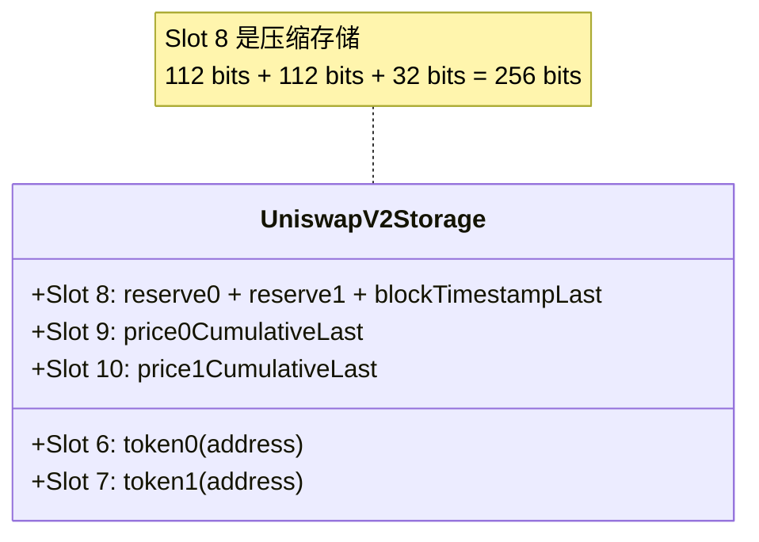

**Slot 8 位布局**：

| Offset | Size | Field |
|--------|------|-------|
| 0-111 | 112 bits | reserve0 |
| 112-223 | 112 bits | reserve1 |
| 224-255 | 32 bits | blockTimestampLast |

**UniswapV3 Storage Layout**：

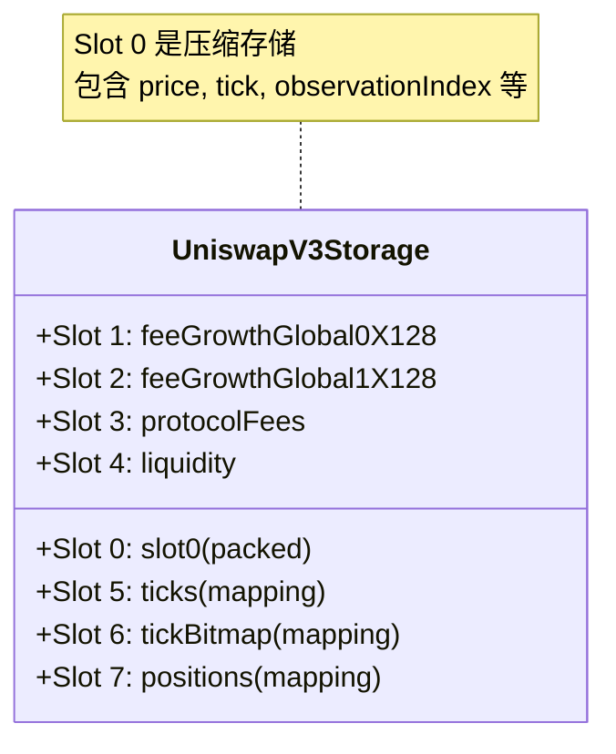

**Slot 0 位布局**：

| Offset | Size | Field |
|--------|------|-------|
| 0-159 | 160 bits | sqrtPriceX96 |
| 160-183 | 24 bits | tick |
| 184-199 | 16 bits | observationIndex |
| 200-215 | 16 bits | observationCardinality |
| 216-231 | 16 bits | observationCardinalityNext |
| 232-239 | 8 bits | feeProtocol |
| 240 | 1 bit | unlocked |

## 3. 数据流设计

### 3.1 单个 Pool 读取流程

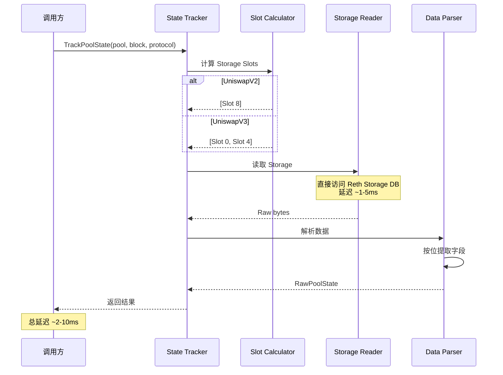

### 3.2 批量读取流程

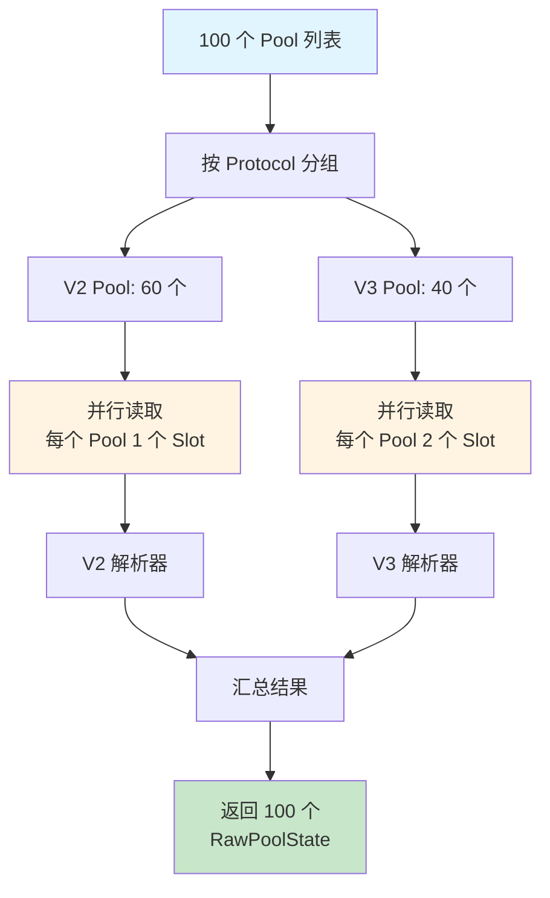

**性能优化**：

| 优化策略 | 说明 | 收益 |
|---------|------|------|
| 并行读取 | 使用 Rayon 并行读取 | 延迟降低 80% |
| 批量 IO | 一次性读取多个 Slot | IO 次数减少 50% |
| 按 Protocol 分组 | 减少 Slot 计算次数 | CPU 降低 30% |

### 3.3 变化检测流程

**问题**：如何高效识别哪些 Pool 在区块中发生了变化？

**方案 1：交易分析**（推荐）

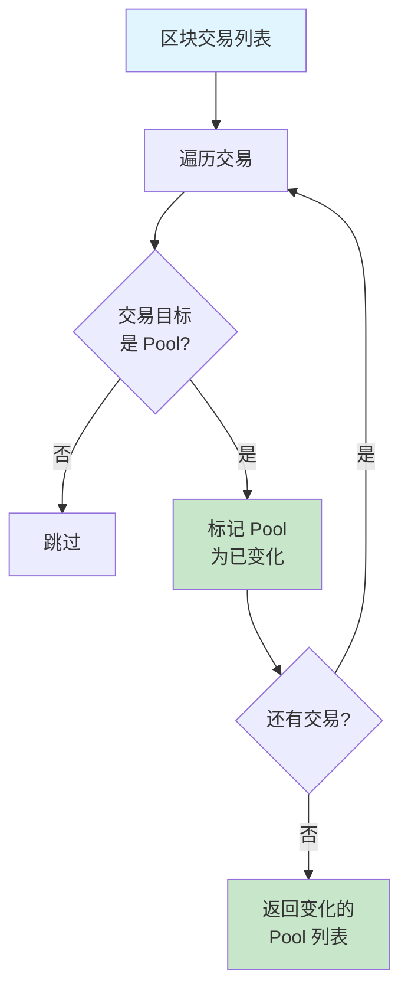

**方案 2：全量对比**（降级方案）

```mermaid
flowchart LR
    A[读取 Block N-1<br/>所有 Pool State] --> B[读取 Block N<br/>所有 Pool State]
    B --> C[逐个对比]
    C --> D[返回变化的 Pool]
    
    style A fill:#ffe0e0
    style B fill:#ffe0e0
    note right of A: 性能差<br/>仅作降级方案
```

**对比分析**：

| 方案 | 延迟（1000 Pools） | 准确性 | 适用场景 |
|------|------------------|--------|---------|
| 方案 1：交易分析 | < 10ms | 100% | 推荐使用 |
| 方案 2：全量对比 | 1-5s | 100% | 降级方案 |

## 4. UniswapV2/V3 读取策略对比

### 4.1 策略对比表

| 维度 | UniswapV2 | UniswapV3 |
|------|-----------|-----------|
| **核心数据 Slot 数** | 1 个（Slot 8） | 2 个（Slot 0, 4） |
| **单 Pool 读取延迟** | 1-3ms | 2-5ms |
| **数据解析复杂度** | 低（简单位运算） | 中（多字段解包） |
| **Tick 数据** | 无 | 需单独处理 |
| **扩展数据** | 无 | 观测点、手续费等 |

### 4.2 UniswapV2 读取详解

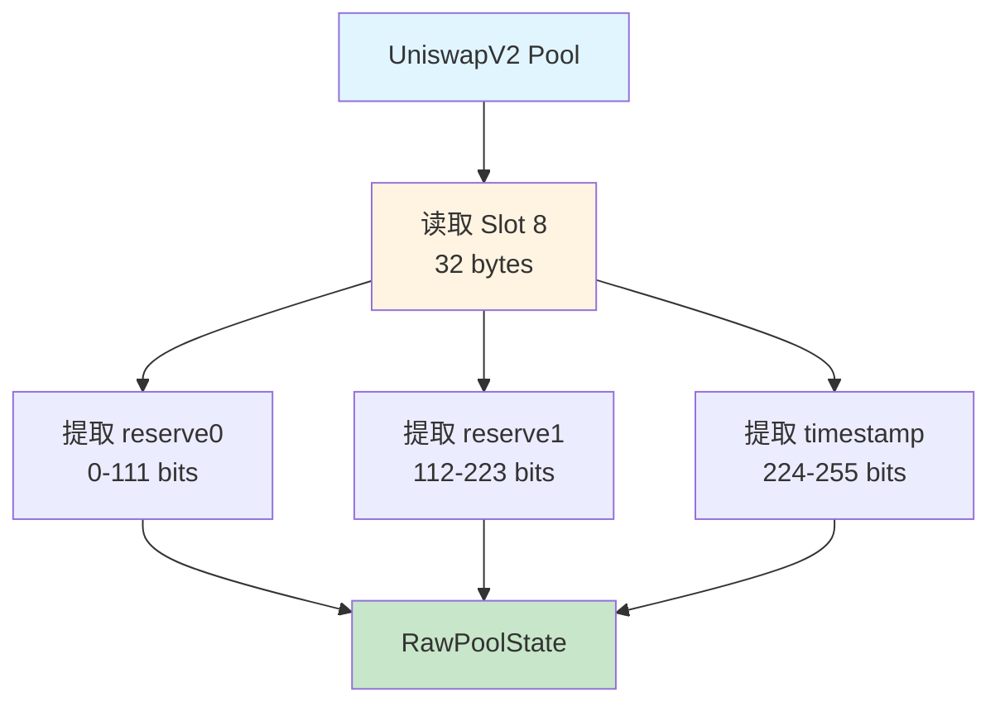

**位提取示例逻辑**（概念描述，非代码）：

| 操作 | 说明 |
|------|------|
| `reserve0 = (slot8 & MASK_112) >> 0` | 提取低 112 位 |
| `reserve1 = (slot8 & (MASK_112 << 112)) >> 112` | 提取中 112 位 |
| `timestamp = slot8 >> 224` | 提取高 32 位 |

### 4.3 UniswapV3 读取详解

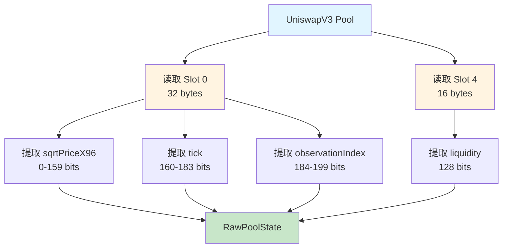

**V3 特殊处理**：

| 字段 | 特殊性 | 处理方法 |
|------|-------|---------|
| sqrtPriceX96 | 160 bits，Q64.96 格式 | 提取后需转换为浮点数 |
| tick | 24 bits 有符号整数 | 需符号扩展 |
| liquidity | 128 bits | 直接使用 U128 |

### 4.4 UniswapV3 Tick 数据读取

**问题**：Tick 数据存储在 `mapping(int24 => Tick)` 中，如何读取？

**Tick Storage Slot 计算**：

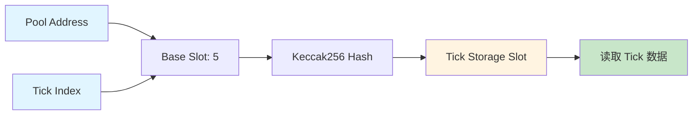

**计算公式**（概念）：

```
tick_slot = keccak256(abi.encode(tick_index, 5))
```

**优化策略**：

| 策略 | 说明 | 收益 |
|------|------|------|
| **增量更新**（推荐） | 仅读取变化的 Tick | 延迟降低 95% |
| 缓存活跃 Tick | 缓存 ±1000 范围内的 Tick | 查询延迟 < 1ms |
| 批量读取 | 一次读取多个 Tick | IO 减少 80% |
| 全量读取（降级） | 读取所有初始化的 Tick | 延迟高，不推荐 |

**Tick 变化检测**：

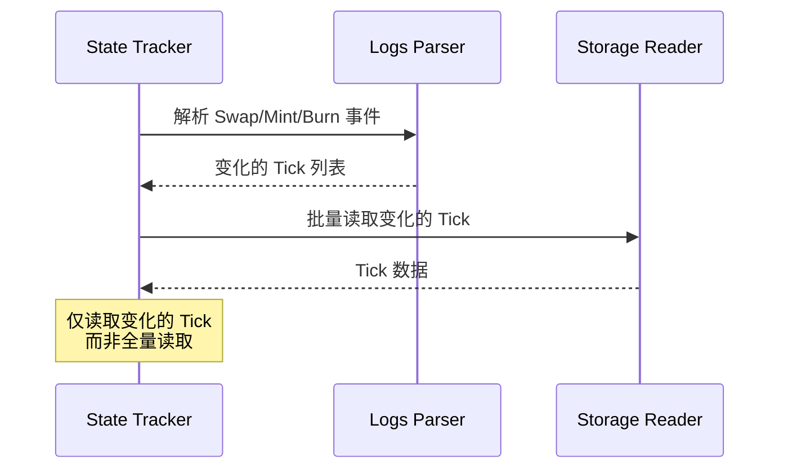

## 5. 批量优化策略

### 5.1 并行读取

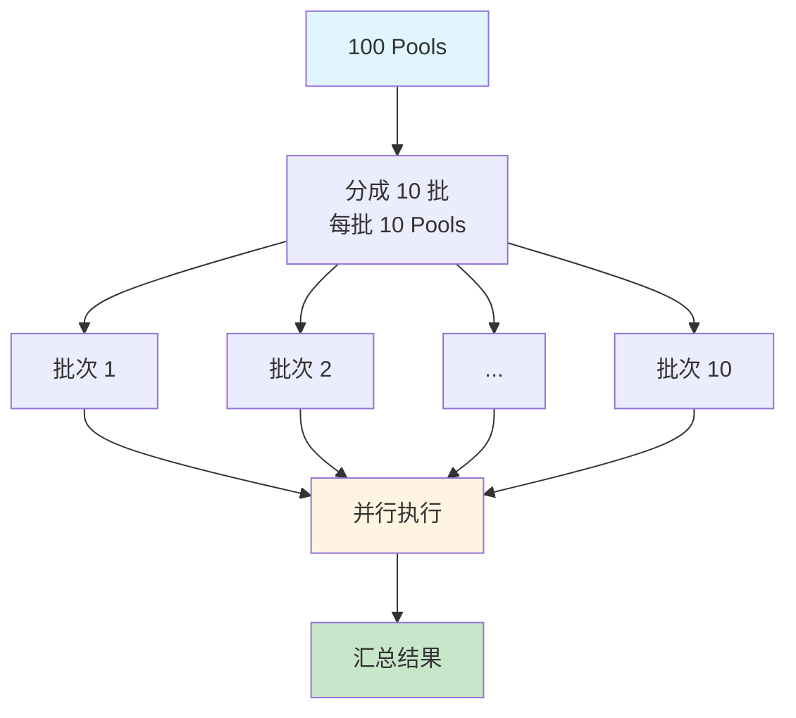

**并行度配置**：

| 场景 | Pool 数量 | 并行度 | 单批大小 | 预计延迟 |
|------|----------|--------|---------|---------|
| 少量 Pool | 10 | 10 | 1 | 5ms |
| 中等 Pool | 100 | 20 | 5 | 50ms |
| 大量 Pool | 1000 | 50 | 20 | 500ms |

### 5.2 批量 IO 优化

**Reth Storage 批量读取接口**：

| 接口 | 说明 | 性能 |
|------|------|------|
| 单次读取 | `get_storage(address, slot)` | 1-3ms/次 |
| 批量读取 | `batch_get_storage(Vec<(address, slot)>)` | 0.5-1ms/次 |

**收益分析**：

```
单次读取 100 Pools：100 × 2ms = 200ms
批量读取 100 Pools：100 × 0.5ms = 50ms
性能提升：75%
```

### 5.3 缓存优化

**多层缓存策略**：

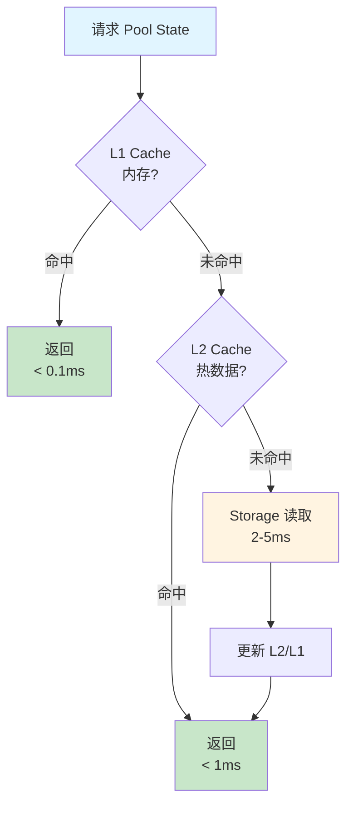

**缓存层级**：

| 层级 | 技术 | 容量 | 命中率 | 延迟 |
|------|------|------|--------|------|
| L1 | 内存 LRU | 100 Pools | 80% | < 0.1ms |
| L2 | 内存 LRU | 1000 Pools | 15% | < 1ms |
| Storage | RocksDB | 无限 | 5% | 2-5ms |

## 6. 错误处理流程

### 6.1 错误分类

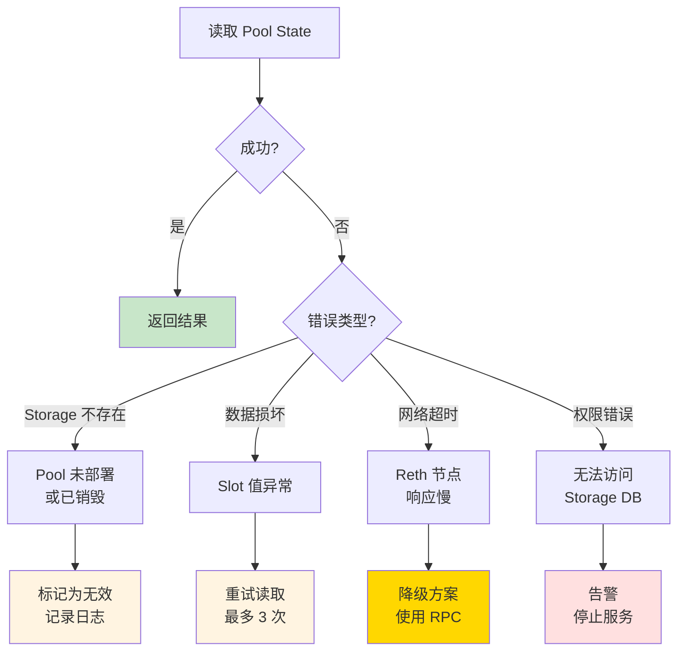

### 6.2 错误处理策略表

| 错误类型 | 原因 | 处理策略 | 影响 |
|---------|------|---------|------|
| Storage 不存在 | Pool 未部署或已销毁 | 标记为无效，跳过 | 单个 Pool 失败 |
| 数据损坏 | 节点数据损坏 | 重试 3 次 → 降级 RPC | 性能下降 |
| 读取超时 | 节点负载高 | 延长超时 → 降级 RPC | 性能下降 |
| 权限错误 | 配置错误 | 告警，停止服务 | 服务中断 |

### 6.3 重试策略

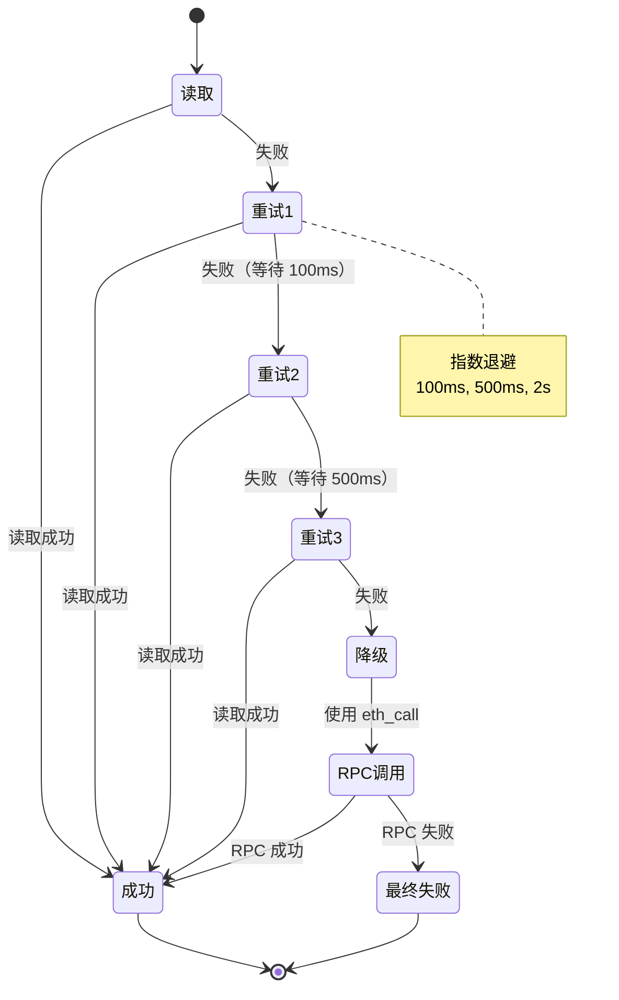

## 7. 性能基准

### 7.1 延迟基准

| 操作 | Pool 数量 | 延迟（P50） | 延迟（P99） |
|------|----------|------------|------------|
| 单 Pool（V2） | 1 | 1ms | 3ms |
| 单 Pool（V3） | 1 | 2ms | 5ms |
| 批量（V2） | 100 | 30ms | 50ms |
| 批量（V3） | 100 | 50ms | 100ms |
| 批量（混合） | 1000 | 400ms | 800ms |

### 7.2 吞吐量基准

| 场景 | QPS | 并发度 | CPU 占用 |
|------|-----|--------|---------|
| 单 Pool 查询 | 1000 | 1 | 10% |
| 批量 100 Pools | 100 | 10 | 50% |
| 批量 1000 Pools | 10 | 5 | 80% |

### 7.3 优化收益对比

| 优化项 | 优化前 | 优化后 | 改进 |
|-------|--------|--------|------|
| 并行读取 | 200ms (100 Pools) | 50ms | 75% |
| 批量 IO | 200ms | 50ms | 75% |
| 缓存（L1 命中） | 2ms | 0.1ms | 95% |
| 增量 Tick（V3） | 500ms | 50ms | 90% |

## 8. 监控指标

| 指标 | 说明 | 告警阈值 |
|------|------|---------|
| storage_read_latency | Storage 读取延迟 | P99 > 10ms |
| storage_read_errors | 读取错误次数 | > 10/分钟 |
| batch_read_size | 批量读取的 Pool 数量 | 平均 < 10 |
| cache_hit_rate | 缓存命中率 | < 70% |
| rpc_fallback_rate | 降级到 RPC 的比例 | > 5% |

---

## 9. 实现说明（2025-12-16）

### 9.1 已实现功能

Pool State Tracker 基础版本已实现，代码位于 `crates/exex/mev-pool-state-tracker/`。

#### 核心组件

1. **数据结构** (`raw_state.rs`)
   - ✅ `RawPoolState` 枚举
   - ✅ `UniswapV2State` 结构体
   - ✅ `UniswapV3State` 结构体（接口已保留，待实现）
   - ✅ Slot 8 解析逻辑（112+112+32 bits）
   - ✅ 数据验证方法

2. **State Tracker** (`tracker.rs`)
   - ✅ `PoolStateTracker<P>` 泛型结构
   - ✅ `track_pool_state()` - 单个 pool 读取
   - ✅ `track_multiple_states()` - 批量并发读取
   - ✅ `get_storage_slot()` - Slot 计算
   - ✅ 使用 Reth `StateProviderFactory` 接口
   - ✅ 完整的日志输出（info/debug/trace 三级）

3. **测试覆盖**
   - ✅ 8 个单元测试全部通过
   - ✅ 边界值测试（最大值、零值）
   - ✅ 随机值测试
   - ✅ 验证逻辑测试

#### 日志示例

```bash
# Info 级别
INFO 开始批量读取 Pool 状态 total_pools=100 block=1000000
INFO 按协议分组统计 uniswap_v2_pools=100 uniswap_v3_pools=0
INFO 成功读取 Pool 状态 pool=0x... elapsed_ms=2
INFO 批量读取完成 success=98 errors=2 elapsed_ms=150

# Debug 级别
DEBUG 开始读取 Pool 状态 pool=0x... protocol=UniswapV2
DEBUG 读取 UniswapV2 Slot 8 pool=0x... slot=8

# Trace 级别
TRACE UniswapV2 状态详情 reserve0=1000000 reserve1=2000000 timestamp=1234567890
```

#### 使用方法

```rust
use reth_exex_mev_pool_state_tracker::{PoolStateTracker, RawPoolState};
use reth_exex_mev_pool_discovery::ProtocolType;

// 创建 tracker（需要 StateProviderFactory）
let tracker = PoolStateTracker::new(provider_factory);

// 读取单个 Pool
let state = tracker.track_pool_state(
    pool_address,
    block_number,
    ProtocolType::UniswapV2
)?;

if let Some(RawPoolState::UniswapV2(v2_state)) = state {
    println!("Reserve0: {}", v2_state.reserve0);
    println!("Reserve1: {}", v2_state.reserve1);
}

// 批量读取
let pools = vec![
    (addr1, ProtocolType::UniswapV2),
    (addr2, ProtocolType::UniswapV2),
];
let states = tracker.track_multiple_states(pools, block_number).await?;
```

### 9.2 待实现功能

1. **UniswapV3 支持**
   - Slot 0 读取和解析（sqrtPriceX96, tick, observationIndex）
   - Slot 4 读取（liquidity）
   - Tick 数据读取（mapping）

2. **变化检测**
   - `DetectChangedPools` 方法实现
   - 基于交易分析的变化检测

3. **性能优化**
   - 状态缓存层
   - 更高级的批量优化

4. **测试增强**
   - 集成测试（需要测试数据或 Mock Reth 节点）
   - 性能基准测试

### 9.3 技术决策

| 决策项 | 选择 | 原因 |
|-------|------|------|
| 泛型设计 | `PoolStateTracker<P: StateProviderFactory>` | 支持不同的 Provider 实现，便于测试 |
| 异步并发 | tokio | 与 Reth 异步运行时一致 |
| 日志框架 | tracing | Reth 标准日志框架 |
| 测试策略 | 单元测试优先 | 避免复杂的 Mock 设置，快速验证核心逻辑 |

### 9.4 已知限制

1. **UniswapV3 未实现**：接口已保留，但解析逻辑待实现
2. **测试数据**：集成测试需要实际的区块链数据或完整的 Mock
3. **性能基准**：尚未在实际环境中进行基准测试
4. **缓存层**：目前直接读取 Storage，无缓存优化

### 9.5 相关文档

- **实现代码**: `crates/exex/mev-pool-state-tracker/`
- **使用文档**: `crates/exex/mev-pool-state-tracker/README.md`
- **前置依赖**: [04-Pool Discovery](./04-component-pool-discovery.md)
- **后续组件**: [06-State Converter](./06-component-state-converter.md)

---

**下一步**：阅读 [06-State Converter](./06-component-state-converter.md) 了解如何转换原始数据
