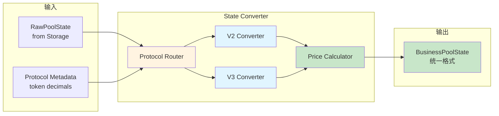
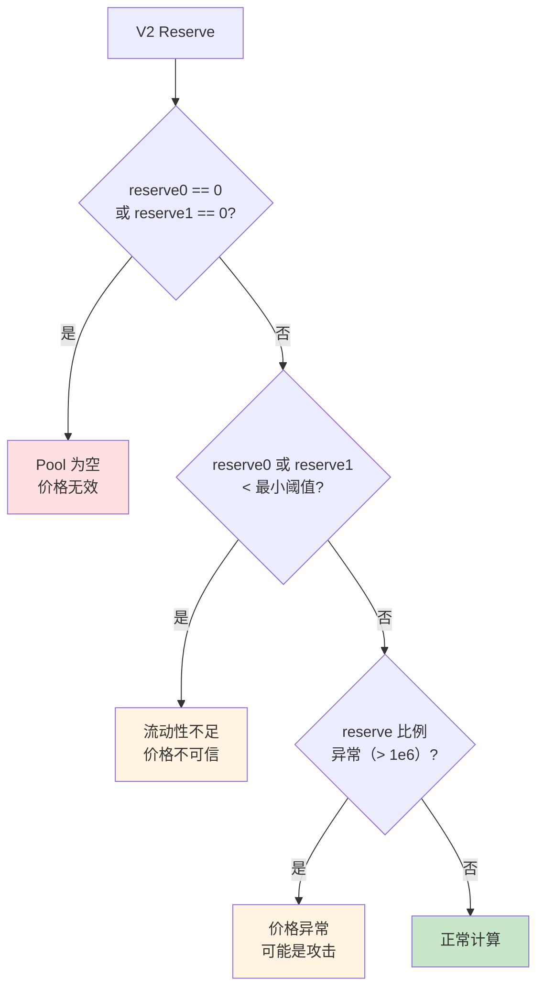
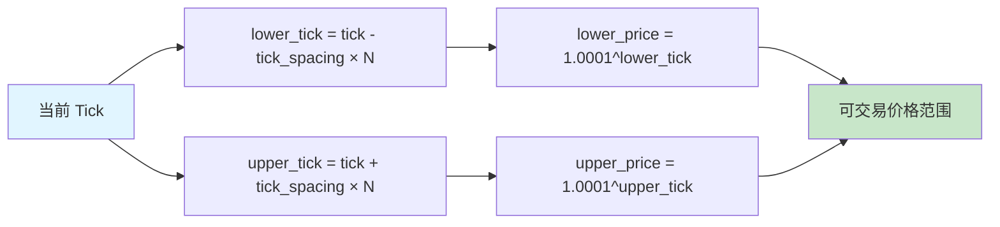
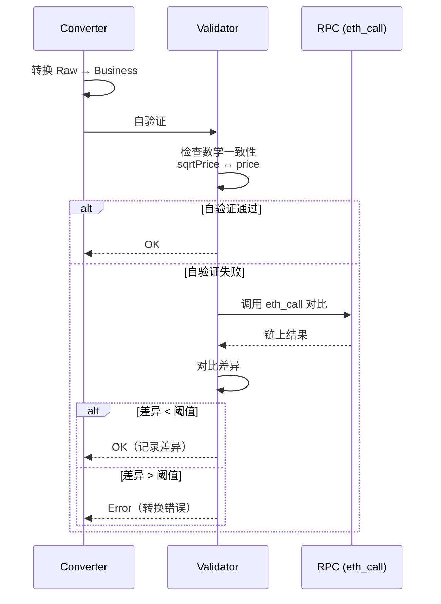
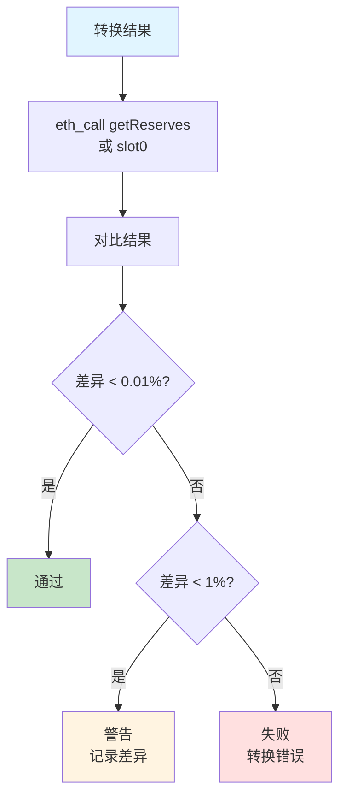
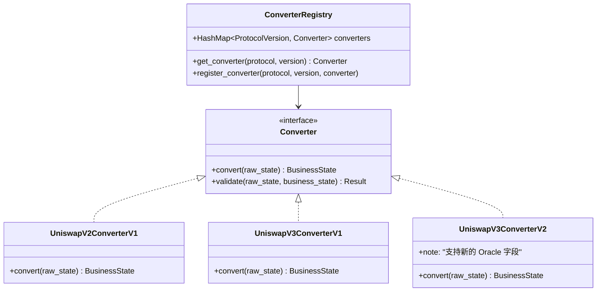
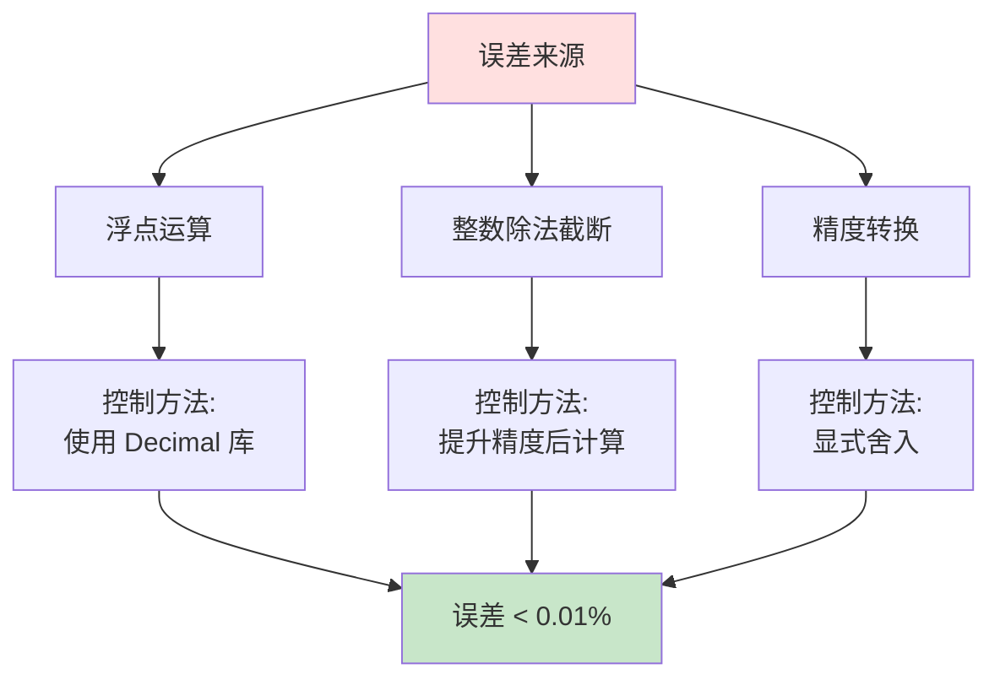
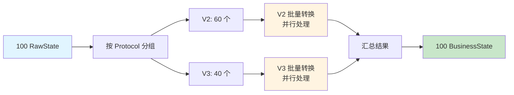

# 组件设计：State Converter

## 文档元信息

| 项目 | 内容 |
|------|------|
| 组件名称 | State Converter |
| 文档版本 | v1.0 |
| 创建日期 | 2025-12-12 |
| 最后更新 | 2025-12-12 |
| 文档状态 | 草稿 |
| 责任人 | 架构组 |

## 1. 组件概述

### 1.1 职责定义

State Converter 负责将底层 Raw Storage Data 转换为业务系统可用的标准格式，确保转换的**正确性**和**一致性**。

**核心职责**：

| 职责 | 说明 | 优先级 |
|------|------|--------|
| 数据转换 | 将 Raw State 转换为 Business State | P0 |
| 价格计算 | 根据 reserve/sqrt_price 计算交易价格 | P0 |
| 精度处理 | 处理浮点数精度，避免误差累积 | P0 |
| 格式统一 | 统一不同 Protocol 的 State 格式 | P1 |
| 版本管理 | 支持多版本转换逻辑共存 | P1 |

### 1.2 输入输出



### 1.3 接口设计表格

| 接口名称 | 输入参数 | 输出 | 用途 |
|---------|---------|------|------|
| `ConvertState` | raw_state, protocol, metadata | BusinessPoolState | 转换单个 Pool 状态 |
| `ConvertBatch` | Vec\<raw_state\>, metadata_map | Vec\<BusinessPoolState\> | 批量转换 |
| `CalculatePrice` | state, direction (0→1 or 1→0) | Price | 计算交易价格 |
| `ValidateConversion` | raw_state, business_state | Result\<(), Error\> | 验证转换正确性 |

## 2. 数据结构设计

### 2.1 BusinessPoolState（统一格式）

**表格定义**：

| 字段名 | 类型 | UniswapV2 | UniswapV3 | 说明 |
|-------|------|-----------|-----------|------|
| pool_id | String | ✓ | ✓ | Pool 合约地址 |
| protocol_id | Enum | ✓ | ✓ | UniswapV2 / UniswapV3 |
| block_number | u64 | ✓ | ✓ | 状态对应的区块号 |
| tx_index | u32 | ✓ | ✓ | 交易索引 |
| token0 | Address | ✓ | ✓ | Token0 地址 |
| token1 | Address | ✓ | ✓ | Token1 地址 |
| **价格字段** | | | | |
| price_0_to_1 | Decimal | ✓ | ✓ | Token0 换 Token1 的价格 |
| price_1_to_0 | Decimal | ✓ | ✓ | Token1 换 Token0 的价格 |
| **V2 特有字段** | | | | |
| reserve0 | U256 | ✓ | - | Token0 储备量（原始单位） |
| reserve1 | U256 | ✓ | - | Token1 储备量（原始单位） |
| **V3 特有字段** | | | | |
| sqrt_price_x96 | U256 | - | ✓ | 当前价格的平方根（Q64.96） |
| tick | i32 | - | ✓ | 当前 Tick |
| liquidity | u128 | - | ✓ | 当前流动性 |
| **元数据** | | | | |
| fee_rate | u32 | ✓ | ✓ | 手续费率（bps） |
| timestamp | u64 | ✓ | ✓ | 区块时间戳 |

### 2.2 Protocol Metadata

**Token 元数据**：

| 字段 | 类型 | 说明 | 来源 |
|------|------|------|------|
| token_address | Address | Token 合约地址 | Pool Metadata |
| decimals | u8 | 精度（如 USDC = 6, WETH = 18） | eth_call getDecimals() |
| symbol | String | Token 符号（如 "USDC"） | eth_call symbol() |
| is_stable | bool | 是否稳定币 | 配置文件 |

## 3. UniswapV2 转换逻辑

### 3.1 V2 数据流

```mermaid
flowchart TD
    A[RawPoolState<br/>reserve0, reserve1] --> B[提取数值]
    B --> C{Decimals 相同?}
    
    C -->|是| D[直接计算<br/>price = reserve1 / reserve0]
    C -->|否| E[标准化<br/>reserve0_std = reserve0 / 10^decimals0<br/>reserve1_std = reserve1 / 10^decimals1]
    
    E --> F[计算价格<br/>price_0_to_1 = reserve1_std / reserve0_std]
    D --> F
    
    F --> G[计算反向价格<br/>price_1_to_0 = 1 / price_0_to_1]
    
    G --> H[应用手续费<br/>实际价格 = price × (1 - fee_rate)]
    
    H --> I[BusinessPoolState]
    
    style A fill:#e1f5ff
    style F fill:#fff4e1
    style I fill:#c8e6c9
```

### 3.2 V2 价格计算公式

**基本公式**：

$$
\text{price}_{0 \to 1} = \frac{\text{reserve}_1 \times 10^{\text{decimals}_0}}{\text{reserve}_0 \times 10^{\text{decimals}_1}}
$$

**考虑手续费**：

$$
\text{actual\_price}_{0 \to 1} = \text{price}_{0 \to 1} \times (1 - \text{fee\_rate})
$$

**示例计算**：

| 场景 | reserve0 | reserve1 | decimals0 | decimals1 | fee_rate | price_0_to_1 |
|------|----------|----------|-----------|-----------|----------|--------------|
| WETH/USDC | 100 ETH | 200,000 USDC | 18 | 6 | 0.3% | 2000 × 0.997 = 1994 |
| USDC/WETH | 200,000 USDC | 100 ETH | 6 | 18 | 0.3% | 0.0005 × 0.997 |

### 3.3 V2 边界情况处理



**边界规则表**：

| 情况 | 检测条件 | 处理策略 |
|------|---------|---------|
| Pool 为空 | reserve0 == 0 或 reserve1 == 0 | 标记为无效 |
| 流动性极低 | reserve0 < 1e6 或 reserve1 < 1e6 | 标记为低置信度 |
| 价格异常 | price > 1e18 或 price < 1e-18 | 标记为异常 |
| 精度溢出 | 计算中间值 > U256::MAX | 使用高精度库 |

## 4. UniswapV3 转换逻辑

### 4.1 V3 数据流

```mermaid
flowchart TD
    A[RawPoolState<br/>sqrtPriceX96, liquidity, tick] --> B[解码 sqrtPriceX96]
    B --> C[sqrtPrice = sqrtPriceX96 / 2^96]
    C --> D[计算价格<br/>price = sqrtPrice^2]
    
    D --> E{Decimals 相同?}
    E -->|否| F[标准化<br/>price_adj = price × 10^(decimals1 - decimals0)]
    E -->|是| G[直接使用 price]
    
    F --> H[price_0_to_1]
    G --> H
    
    H --> I[计算反向价格<br/>price_1_to_0 = 1 / price_0_to_1]
    
    I --> J[应用手续费<br/>实际价格 = price × (1 - fee_rate)]
    
    J --> K[BusinessPoolState]
    
    style A fill:#e1f5ff
    style D fill:#fff4e1
    style K fill:#c8e6c9
```

### 4.2 V3 价格计算公式

**从 sqrtPriceX96 计算价格**：

$$
\text{sqrtPrice} = \frac{\text{sqrtPriceX96}}{2^{96}}
$$

$$
\text{price}_{0 \to 1} = (\text{sqrtPrice})^2 \times 10^{\text{decimals}_1 - \text{decimals}_0}
$$

**从 Tick 计算价格**（验证用）：

$$
\text{price}_{0 \to 1} = 1.0001^{\text{tick}} \times 10^{\text{decimals}_1 - \text{decimals}_0}
$$

**示例计算**：

| 场景 | sqrtPriceX96 | tick | decimals0 | decimals1 | price_0_to_1 |
|------|--------------|------|-----------|-----------|--------------|
| WETH/USDC | 1.41 × 2^96 | 200000 | 18 | 6 | ~2000 |
| USDC/WETH | 0.707 × 2^96 | -200000 | 6 | 18 | ~0.0005 |

### 4.3 V3 边界情况处理

```mermaid
flowchart TD
    A[V3 sqrtPriceX96] --> B{sqrtPriceX96 == 0?}
    
    B -->|是| C[Pool 未初始化<br/>无效]
    B -->|否| D{liquidity == 0?}
    
    D -->|是| E[无流动性<br/>不可交易]
    D -->|否| F{tick 超出范围<br/>[-887272, 887272]?}
    
    F -->|是| G[Tick 异常<br/>数据损坏]
    F -->|否| H{sqrtPrice 与 tick<br/>不一致?}
    
    H -->|是| I[数据不一致<br/>可能 Reorg]
    H -->|否| J[正常计算]
    
    style C fill:#ffe0e0
    style E fill:#fff4e1
    style G fill:#ffe0e0
    style I fill:#fff4e1
    style J fill:#c8e6c9
```

**V3 特殊规则表**：

| 情况 | 检测条件 | 处理策略 |
|------|---------|---------|
| 未初始化 | sqrtPriceX96 == 0 | 标记为无效 |
| 无流动性 | liquidity == 0 | 标记为不可交易 |
| Tick 超范围 | tick < -887272 或 > 887272 | 标记为异常 |
| sqrtPrice/tick 不一致 | abs(calc_tick - tick) > 1 | 标记为疑似 Reorg |

### 4.4 V3 Tick 范围计算

**当前可交易价格范围**：



**示例**：

| Fee Tier | Tick Spacing | 当前 Tick | 可交易范围（±10 Ticks） |
|----------|-------------|----------|----------------------|
| 0.05% | 10 | 200000 | [199900, 200100] |
| 0.3% | 60 | 200000 | [199400, 200600] |
| 1% | 200 | 200000 | [198000, 202000] |

## 5. 转换正确性验证策略

### 5.1 自验证机制



### 5.2 验证规则表

| 验证项 | V2 规则 | V3 规则 | 允许误差 |
|-------|---------|---------|---------|
| **价格一致性** | price × reserve0 ≈ reserve1 | - | < 0.01% |
| **sqrtPrice 一致性** | - | (sqrtPrice)^2 ≈ price | < 0.01% |
| **Tick 一致性** | - | 1.0001^tick ≈ price | ±1 tick |
| **反向价格** | price_0_to_1 × price_1_to_0 ≈ 1 | 同左 | < 0.01% |
| **精度不溢出** | reserve < U256::MAX | sqrtPrice < U256::MAX | 无溢出 |

### 5.3 对比验证流程

**与 eth_call 对比**：



**采样策略**：

| 验证类型 | 采样比例 | 触发条件 |
|---------|---------|---------|
| 全量验证 | 100% | 开发/测试环境 |
| 抽样验证 | 10% | 生产环境（随机抽样） |
| 定向验证 | 100% | 新 Pool 首次转换 |
| 异常验证 | 100% | 自验证失败时 |

## 6. 版本管理策略

### 6.1 版本化设计

**问题**：如何支持合约升级或协议变更？

**解决方案**：版本化 Converter



### 6.2 版本识别策略

| 方法 | 说明 | 优先级 |
|------|------|--------|
| 合约代码 Hash | 通过合约字节码识别版本 | P0 |
| 创建区块号 | 根据 Pool 创建时间推断版本 | P1 |
| 手动配置 | 维护 Pool → Version 映射表 | P2 |

### 6.3 版本迁移流程

```mermaid
stateDiagram-v2
    [*] --> V1: Pool 创建
    V1 --> V2: 合约升级
    
    state V1 {
        [*] --> 使用 ConverterV1
    }
    
    state V2 {
        [*] --> 检测升级
        检测升级 --> 切换到 ConverterV2
        切换到 ConverterV2 --> 重新转换历史 State
    }
    
    note right of V2: 升级检测<br/>1. 监听 Upgrade 事件<br/>2. 定期检查合约代码
```

## 7. 精度处理和误差控制

### 7.1 精度策略

| 数据类型 | 存储类型 | 计算类型 | 精度 |
|---------|---------|---------|------|
| reserve (V2) | U256 | Decimal (U256 + scale) | 18 位小数 |
| sqrtPriceX96 (V3) | U256 | Q64.96 Fixed Point | 96 位小数 |
| Price | Decimal | Decimal (U256 + scale) | 18 位小数 |
| Fee Rate | u32 (bps) | Decimal | 2 位小数 |

### 7.2 误差来源和控制



**误差控制表**：

| 误差源 | 原因 | 控制方法 | 允许误差 |
|-------|------|---------|---------|
| 浮点运算 | sqrt, power | 使用 Decimal 或 Fixed Point | < 0.001% |
| 整数除法 | reserve1 / reserve0 | 先乘后除，保留精度 | < 0.001% |
| Decimals 转换 | 10^decimals | 使用 U256 防止溢出 | 无误差 |
| 舍入误差 | 最后一位舍入 | 统一使用 round-down | < 1 wei |

## 8. 性能优化

### 8.1 批量转换优化



**性能基准**：

| 操作 | Pool 数量 | 延迟（串行） | 延迟（并行） | 改进 |
|------|----------|------------|------------|------|
| V2 转换 | 100 | 50ms | 10ms | 80% |
| V3 转换 | 100 | 100ms | 20ms | 80% |

### 8.2 缓存中间结果

| 缓存项 | 用途 | 命中率 | 收益 |
|-------|------|--------|------|
| Token Decimals | 避免重复查询 | 99% | 延迟降低 50% |
| Price Oracle | 价格异常检测 | 80% | 延迟降低 30% |

## 9. 监控指标

| 指标 | 说明 | 告警阈值 |
|------|------|---------|
| conversion_latency | 转换延迟 | P99 > 20ms |
| conversion_errors | 转换错误次数 | > 10/分钟 |
| validation_failures | 验证失败次数 | > 5% |
| precision_errors | 精度误差超阈值 | > 1/小时 |

---

**下一步**：阅读 [07-State Validator](./07-component-state-validator.md) 了解验证策略
