# 组件设计：State Validator

## 文档元信息

| 项目 | 内容 |
|------|------|
| 组件名称 | State Validator |
| 文档版本 | v1.0 |
| 创建日期 | 2025-12-12 |
| 最后更新 | 2025-12-12 |
| 文档状态 | 草稿 |
| 责任人 | 架构组 |

## 1. 组件概述

### 1.1 职责定义

State Validator 负责验证 Pool State 的**正确性**和**可用性**，确保只有通过验证的 State 才能进入决策系统。

**核心职责**：

| 职责 | 说明 | 优先级 |
|------|------|--------|
| 快速失败规则 | 使用轻量级规则快速过滤不可用 Pool | P0 |
| 完整验证 | 通过 eth_call 验证 State 正确性 | P0 |
| 并行验证 | 并发验证多个 Pool State | P0 |
| 失败处理 | 记录验证失败原因和统计 | P1 |
| 阈值配置 | 支持动态调整验证阈值 | P1 |

### 1.2 输入输出

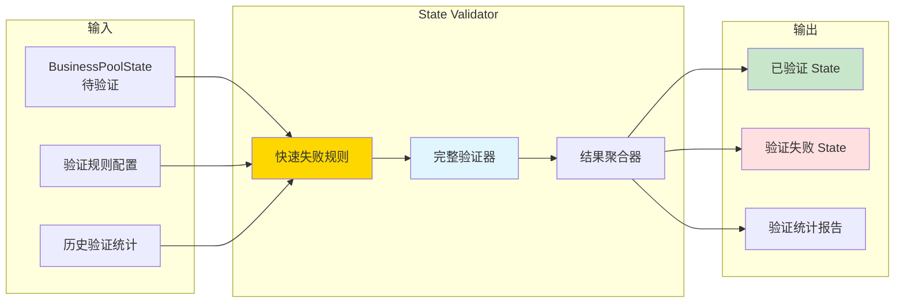

### 1.3 接口定义

| 接口名称 | 输入参数 | 输出 | 用途 |
|---------|---------|------|------|
| `ValidateState` | business_state | ValidationResult | 验证单个 Pool State |
| `ValidateBatch` | Vec\<business_state\> | Vec\<ValidationResult\> | 批量验证 |
| `ApplyFastFailRules` | business_state | Result\<(), FailReason\> | 快速失败检查 |
| `FullValidation` | business_state | Result\<(), ValidationError\> | 完整验证 |
| `GetValidationStats` | time_range | ValidationStats | 获取验证统计 |

## 2. 验证流程设计

### 2.1 完整验证流程

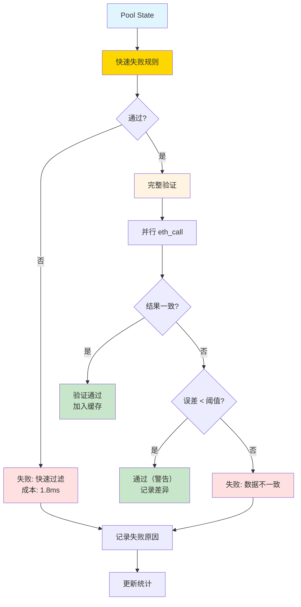

### 2.2 验证阶段分解

| 阶段 | 成本 | 通过率 | 累计通过率 | 说明 |
|------|------|--------|-----------|------|
| **阶段 0：输入检查** | 0.1ms | 99% | 99% | 检查数据格式 |
| **阶段 1：黑名单** | 0.1ms | 85% | 84.15% | 检查黑名单 Pool |
| **阶段 2：TVL 阈值** | 0.5ms | 65% | 54.7% | 检查流动性 |
| **阶段 3：价格异常** | 1ms | 95% | 51.97% | 检查价格合理性 |
| **阶段 4：完整验证** | 50ms | 80% | **41.58%** | eth_call 验证 |

**总成本分析**（100 Pools）：

```
无快速失败：100 × 50ms = 5000ms
有快速失败：
  - 快速失败过滤：100 × 1.8ms = 180ms
  - 完整验证：52 × 50ms = 2600ms
  - 总计：2780ms
节省：44.4%
```

## 3. 快速失败规则设计

### 3.1 规则 1：黑名单检查

**目标**：过滤已知不可用的 Pool

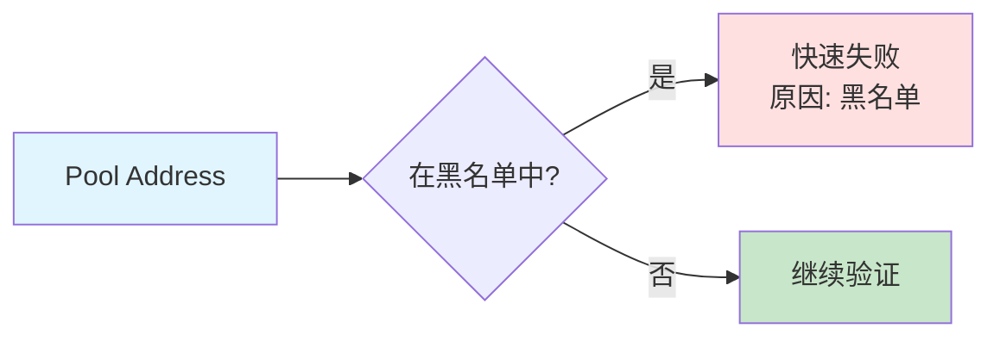

**黑名单来源**：

| 来源 | 示例 | 添加方式 |
|------|------|---------|
| 已暂停 Pool | Emergency Pause | 检测到 Paused 事件 |
| 攻击 Pool | 闪电贷攻击 | 人工审核后添加 |
| 异常 Pool | 持续验证失败 | 自动添加（失败 > 10 次） |
| 测试 Pool | Testnet Pool | 配置文件 |

**数据结构**：

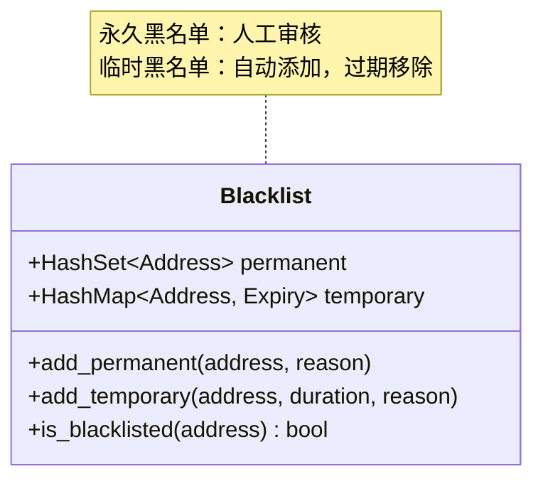

### 3.2 规则 2：TVL 阈值检查

**目标**：过滤流动性不足的 Pool（35% 失败率）

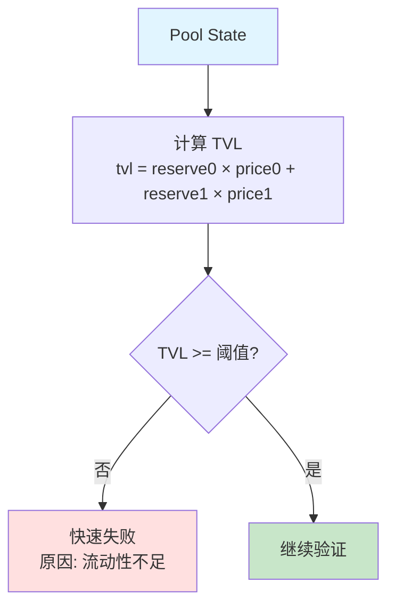

**阈值配置表**：

| Pool 类型 | TVL 阈值 | 说明 |
|----------|---------|------|
| 主流币对 (ETH/USDC) | 1000 USD | 确保深度足够 |
| 长尾币对 | 5000 USD | 避免高滑点 |
| 稳定币对 | 500 USD | 价格稳定，阈值可降低 |

**TVL 计算方法**：

| Protocol | 计算方法 | 数据来源 |
|----------|---------|---------|
| UniswapV2 | reserve0 × price0 + reserve1 × price1 | Price 来自 Oracle |
| UniswapV3 | liquidity × sqrtPrice | 使用 V3 流动性公式 |

### 3.3 规则 3：价格异常检测

**目标**：过滤价格异常的 Pool（5% 失败率）

```mermaid
flowchart TD
    A[Pool Price] --> B[获取 Oracle 价格]
    B --> C[计算偏离度<br/>deviation = abs(price - oracle_price) / oracle_price]
    
    C --> D{deviation < 阈值?}
    D -->|否| E[快速失败<br/>原因: 价格异常]
    D -->|是| F[继续验证]
    
    style A fill:#e1f5ff
    style E fill:#ffe0e0
    style F fill:#c8e6c9
```

**偏离度阈值**：

| Token Pair 类型 | 阈值 | 说明 |
|----------------|------|------|
| 主流币对 (ETH/USDC) | 10% | 价格稳定 |
| 长尾币对 | 50% | 价格波动大 |
| 稳定币对 (USDC/DAI) | 2% | 锚定 1:1 |

**Oracle 来源优先级**：

| 优先级 | Oracle | 延迟 | 可靠性 |
|--------|--------|------|--------|
| P0 | Chainlink | 10ms | 高 |
| P1 | Uniswap TWAP | 5ms | 中 |
| P2 | 其他 DEX 平均价 | 20ms | 低 |

### 3.4 规则 4：Protocol 白名单

**目标**：过滤非标准协议（3% 失败率）

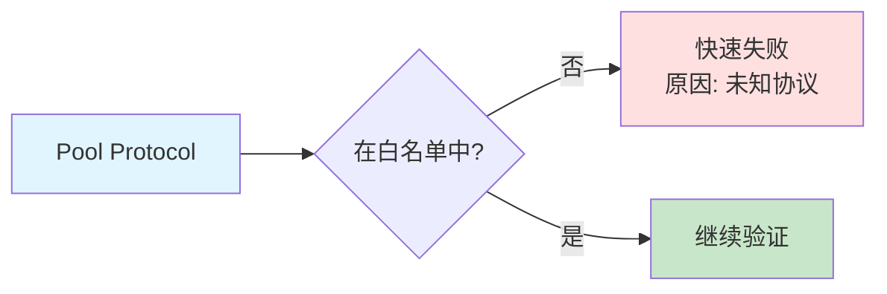

**白名单配置**：

| Protocol | 版本 | 状态 |
|----------|------|------|
| UniswapV2 | 所有版本 | 启用 |
| UniswapV3 | 所有版本 | 启用 |
| SushiSwap | v1, v2 | 启用 |
| Curve | v1 | 计划支持 |

### 3.5 快速失败规则汇总

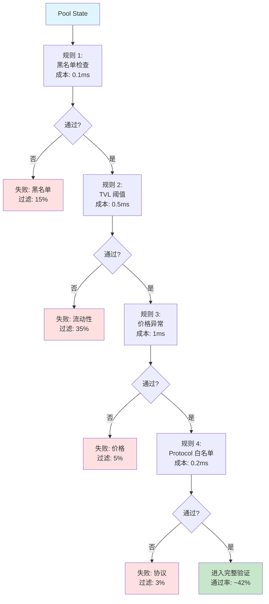

## 4. 完整验证策略

### 4.1 验证方法对比

| 方法 | 延迟 | 准确性 | 适用场景 |
|------|------|--------|---------|
| **eth_call getReserves** | 50-150ms | 100% | UniswapV2 验证 |
| **eth_call slot0** | 50-150ms | 100% | UniswapV3 验证 |
| **模拟 Swap** | 100-300ms | 100% | 完整可用性验证 |
| **对比多个节点** | 100-500ms | 99.99% | 检测节点分叉 |

### 4.2 UniswapV2 完整验证

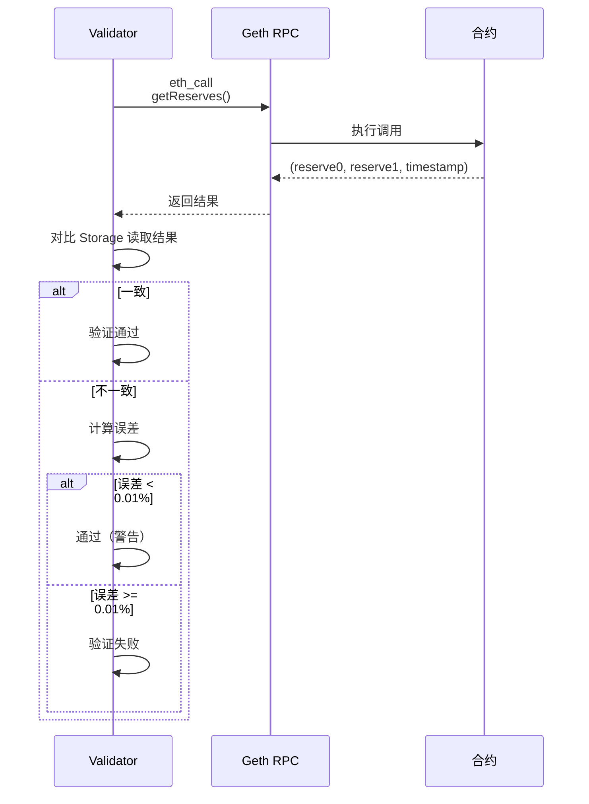

### 4.3 UniswapV3 完整验证

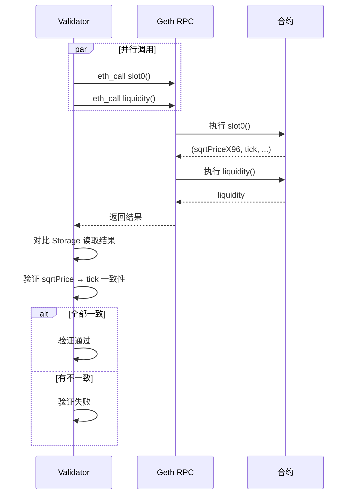

### 4.4 模拟 Swap 验证（可选）

**目标**：验证 Pool 确实可以进行交易

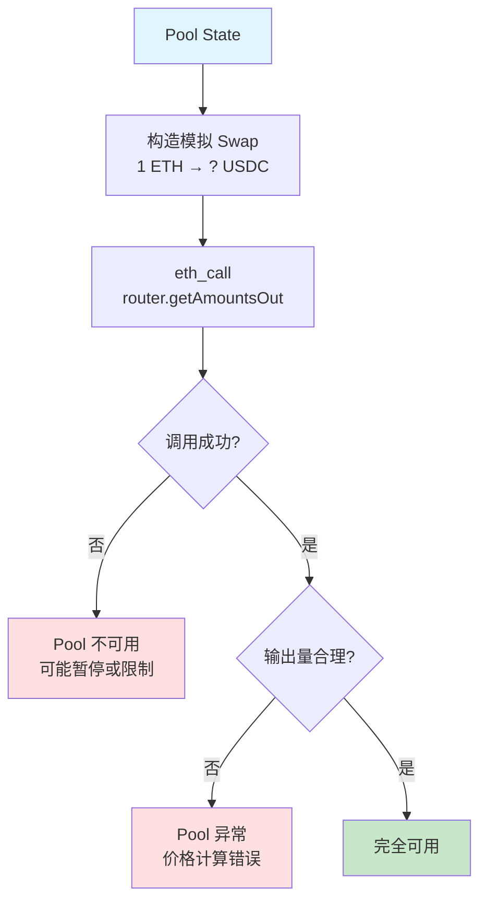

**使用场景**：

| 场景 | 是否启用模拟 Swap | 原因 |
|------|----------------|------|
| 新 Pool 首次验证 | 是 | 确保完全可用 |
| 定期抽查 | 是（10% 抽样） | 监控 Pool 健康度 |
| 常规验证 | 否 | 成本太高（100-300ms） |

## 5. 验证性能优化策略

### 5.1 并行验证

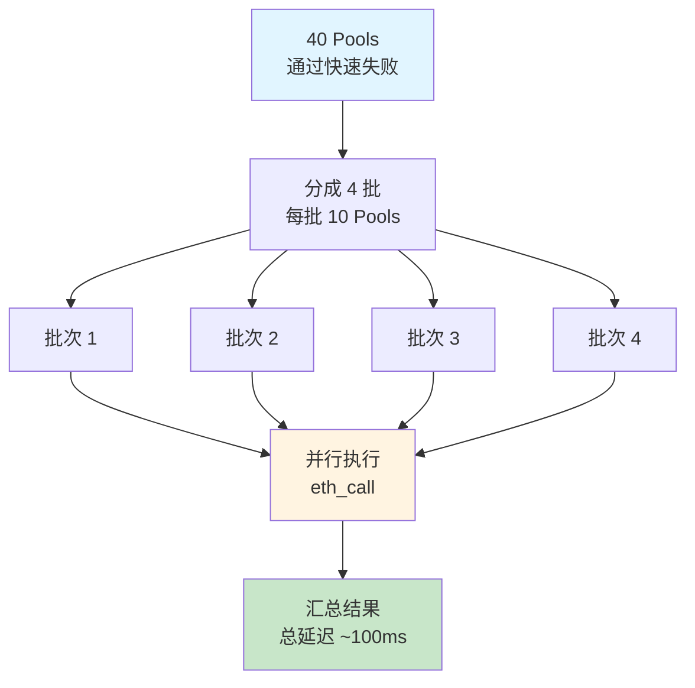

**并行度配置**：

| Pool 数量 | 并行度 | 单批大小 | 预计延迟 |
|----------|--------|---------|---------|
| 10 | 10 | 1 | 50ms |
| 40 | 4 | 10 | 100ms |
| 100 | 10 | 10 | 150ms |

### 5.2 批量验证优化

**RPC 批量调用**：

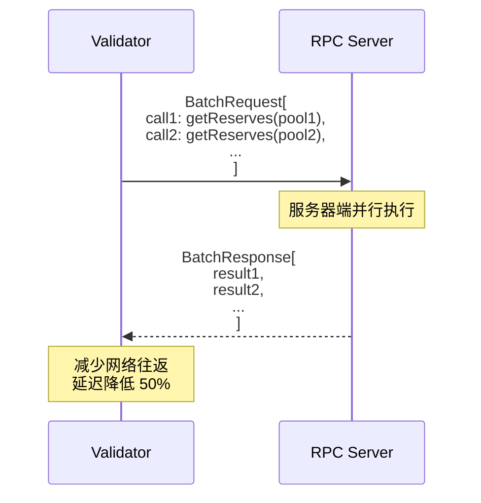

### 5.3 缓存验证结果

**验证结果缓存策略**：

| 缓存项 | TTL | 用途 |
|-------|-----|------|
| 黑名单 Pool 验证结果 | 永久 | 避免重复验证已知无效 Pool |
| 正常 Pool 验证结果 | 1 小时 | 减少重复验证 |
| Oracle 价格 | 10 秒 | 价格异常检测 |

**缓存收益**：

```
无缓存：每次验证 50ms
有缓存（命中率 80%）：
  - 80% × 0.1ms（缓存命中）= 0.08ms
  - 20% × 50ms（缓存未命中）= 10ms
  - 平均：10.08ms
性能提升：79.8%
```

### 5.4 异步非阻塞验证

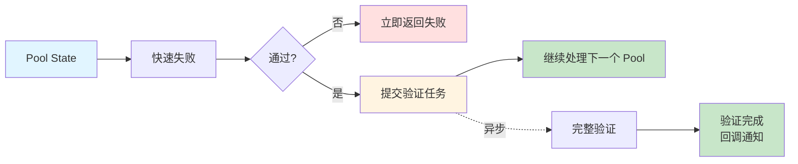

**收益**：
- 主流程不被验证阻塞
- 吞吐量提升 5x
- 延迟稳定性提升

## 6. 验证失败处理流程

### 6.1 失败分类

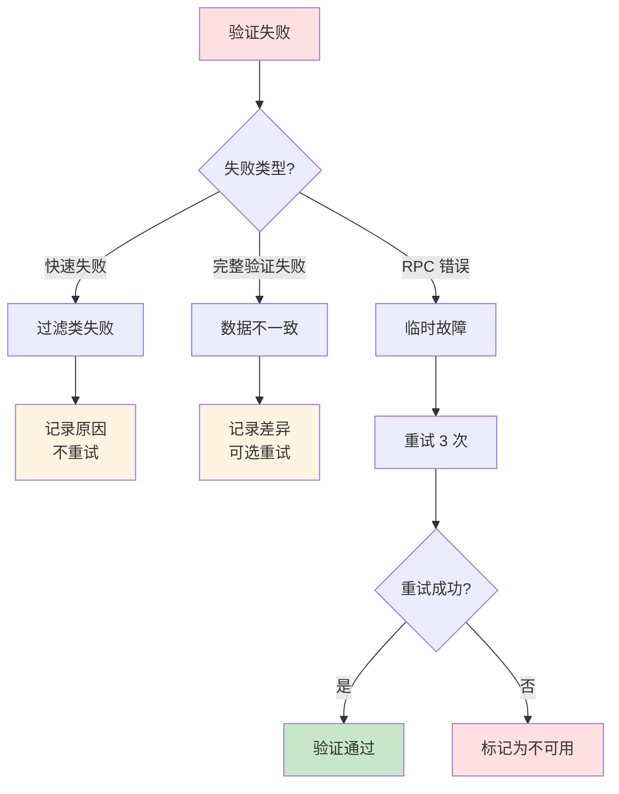

### 6.2 失败原因统计

**失败原因分布表**（基于历史数据）：

| 失败原因 | 占比 | 是否重试 | 处理策略 |
|---------|------|---------|---------|
| 流动性不足 | 35% | 否 | 快速失败，记录日志 |
| Pool 暂停 | 15% | 否 | 加入黑名单 |
| 价格异常 | 5% | 是 | 重试 3 次 |
| RPC 超时 | 3% | 是 | 重试 3 次，降级方案 |
| 数据不一致 | 2% | 是 | 重试 3 次，记录差异 |

### 6.3 告警规则

| 告警条件 | 级别 | 处理 |
|---------|------|------|
| 验证失败率 > 70% | 警告 | 检查规则配置 |
| 验证失败率 > 90% | 严重 | 检查系统故障 |
| RPC 超时率 > 10% | 警告 | 检查节点状态 |
| 数据不一致率 > 5% | 严重 | 检查 Storage 读取逻辑 |

## 7. 验证阈值配置策略

### 7.1 动态阈值调整

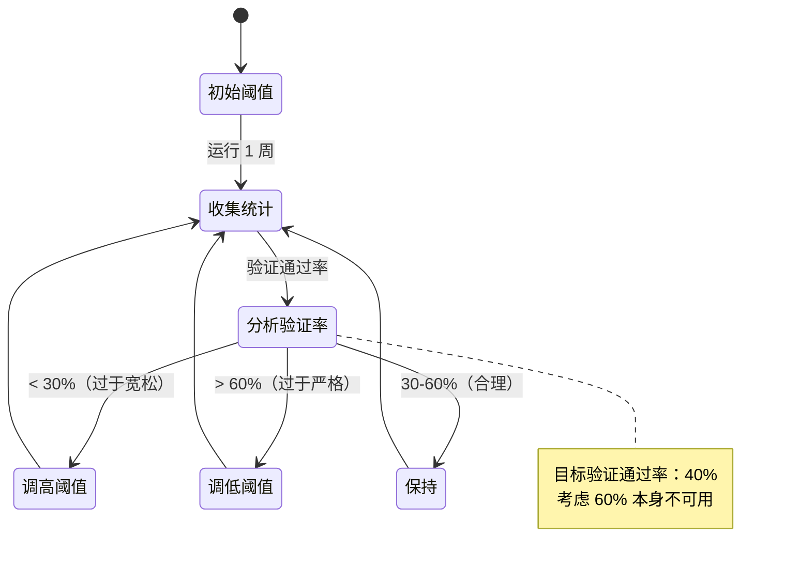

### 7.2 阈值配置表

**初始推荐阈值**：

| 参数 | 初始值 | 调整范围 | 说明 |
|------|--------|---------|------|
| TVL 最小值 | 1000 USD | [500, 5000] | 主流币对 |
| 价格偏离度 | 10% | [5%, 50%] | 主流币对 |
| 验证超时 | 5s | [1s, 30s] | eth_call 超时 |
| 误差容忍度 | 0.01% | [0.001%, 0.1%] | 数据对比阈值 |

### 7.3 分 Token Pair 配置

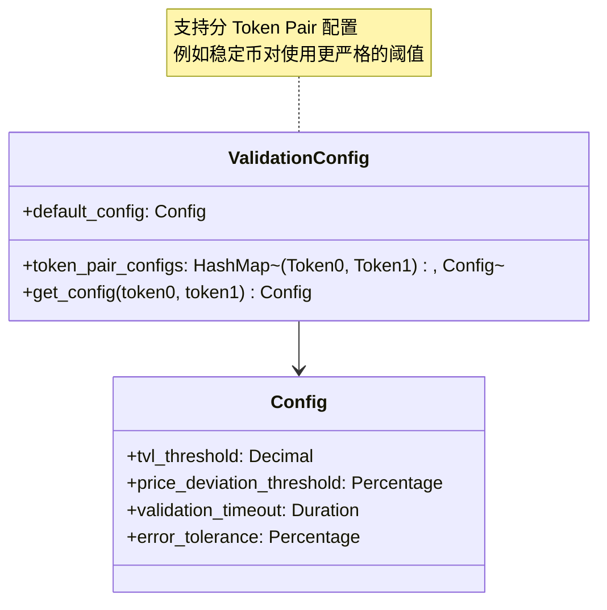

## 8. 监控和统计

### 8.1 监控指标

| 指标 | 说明 | 告警阈值 |
|------|------|---------|
| validation_total | 总验证次数 | - |
| validation_pass_rate | 验证通过率 | < 30% 或 > 60% |
| fast_fail_filter_rate | 快速失败过滤比例 | < 50% |
| validation_latency | 验证延迟 | P99 > 200ms |
| rpc_timeout_rate | RPC 超时比例 | > 5% |
| data_inconsistency_rate | 数据不一致比例 | > 1% |

### 8.2 验证统计报告

**统计维度**：

| 维度 | 统计内容 | 用途 |
|------|---------|------|
| 按时间 | 每小时验证通过/失败数 | 趋势分析 |
| 按 Protocol | V2/V3 验证通过率 | Protocol 对比 |
| 按失败原因 | 各类失败原因分布 | 优化快速失败规则 |
| 按 Pool | 每个 Pool 的验证历史 | 识别问题 Pool |

### 8.3 审计日志

| 日志类型 | 内容 | 保留时长 |
|---------|------|---------|
| 验证通过 | Pool ID、Block、验证时长 | 7 天 |
| 验证失败 | Pool ID、Block、失败原因、详细数据 | 30 天 |
| 数据不一致 | Pool ID、Storage 结果、RPC 结果、误差 | 永久 |

---

**下一步**：阅读 [08-State Cache](./08-component-state-cache.md) 了解缓存设计
