# 组件设计：Verified State Cache

## 文档元信息

| 项目 | 内容 |
|------|------|
| 组件名称 | Verified State Cache |
| 文档版本 | v1.0 |
| 创建日期 | 2025-12-12 |
| 最后更新 | 2025-12-12 |
| 文档状态 | 草稿 |
| 责任人 | 架构组 |

## 1. 组件概述

### 1.1 职责定义

Verified State Cache 负责缓存**已验证**的 Pool State，提供高性能查询服务，并保证**原子性**和**一致性**。

**核心职责**：

| 职责 | 说明 | 优先级 |
|------|------|--------|
| State 缓存 | 存储已验证的 Pool State | P0 |
| 多维查询 | 支持按 Block、Pool、Tx 查询 | P0 |
| Reorg 处理 | 原子回滚无效 Block | P0 |
| 一致性保证 | 保证同一 Block 的 State 原子性 | P0 |
| 内存管理 | LRU 淘汰 + 持久化 | P1 |

### 1.2 输入输出

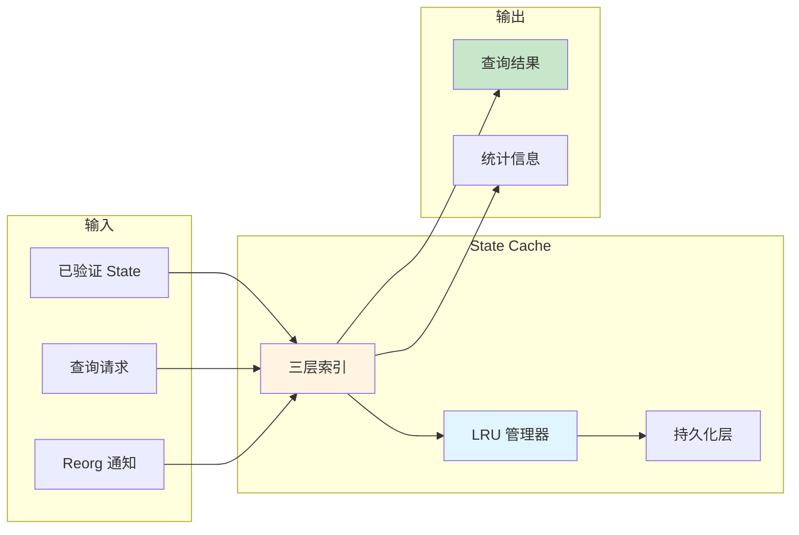

### 1.3 接口定义

| 接口名称 | 输入参数 | 输出 | 用途 |
|---------|---------|------|------|
| `InsertState` | block, pool_id, state | Result | 插入已验证 State |
| `InsertBlockBatch` | block, Vec\<state\> | Result | 原子插入一个 Block 的所有 State |
| `GetLatestState` | pool_id | Option\<State\> | 查询 Pool 最新 State |
| `GetStateAtBlock` | pool_id, block_number | Option\<State\> | 查询指定区块的 State |
| `GetBlockStates` | block_number | Vec\<State\> | 查询指定区块的所有 State |
| `HandleReorg` | invalid_blocks | Result | 处理区块重组 |
| `GetCacheStats` | - | CacheStats | 获取缓存统计 |

## 2. 数据结构设计

### 2.1 三层索引结构

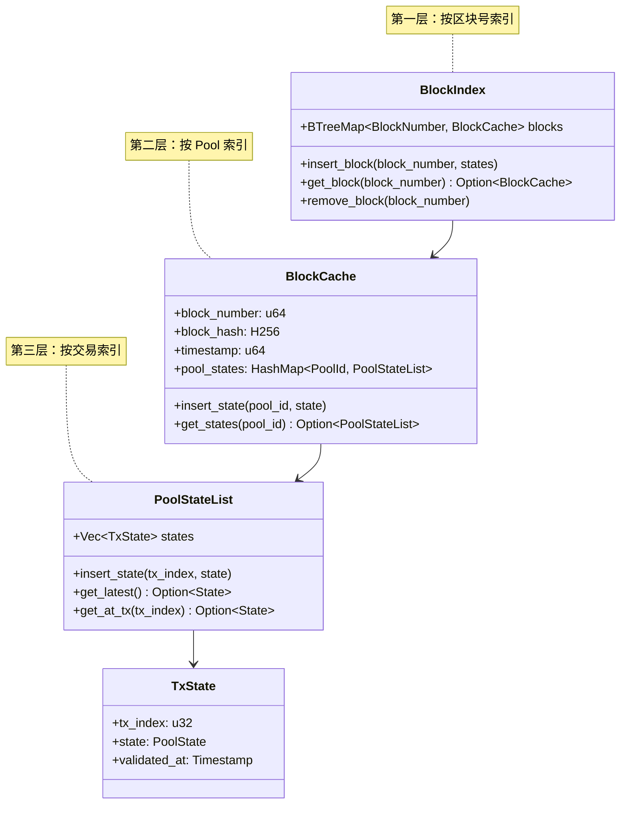

### 2.2 数据结构字段表

**BlockCache 字段**：

| 字段名 | 类型 | 必选 | 说明 |
|-------|------|------|------|
| block_number | u64 | ✓ | 区块号 |
| block_hash | H256 | ✓ | 区块 Hash（用于 Reorg 检测） |
| parent_hash | H256 | ✓ | 父区块 Hash |
| timestamp | u64 | ✓ | 区块时间戳 |
| pool_states | HashMap | ✓ | Pool ID → PoolStateList |
| is_finalized | bool | ✓ | 是否已最终确认（> 64 blocks） |

**PoolStateList 字段**：

| 字段名 | 类型 | 必选 | 说明 |
|-------|------|------|------|
| pool_id | Address | ✓ | Pool 合约地址 |
| states | Vec\<TxState\> | ✓ | 按 tx_index 排序的 State 列表 |
| latest_state | Arc\<State\> | ✓ | 最新 State（优化查询） |

**TxState 字段**：

| 字段名 | 类型 | 必选 | 说明 |
|-------|------|------|------|
| tx_index | u32 | ✓ | 交易在区块中的索引 |
| state | PoolState | ✓ | Pool State 数据 |
| validated_at | Timestamp | ✓ | 验证完成时间 |
| validation_latency | Duration | ✗ | 验证耗时（统计用） |

### 2.3 辅助索引

**PoolLatest Index**（快速查询最新 State）：

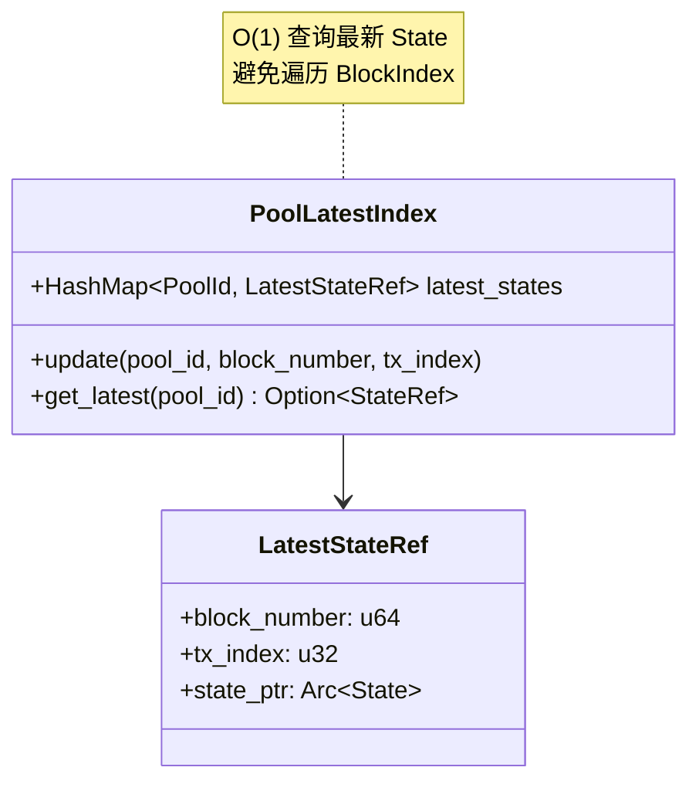

## 3. 核心操作流程设计

### 3.1 插入操作流程

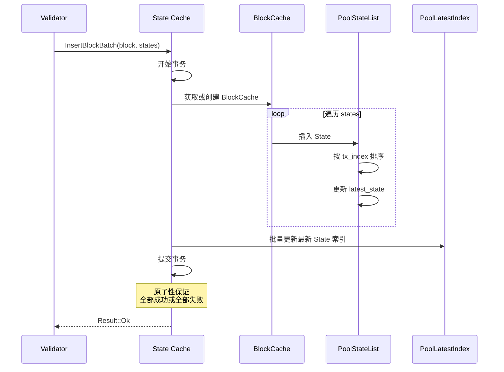

### 3.2 查询操作流程

**查询最新 State**：

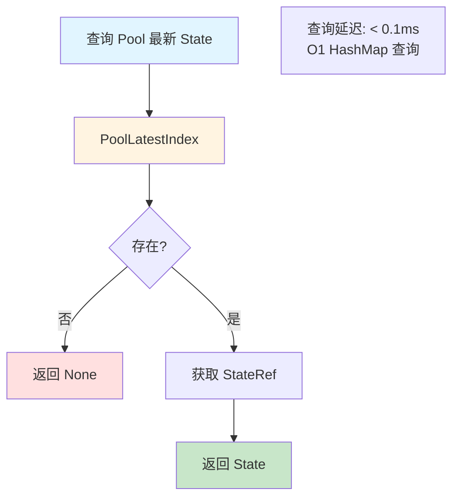

**查询指定区块的 State**：

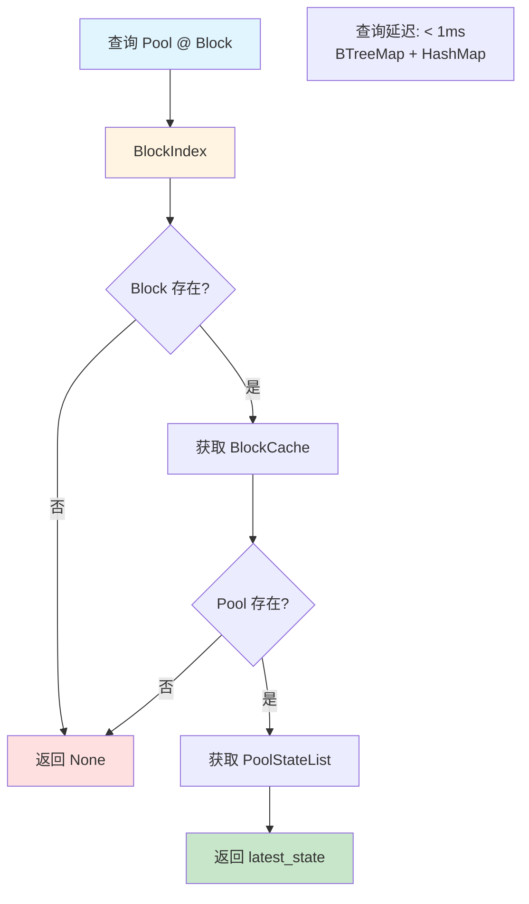

### 3.3 Reorg 处理流程

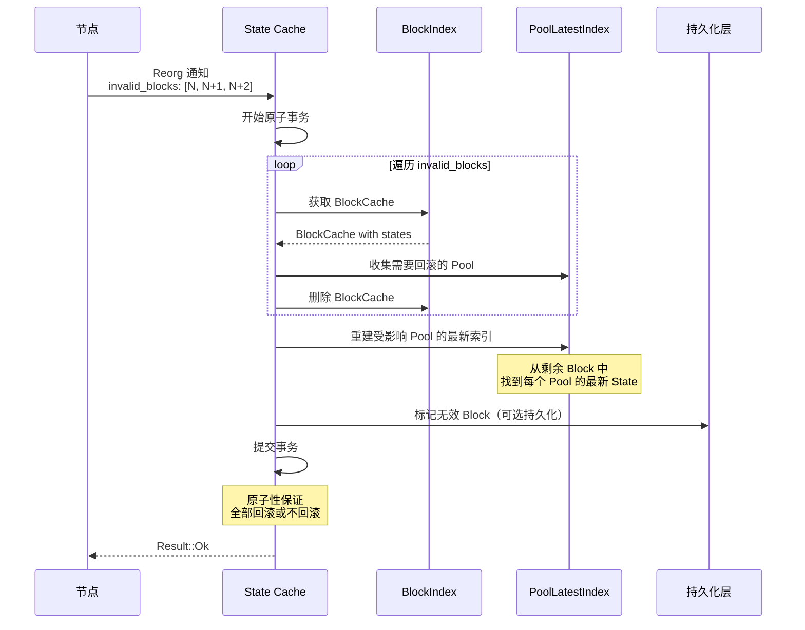

**Reorg 影响分析**：

| 场景 | Reorg 深度 | 受影响 Pool 数 | 回滚耗时 |
|------|-----------|--------------|---------|
| 正常 Reorg | 1-2 blocks | 10-50 | < 10ms |
| 深度 Reorg | 3-5 blocks | 50-200 | < 50ms |
| 极端 Reorg | 10+ blocks | 500+ | < 200ms |

### 3.4 清理操作流程

```mermaid
flowchart TD
    A[定期清理任务<br/>每 1 分钟] --> B{内存占用 > 阈值?}
    
    B -->|否| C[跳过清理]
    B -->|是| D[LRU 淘汰策略]
    
    D --> E[计算每个 Block 的分数<br/>score = age × (1 - access_freq)]
    
    E --> F[淘汰分数最高的 Block]
    
    F --> G{是否持久化?}
    G -->|是| H[写入磁盘]
    G -->|否| I[直接删除]
    
    H --> J[从内存移除]
    I --> J
    
    J --> K{内存占用 < 目标?}
    K -->|否| F
    K -->|是| L[清理完成]
    
    style A fill:#e1f5ff
    style D fill:#fff4e1
    style L fill:#c8e6c9
```

## 4. 索引结构设计

### 4.1 三层索引示意图

```mermaid
graph TB
    subgraph 第一层：Block Index [BTreeMap]
        A1[Block 20000000]
        A2[Block 20000001]
        A3[Block 20000002]
    end
    
    subgraph 第二层：Pool Index [HashMap]
        B1[Pool 0xAAA]
        B2[Pool 0xBBB]
        B3[Pool 0xCCC]
    end
    
    subgraph 第三层：Tx Index [Vec]
        C1[State @ Tx 0]
        C2[State @ Tx 5]
        C3[State @ Tx 10]
    end
    
    A2 --> B1
    A2 --> B2
    
    B1 --> C1
    B1 --> C2
    B1 --> C3
    
    style A1 fill:#e1f5ff
    style A2 fill:#fff4e1
    style A3 fill:#e1f5ff
    style B1 fill:#c8e6c9
    style B2 fill:#c8e6c9
    style C1 fill:#f0f0f0
    style C2 fill:#f0f0f0
    style C3 fill:#f0f0f0
```

### 4.2 索引查询性能

| 查询类型 | 索引路径 | 复杂度 | 延迟 |
|---------|---------|--------|------|
| 最新 State | PoolLatestIndex | O(1) | < 0.1ms |
| Pool @ Block | BlockIndex → PoolIndex | O(log N + 1) | < 1ms |
| Block 所有 State | BlockIndex | O(log N) | < 1ms |
| Pool @ Block @ Tx | BlockIndex → PoolIndex → TxIndex | O(log N + 1 + log M) | < 1ms |

### 4.3 索引一致性保证

**不变式**（Invariants）：

| 不变式 | 说明 | 保证方法 |
|-------|------|---------|
| 单调性 | BlockIndex 的 Block Number 严格递增 | BTreeMap 天然保证 |
| 完整性 | BlockCache 中的所有 Pool 都在 PoolLatestIndex 中 | 原子事务保证 |
| 最新性 | PoolLatestIndex 指向最大的 Block Number | 插入时更新 |
| Reorg 一致性 | Reorg 后 PoolLatestIndex 正确 | 原子回滚 + 重建 |

**一致性检查流程**：

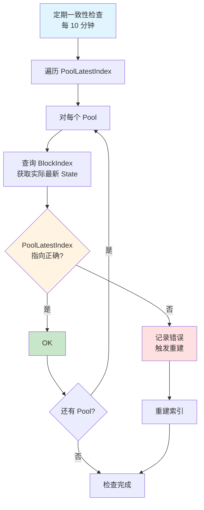

## 5. 一致性保证机制

### 5.1 原子性保证

**问题**：如何保证同一 Block 的所有 State 原子插入？

**解决方案**：事务机制

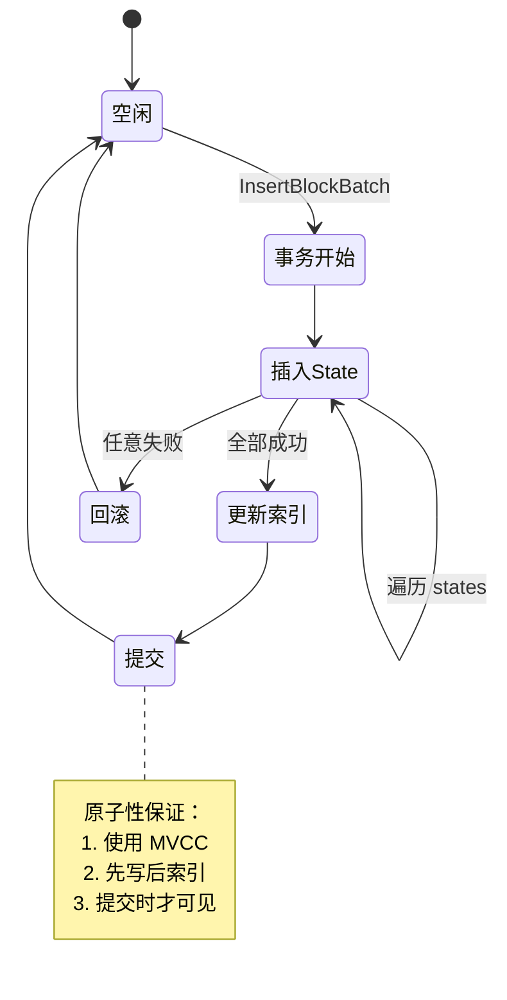

**事务实现表**：

| 技术 | 说明 | 优缺点 |
|------|------|--------|
| MVCC（推荐） | 多版本并发控制 | 优：高并发；缺：内存占用 |
| 写时复制 | Copy-on-Write | 优：简单；缺：性能开销 |
| RwLock | 读写锁 | 优：实现简单；缺：写入阻塞读取 |

### 5.2 Reorg 一致性

**Reorg 检测**：

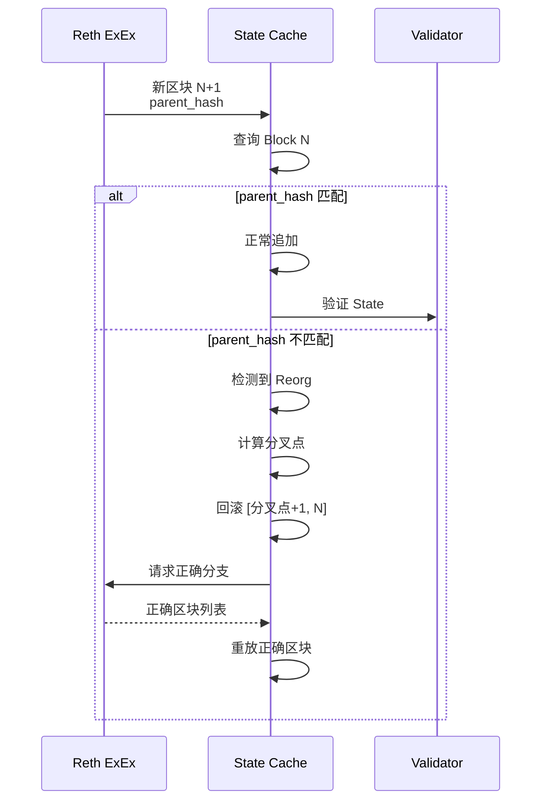

**Reorg 保证表**：

| 保证项 | 实现方法 |
|-------|---------|
| 原子回滚 | 使用事务删除多个 Block |
| 不丢失数据 | Reorg 前持久化（可选） |
| 索引一致 | 回滚后重建 PoolLatestIndex |
| 通知下游 | 广播 Reorg 事件 |

### 5.3 并发访问控制

**读写并发策略**：

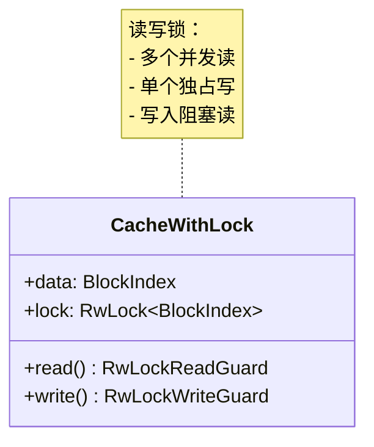

**锁粒度优化**：

| 锁级别 | 锁对象 | 并发度 | 使用场景 |
|-------|--------|--------|---------|
| 全局锁 | 整个 BlockIndex | 低 | 简单实现 |
| Block 级锁 | 单个 BlockCache | 中 | 不同 Block 可并发 |
| Pool 级锁 | 单个 PoolStateList | 高（推荐） | 不同 Pool 可并发 |

## 6. 内存使用估算和控制策略

### 6.1 内存估算

**单个 State 大小**：

| 数据项 | 大小 | 说明 |
|-------|------|------|
| Pool ID | 20 bytes | Address |
| Block Number | 8 bytes | u64 |
| Tx Index | 4 bytes | u32 |
| UniswapV2 State | ~150 bytes | reserve0, reserve1, price, fee |
| UniswapV3 State | ~300 bytes | sqrtPrice, tick, liquidity, 部分 Tick |
| 元数据 | ~50 bytes | timestamp, validation_latency, etc. |
| **平均** | **~200 bytes** | 加权平均 |

**总内存占用**：

```
假设：
- 活跃 Pool 数：10,000
- 缓存 Block 深度：64
- 每个 Block 平均更新 100 Pools
- 每个 Pool 平均 1.2 个 Tx（考虑同一 Block 多次更新）

计算：
State 数量 = 64 × 100 × 1.2 = 7,680
State 内存 = 7,680 × 200 bytes = 1.536 MB

索引开销：
- BlockIndex: 64 × (8 + pointer) ≈ 1 KB
- PoolLatestIndex: 10,000 × (20 + pointer + 16) ≈ 500 KB
- 其他索引: ≈ 500 KB

总计：1.536 MB + 1 MB ≈ 2.5 MB
```

**极端情况（10 万 Pool）**：

```
State 数量 = 64 × 1,000 × 1.2 = 76,800
State 内存 = 76,800 × 200 bytes = 15.36 MB
索引开销 ≈ 10 MB
总计：≈ 25 MB
```

**结论**：内存占用**远低于**预期的 500MB，设计安全。

### 6.2 内存控制策略

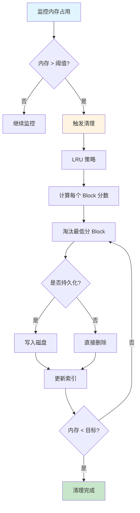

**LRU 评分规则**：

| 因素 | 权重 | 说明 |
|------|------|------|
| Age（区块年龄） | 50% | 越老越容易淘汰 |
| Access Frequency（访问频率） | 30% | 越少访问越容易淘汰 |
| Finality（是否最终确认） | 20% | 未最终确认不淘汰 |

**评分公式**：

$$
\text{score} = 0.5 \times \frac{\text{age}}{\text{max\_age}} + 0.3 \times (1 - \frac{\text{access\_freq}}{\text{max\_freq}}) + 0.2 \times \text{is\_finalized}
$$

### 6.3 内存压力应对

| 压力级别 | 内存占用 | 应对策略 |
|---------|---------|---------|
| 正常 | < 50MB | 无需操作 |
| 中等 | 50-100MB | 软淘汰（仅淘汰已最终确认的 Block） |
| 高 | 100-200MB | 硬淘汰（淘汰所有可淘汰 Block） |
| 紧急 | > 200MB | 强制持久化 + 清空非最新 Block |

## 7. 持久化策略

### 7.1 持久化层设计

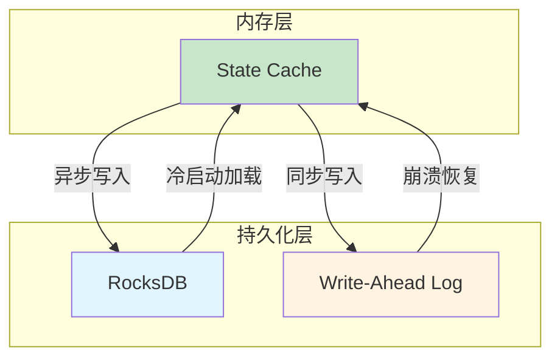

### 7.2 持久化时机

| 时机 | 条件 | 持久化内容 |
|------|------|-----------|
| 区块最终确认 | > 64 confirmations | BlockCache 全量 |
| 内存压力 | Memory > 100MB | LRU 淘汰的 Block |
| 定期同步 | 每 10 分钟 | 增量同步 |
| 优雅关闭 | 系统关闭信号 | 全量同步 |

### 7.3 持久化格式

**RocksDB Key-Value 设计**：

| Key Format | Value | 说明 |
|-----------|-------|------|
| `block:{block_number}` | BlockCache (serialized) | 按 Block 存储 |
| `pool_latest:{pool_id}` | LatestStateRef (serialized) | 最新 State 索引 |
| `meta:last_block` | u64 | 最后持久化的 Block |

### 7.4 恢复流程

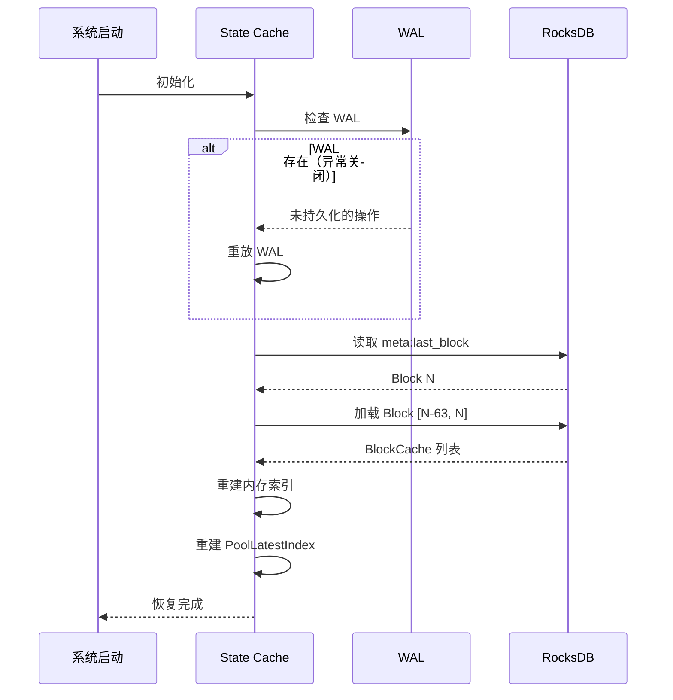

## 8. 性能优化

### 8.1 查询优化

| 优化项 | 方法 | 收益 |
|-------|------|------|
| 最新 State 查询 | PoolLatestIndex | 延迟 < 0.1ms |
| 热点 State 缓存 | Arc\<State\> 共享 | 内存节省 50% |
| 预取（Prefetch） | 预测访问模式，提前加载 | 命中率提升 20% |

### 8.2 写入优化

| 优化项 | 方法 | 收益 |
|-------|------|------|
| 批量插入 | InsertBlockBatch | 延迟降低 80% |
| 异步持久化 | 后台线程写入 RocksDB | 不阻塞主流程 |
| 零拷贝 | Arc\<State\> 避免拷贝 | CPU 降低 30% |

### 8.3 内存优化

| 优化项 | 方法 | 收益 |
|-------|------|------|
| Arc 共享 | latest_state 使用 Arc | 内存节省 50% |
| 压缩存储 | 持久化时压缩 | 磁盘空间节省 70% |
| 延迟加载 | 需要时才从 RocksDB 加载 | 内存占用降低 60% |

## 9. 监控指标

| 指标 | 说明 | 告警阈值 |
|------|------|---------|
| cache_memory_usage | 内存占用 | > 200MB |
| cache_size_blocks | 缓存的 Block 数量 | < 50 (太少) |
| cache_hit_rate | 查询命中率 | < 90% |
| cache_insert_latency | 插入延迟 | P99 > 10ms |
| cache_query_latency | 查询延迟 | P99 > 1ms |
| reorg_count | Reorg 次数 | > 10/小时 |
| reorg_depth | Reorg 深度 | > 5 blocks |

---

**下一步**：阅读 [09-Pending Tx Simulator](./09-component-pending-tx-simulator.md)
