# 组件设计：Pending Tx Simulator

## 文档元信息

| 项目 | 内容 |
|------|------|
| 组件名称 | Pending Tx Simulator |
| 文档版本 | v1.0 |
| 创建日期 | 2025-12-12 |
| 最后更新 | 2025-12-12 |
| 文档状态 | 草稿 |
| 责任人 | 架构组 |

## 1. 组件概述

### 1.1 职责定义

Pending Tx Simulator 负责模拟 **Pending Transaction** 对 Pool State 的影响，预测交易执行后的状态，为抢先交易决策提供数据支持。

**核心职责**：

| 职责 | 说明 | 优先级 |
|------|------|--------|
| 识别影响的 Pool | 分析 Pending Tx 会影响哪些 Pool | P0 |
| 模拟 State 变化 | 基于 Onchain State 计算模拟后 State | P0 |
| 快速模拟 | 单 Tx 模拟延迟 < 10ms | P0 |
| 批量模拟 | 支持批量模拟多个 Tx | P1 |
| 模拟验证 | 验证模拟结果合理性 | P1 |

### 1.2 输入输出

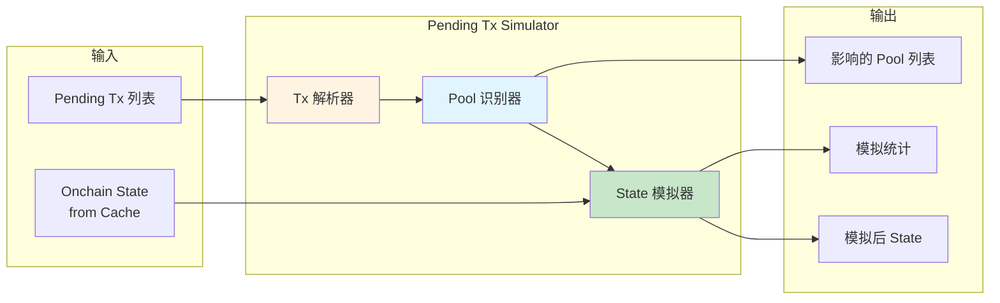

### 1.3 接口定义

| 接口名称 | 输入参数 | 输出 | 用途 |
|---------|---------|------|------|
| `SimulateTx` | pending_tx, onchain_state | SimulatedState | 模拟单个 Tx |
| `SimulateBatch` | Vec\<pending_tx\>, onchain_state | Vec\<SimulatedState\> | 批量模拟 |
| `IdentifyAffectedPools` | pending_tx | Vec\<pool_id\> | 识别影响的 Pool |
| `GetSimulationStats` | time_range | SimulationStats | 获取模拟统计 |

## 2. 工作流程设计

### 2.1 完整模拟流程

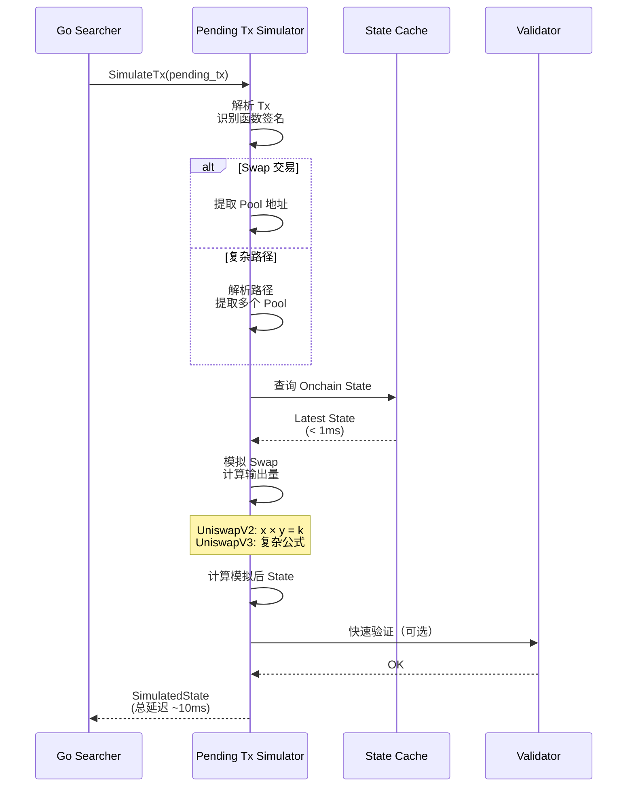

### 2.2 Tx 解析流程

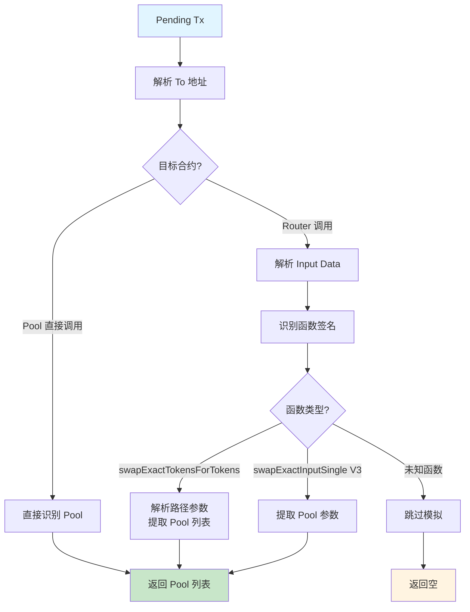

### 2.3 State 模拟流程

**UniswapV2 模拟**：

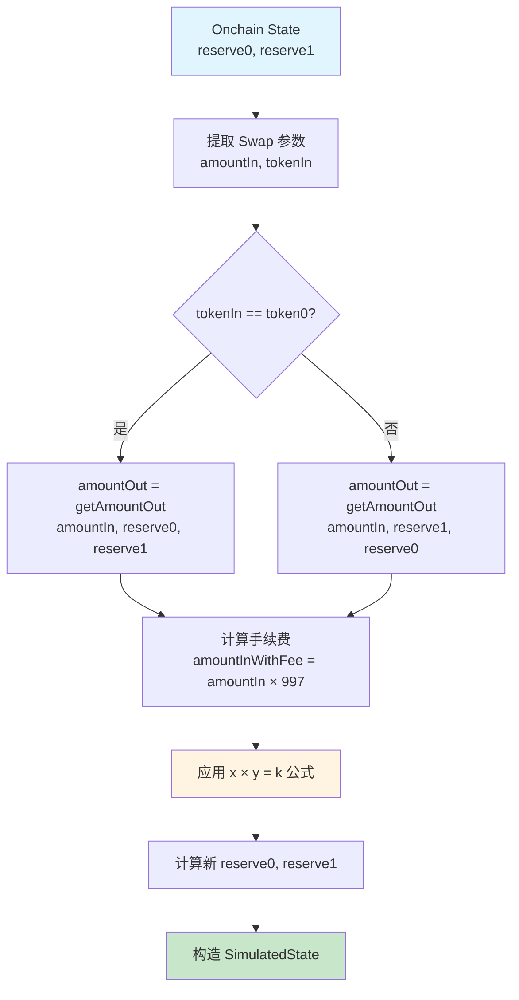

**UniswapV3 模拟**：

```mermaid
flowchart TD
    A[Onchain State<br/>sqrtPriceX96, liquidity, tick] --> B[提取 Swap 参数<br/>amountIn, zeroForOne]
    
    B --> C[计算新 sqrtPrice]
    Note over C: 使用 V3 swap math<br/>复杂公式
    
    C --> D[计算 amountOut]
    D --> E[计算新 tick]
    
    E --> F{跨越 tick boundary?}
    F -->|是| G[更新 liquidity]
    F -->|否| H[liquidity 不变]
    
    G --> I[构造 SimulatedState]
    H --> I
    
    style A fill:#e1f5ff
    style C fill:#fff4e1
    style I fill:#c8e6c9
```

## 3. 与 Onchain State 的依赖关系

### 3.1 依赖关系图

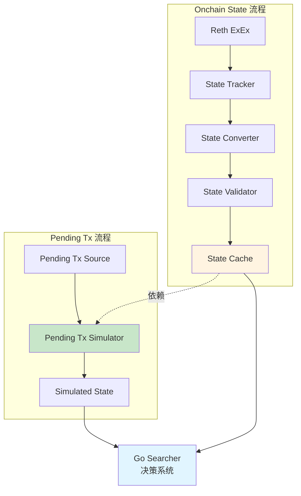

### 3.2 依赖关系表

| 依赖项 | 来源 | 用途 | 必需性 |
|-------|------|------|--------|
| Latest Onchain State | State Cache | 模拟的基础状态 | ✓ 必需 |
| Pool Metadata | Pool Discovery | Token decimals, fee rate | ✓ 必需 |
| Oracle Price | State Validator | 验证模拟结果合理性 | ✗ 可选 |

### 3.3 数据新鲜度要求

| 数据项 | 最大延迟 | 影响 |
|-------|---------|------|
| Onchain State | < 1 block | State 过期会导致模拟不准 |
| Pool Metadata | < 1 hour | 影响较小（通常不变） |
| Oracle Price | < 1 minute | 仅影响验证 |

### 3.4 优先级策略

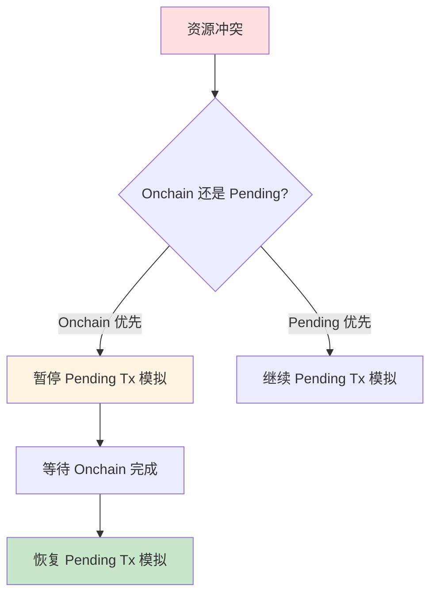

**优先级规则**：

| 场景 | Onchain 优先级 | Pending 优先级 | 策略 |
|------|---------------|---------------|------|
| 正常情况 | P0 | P1 | 并行处理，Pending 可降级 |
| CPU 满载 | P0 | P2 | 暂停 Pending 模拟 |
| Onchain 延迟高 | P0 | P0 | 两者都加速处理 |

## 4. 性能优化策略（10ms 目标）

### 4.1 延迟预算分配

| 阶段 | 延迟预算 | 优化策略 |
|------|---------|---------|
| Tx 解析 | 1ms | 函数签名缓存 |
| Pool 识别 | 1ms | 地址快速查找 |
| State 查询 | 2ms | State Cache（< 0.1ms） |
| Swap 模拟 | 5ms | 优化数学计算 |
| 结果构造 | 1ms | 零拷贝 |
| **总计** | **10ms** | - |

### 4.2 关键优化

**优化 1：函数签名缓存**

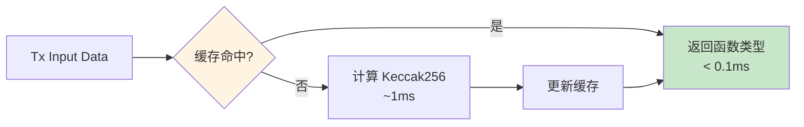

**优化 2：数学计算优化**

| 计算项 | 原始方法 | 优化方法 | 收益 |
|-------|---------|---------|------|
| V2 getAmountOut | 精确计算 | 查表 + 插值 | 延迟降低 50% |
| V3 sqrtPrice | 浮点运算 | Fixed Point (Q64.96) | 延迟降低 70% |
| Tick 计算 | log 运算 | Bit 操作 | 延迟降低 80% |

**优化 3：批量模拟**

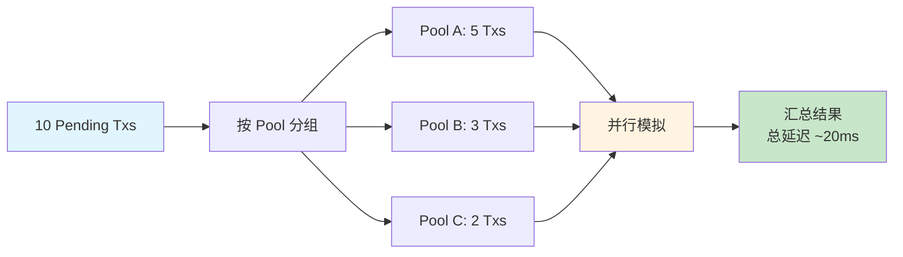

**批量收益**：

```
串行模拟：10 × 10ms = 100ms
并行模拟：3 个 Pool 并行，最大 5 Txs = 5 × 10ms = 50ms
优化：50%
```

### 4.3 缓存策略

| 缓存项 | TTL | 用途 | 命中率 |
|-------|-----|------|--------|
| 函数签名 | 永久 | Tx 解析 | 95% |
| Pool Metadata | 1 小时 | Token decimals, fee | 99% |
| 最近模拟结果 | 10 秒 | 相同 Tx 重复模拟 | 30% |

### 4.4 快速路径

**快速路径条件**：

| 条件 | 快速路径 | 正常路径 | 收益 |
|------|---------|---------|------|
| 单 Pool Swap | 直接计算 | 解析路径 | 延迟降低 50% |
| 标准函数签名 | 查表 | Keccak256 | 延迟降低 90% |
| 小额 Swap | 近似计算 | 精确计算 | 延迟降低 60% |

## 5. 模拟公式和算法

### 5.1 UniswapV2 Swap 公式

**基本公式（x × y = k）**：

$$
\text{reserve0} \times \text{reserve1} = k \quad (\text{constant product})
$$

**getAmountOut 公式**：

$$
\text{amountOut} = \frac{\text{amountIn} \times 997 \times \text{reserveOut}}{(\text{reserveIn} \times 1000) + (\text{amountIn} \times 997)}
$$

**新 reserve 计算**：

$$
\text{newReserve0} = \text{reserve0} + \text{amountIn}
$$

$$
\text{newReserve1} = \text{reserve1} - \text{amountOut}
$$

### 5.2 UniswapV3 Swap 公式

**sqrtPrice 计算**（简化版）：

$$
\text{newSqrtPrice} = \text{sqrtPrice} + \frac{\text{amountIn}}{\text{liquidity}}
$$

**amountOut 计算**：

$$
\text{amountOut} = \text{liquidity} \times (\text{newSqrtPrice} - \text{sqrtPrice})
$$

**Tick 更新**：

$$
\text{newTick} = \lfloor \log_{1.0001}(\text{newSqrtPrice}^2) \rfloor
$$

**注意**：实际 V3 公式更复杂，需考虑：
- Fee tier
- Tick boundary crossing
- Liquidity change
- Price impact

### 5.3 算法复杂度

| 算法 | 复杂度 | 延迟 | 优化方法 |
|------|--------|------|---------|
| V2 getAmountOut | O(1) | ~1ms | 已优化 |
| V3 sqrtPrice 计算 | O(1) | ~3ms | Fixed Point 优化 |
| V3 Tick crossing | O(log N) | ~5ms | 缓存活跃 Tick |

## 6. 模拟结果验证

### 6.1 验证策略

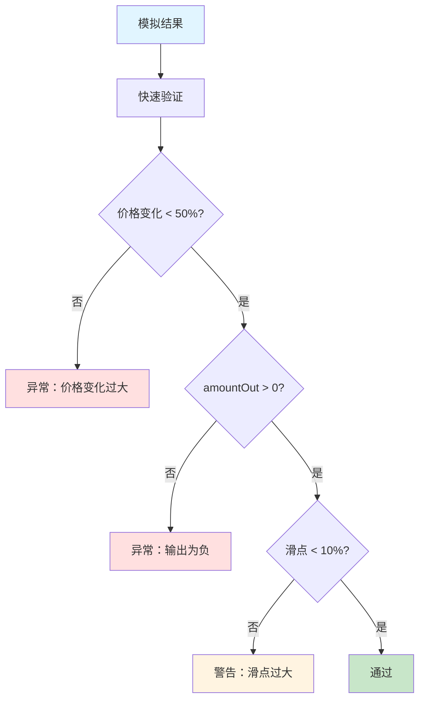

### 6.2 验证规则表

| 验证项 | 规则 | 失败处理 |
|-------|------|---------|
| 价格合理性 | 价格变化 < 50% | 标记为异常，不使用 |
| 输出量正数 | amountOut > 0 | 标记为异常 |
| 滑点合理 | 滑点 < 10% | 警告但可使用 |
| Reserve 不溢出 | reserve < U256::MAX | 标记为异常 |

### 6.3 对比验证（可选）

**与 eth_call 对比**：

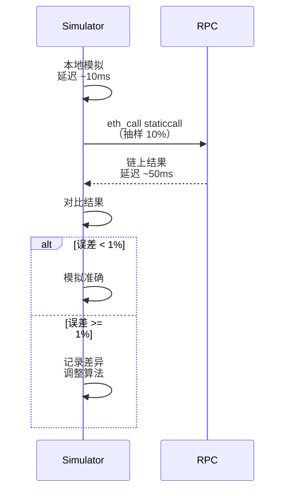

## 7. 错误处理

### 7.1 错误分类

| 错误类型 | 原因 | 处理策略 |
|---------|------|---------|
| Tx 解析失败 | 未知函数签名 | 跳过模拟，记录日志 |
| Pool 不存在 | Pool 未在 Cache 中 | 返回错误 |
| State 过期 | Onchain State 太旧 | 等待最新 State |
| 模拟溢出 | 数值计算溢出 | 返回错误 |
| 验证失败 | 结果不合理 | 标记为低置信度 |

### 7.2 降级策略

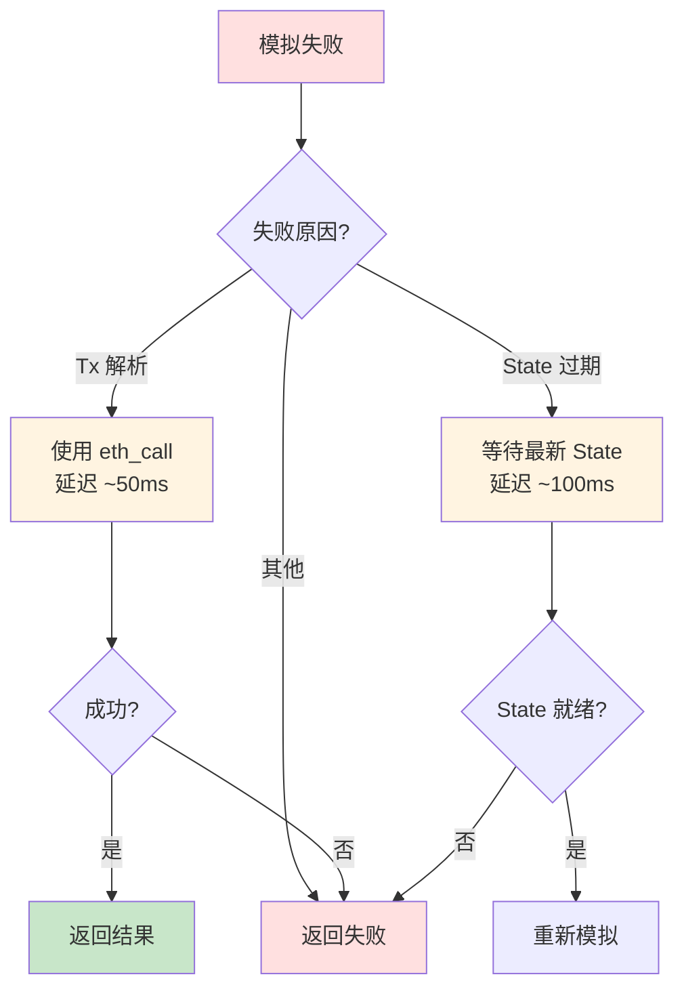

## 8. 监控指标

| 指标 | 说明 | 告警阈值 |
|------|------|---------|
| simulation_latency | 模拟延迟 | P99 > 20ms |
| simulation_success_rate | 模拟成功率 | < 90% |
| validation_failure_rate | 验证失败率 | > 10% |
| cache_hit_rate | State Cache 命中率 | < 90% |
| eth_call_fallback_rate | 降级到 eth_call 的比例 | > 5% |

## 9. 使用场景

### 9.1 场景 1：抢先交易

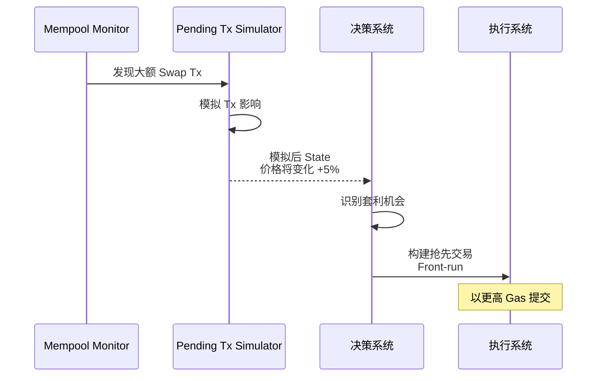

### 9.2 场景 2：Sandwich Attack 检测

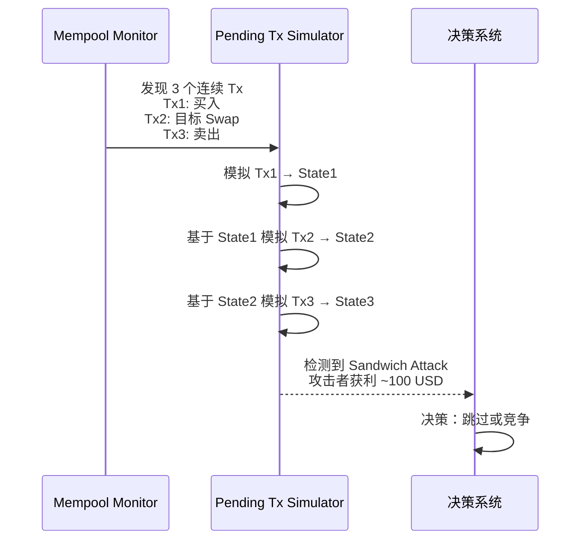

## 10. 未来扩展

### 10.1 支持更多 Protocol

| Protocol | 复杂度 | 预计工作量 |
|----------|--------|-----------|
| Curve（StableSwap） | 高 | 2 周 |
| Balancer | 高 | 3 周 |
| 0x V4 | 中 | 1 周 |

### 10.2 高级功能

| 功能 | 说明 | 优先级 |
|------|------|--------|
| 多跳模拟 | 支持 A→B→C 路径 | P1 |
| Gas 估算 | 估算 Tx 所需 Gas | P2 |
| MEV 检测 | 识别各类 MEV 攻击 | P2 |

---

**下一步**：阅读 [10-Technical POC](./10-technical-poc.md) 了解技术预研方案
