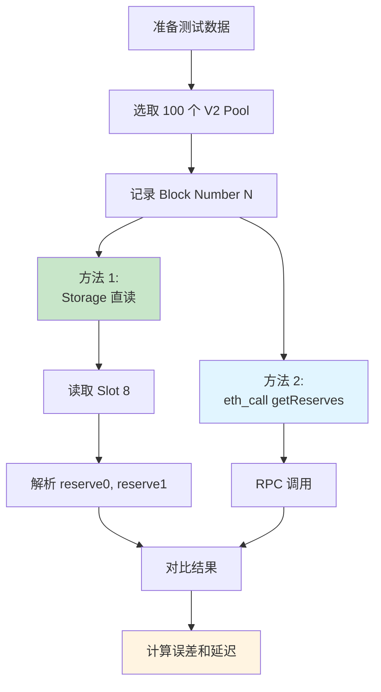
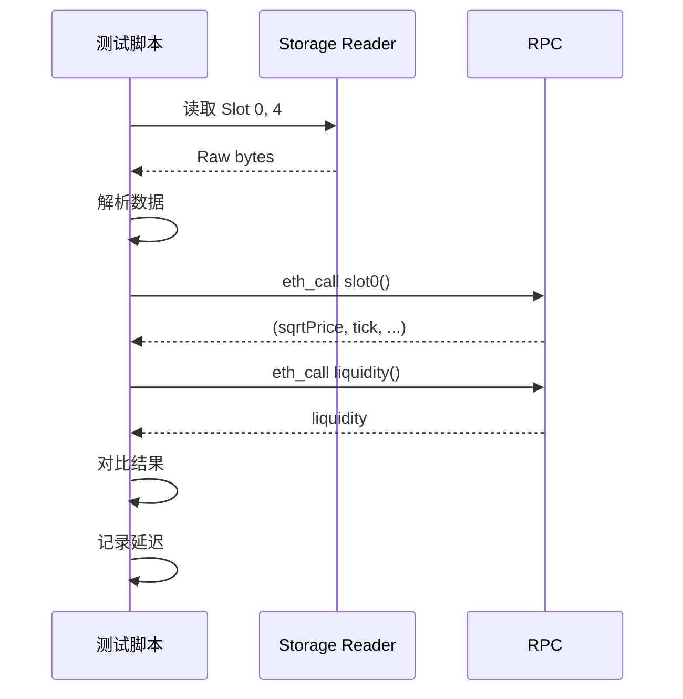
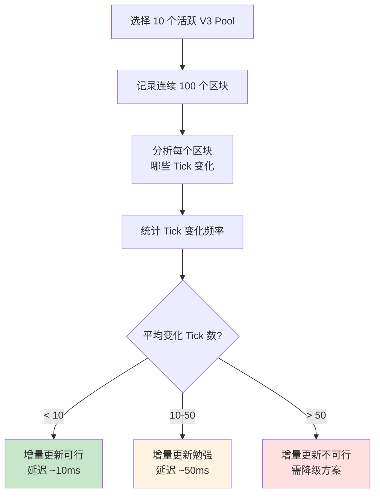
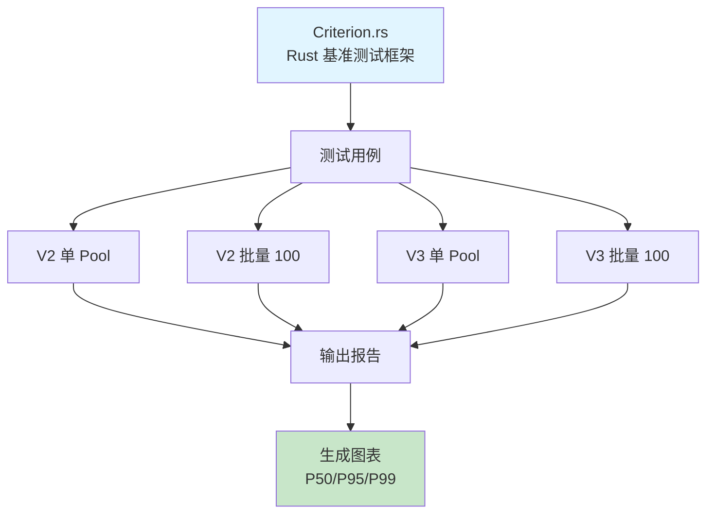
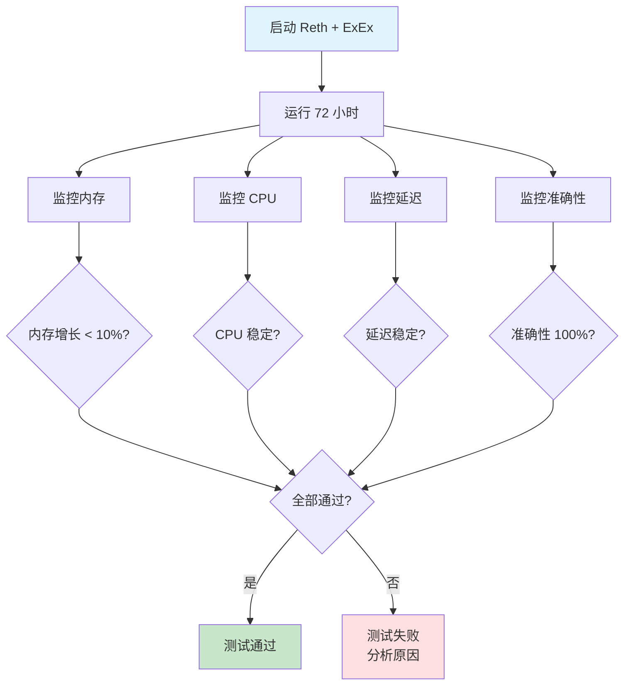
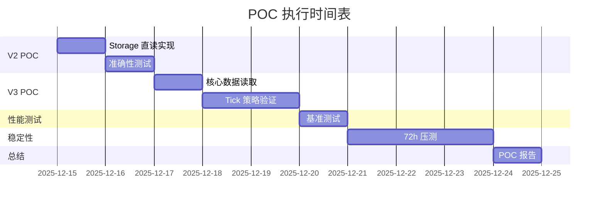
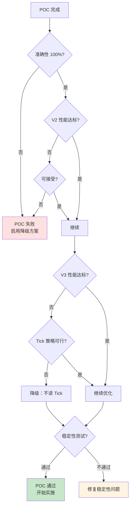

# 技术预研方案（POC）

## 文档元信息

| 项目 | 内容 |
|------|------|
| 文档版本 | v1.0 |
| 创建日期 | 2025-12-12 |
| 最后更新 | 2025-12-12 |
| 文档状态 | 草稿 |
| 责任人 | 架构组 |

## 1. POC 总体目标

### 1.1 核心目标

验证**Storage 直读**技术的可行性和性能，为架构设计提供数据支撑。

**关键问题**：

| 问题 | 重要性 | 验证方法 |
|------|--------|---------|
| Storage 直读速度是否足够快？ | ✓✓✓ | 性能基准测试 |
| UniswapV3 Tick 数据能否增量更新？ | ✓✓✓ | Tick 变化模式分析 |
| Reth ExEx 是否稳定？ | ✓✓ | 72 小时压力测试 |
| 与 eth_call 的误差是否可接受？ | ✓✓ | 准确性对比测试 |

### 1.2 POC 计划表

| POC 项目 | 工期 | 优先级 | 风险 |
|---------|------|--------|------|
| UniswapV2 Storage 直读 | 2 天 | P0 | 低 |
| UniswapV3 Storage 直读（核心数据） | 2 天 | P0 | 中 |
| UniswapV3 Tick 数据策略 | 2 天 | P0 | 高 |
| 性能基准测试 | 1 天 | P0 | 低 |
| Reth ExEx 稳定性测试 | 3 天 | P1 | 中 |

## 2. UniswapV2 Storage 直读 POC

### 2.1 验证目标

| 目标 | 量化指标 |
|------|---------|
| **速度** | 单 Pool 读取延迟 < 5ms |
| **准确性** | 与 eth_call getReserves() 结果 100% 一致 |
| **批量性能** | 100 Pools 读取延迟 < 100ms |

### 2.2 实验设计

### 2.3 测试用例表

| 用例 | Pool 类型 | 预期结果 |
|------|----------|---------|
| TC1 | 主流币对（ETH/USDC） | 延迟 < 3ms，误差 = 0 |
| TC2 | 长尾币对 | 延迟 < 3ms，误差 = 0 |
| TC3 | 低流动性 Pool | 延迟 < 3ms，误差 = 0 |
| TC4 | 批量 100 Pools | 延迟 < 100ms，误差 = 0 |

### 2.4 验收标准

| 指标 | 验收标准 | 不通过后果 |
|------|---------|-----------|
| 单 Pool 延迟 | P99 < 5ms | 优化算法 |
| 准确性 | 100% 一致 | **POC 失败** |
| 批量延迟 | 100 Pools < 100ms | 优化并行策略 |

### 2.5 预期结果

**乐观情况**（80% 概率）：

- 单 Pool 延迟：1-3ms
- 批量延迟：50-80ms
- 准确性：100%
- **结论**：技术可行，性能满足要求

**悲观情况**（20% 概率）：

- 单 Pool 延迟：5-10ms
- 批量延迟：100-200ms
- **结论**：性能略低，需优化或降级方案

## 3. UniswapV3 Storage 直读 POC

### 3.1 核心数据验证

**验证目标**：

| 数据项 | Slot | 验证方法 | 验收标准 |
|-------|------|---------|---------|
| sqrtPriceX96 | Slot 0 (0-159 bits) | 与 eth_call slot0() 对比 | 100% 一致 |
| tick | Slot 0 (160-183 bits) | 与 eth_call slot0() 对比 | 100% 一致 |
| liquidity | Slot 4 | 与 eth_call liquidity() 对比 | 100% 一致 |

**测试流程**：

### 3.2 Tick 数据读取策略验证

**问题**：如何高效读取 Tick 数据？

**策略对比**：

| 策略 | 说明 | 延迟（单 Pool） | 适用场景 |
|------|------|---------------|---------|
| **增量更新** | 仅读取变化的 Tick | 5-20ms | ✓ 推荐 |
| 全量读取 | 读取所有初始化 Tick | 100-500ms | ✗ 不可接受 |
| 按需读取 | 仅读取 ±1000 范围 | 20-50ms | 可选 |
| 不读取 Tick | 仅使用核心数据 | 2-5ms | 降级方案 |

**增量更新验证实验**：

**验收标准**：

| 指标 | 验收标准 | 不通过后果 |
|------|---------|-----------|
| 平均变化 Tick 数 | < 20 | 增量策略可行 |
| 增量读取延迟 | < 50ms | 性能满足要求 |
| Tick 读取准确性 | 100% | **POC 失败** |

### 3.3 性能对比测试

**测试矩阵**：

| Pool 数量 | Storage 直读 | eth_call 方式 | 改进比例 |
|----------|-------------|--------------|---------|
| 10 | ? ms | ? ms | ? % |
| 100 | ? ms | ? ms | ? % |
| 1000 | ? ms | ? ms | ? % |

**测试用例表**：

| 用例 | 输入 | 预期结果 |
|------|------|---------|
| TC1 | 10 个 V3 Pool（仅核心数据） | 延迟 < 50ms |
| TC2 | 10 个 V3 Pool（含 Tick 数据） | 延迟 < 100ms |
| TC3 | 100 个 V3 Pool（仅核心数据） | 延迟 < 200ms |
| TC4 | 100 个 V3 Pool（含 Tick 数据） | 延迟 < 500ms |

### 3.4 预期结果

**乐观情况**（60% 概率）：

- 核心数据延迟：2-5ms
- Tick 增量更新可行（平均变化 < 10 Tick）
- 总延迟：< 50ms（含 Tick）
- **结论**：技术完全可行

**中立情况**（30% 概率）：

- 核心数据延迟：5-10ms
- Tick 增量更新勉强可行（平均变化 10-20 Tick）
- 总延迟：50-100ms
- **结论**：可行但需优化

**悲观情况**（10% 概率）：

- Tick 增量不可行（平均变化 > 50 Tick）
- **结论**：降级方案（不读取 Tick 或使用 RPC）

## 4. 性能基准测试

### 4.1 测试场景

| 场景 | 说明 | 目标值 |
|------|------|--------|
| **单 Pool 读取** | 读取单个 Pool 的 State | < 5ms (P99) |
| **批量读取（10）** | 并行读取 10 个 Pool | < 50ms (P99) |
| **批量读取（100）** | 并行读取 100 个 Pool | < 300ms (P99) |
| **批量读取（1000）** | 并行读取 1000 个 Pool | < 1s (P99) |

### 4.2 与 eth_call 对比

**测试矩阵**：

| Pool 数量 | Storage 直读 | eth_call | 改进比例 | 验收标准 |
|----------|-------------|----------|---------|---------|
| 1 | ? ms | 50-150ms | ? % | > 50% |
| 10 | ? ms | 500-1500ms | ? % | > 80% |
| 100 | ? ms | 5-15s | ? % | > 90% |

### 4.3 测试工具

**基准测试框架**：

### 4.4 测试报告模板

**报告内容**：

| 指标 | V2 单 Pool | V2 批量 100 | V3 单 Pool | V3 批量 100 |
|------|-----------|------------|-----------|------------|
| P50 延迟 | ? ms | ? ms | ? ms | ? ms |
| P95 延迟 | ? ms | ? ms | ? ms | ? ms |
| P99 延迟 | ? ms | ? ms | ? ms | ? ms |
| 最大延迟 | ? ms | ? ms | ? ms | ? ms |
| 标准差 | ? ms | ? ms | ? ms | ? ms |

## 5. Reth ExEx 稳定性测试

### 5.1 测试目标

| 目标 | 验收标准 |
|------|---------|
| **长时间运行** | 72 小时无崩溃 |
| **内存稳定性** | 无内存泄漏（增长 < 10%） |
| **数据一致性** | 与 Reth Core 数据 100% 一致 |
| **Reorg 处理** | 正确处理 Reorg（模拟测试） |

### 5.2 压力测试方案

### 5.3 Reorg 模拟测试

**测试步骤**：

| 步骤 | 操作 | 预期结果 |
|------|------|---------|
| 1 | 同步到 Block N | 正常运行 |
| 2 | 模拟 Reorg：删除 Block N-2, N-1, N | ExEx 检测到 Reorg |
| 3 | 提供正确分支 | ExEx 回滚并重放正确分支 |
| 4 | 验证数据一致性 | State Cache 与链上数据一致 |

### 5.4 监控指标

| 指标 | 采集频率 | 告警阈值 |
|------|---------|---------|
| 内存占用 | 1 分钟 | 增长 > 20%/小时 |
| CPU 使用率 | 1 分钟 | 持续 > 90% |
| 延迟 | 每次操作 | P99 > 200ms |
| 错误率 | 实时 | > 1% |

## 6. 降级方案

### 6.1 降级触发条件

| 条件 | 降级方案 |
|------|---------|
| Storage 直读延迟 > 10ms (P99) | 降级方案 1：Batch RPC |
| UniswapV3 Tick 无法增量更新 | 降级方案 2：不读取 Tick |
| Reth ExEx 不稳定（崩溃 > 3 次/天） | 降级方案 3：使用 Geth RPC |

### 6.2 降级方案 1：Batch RPC

**描述**：使用 Reth 的 Batch JSON-RPC 批量调用 eth_call

**预期性能**：

| 指标 | 预期值 |
|------|--------|
| 100 Pools 延迟 | 1-2s |
| vs Storage 直读 | 慢 5-10x |
| vs 串行 RPC | 快 5x |

**验收标准**：

- 100 Pools 延迟 < 2s
- 准确性 100%

### 6.3 降级方案 2：不读取 Tick

**描述**：仅读取 UniswapV3 核心数据（slot0, liquidity），不读取 Tick 数据

**影响分析**：

| 功能 | 影响 | 可接受性 |
|------|------|---------|
| 价格计算 | 无影响 | ✓ |
| Swap 模拟 | 精度略降 | ✓ |
| 流动性分布 | 无法获取 | ✗（但可接受） |

### 6.4 降级方案 3：使用 Geth RPC

**描述**：回退到原有架构，使用 Geth 的 RPC 接口

**性能退化**：

| 指标 | Reth ExEx | Geth RPC | 退化 |
|------|-----------|----------|------|
| 100 Pools 延迟 | < 500ms | 5-15s | 10-30x |
| CPU 占用 | 低 | 高 | - |

**触发条件**：

- Reth ExEx POC 完全失败
- Reth 稳定性无法满足生产要求

## 7. POC 执行计划

### 7.1 时间表

### 7.2 资源需求

| 资源 | 需求 |
|------|------|
| 开发人员 | 1 人（熟悉 Rust） |
| 测试环境 | Reth 节点 × 1 |
| 测试数据 | 主网数据（最近 1 周） |
| 测试工具 | Criterion.rs, Grafana |

### 7.3 交付物

| 交付物 | 内容 |
|-------|------|
| POC 代码 | Rust 代码仓库 |
| 测试报告 | 性能数据、准确性验证结果 |
| 基准数据 | 延迟分布图（P50/P95/P99） |
| 结论和建议 | 技术可行性评估 + 风险点 |

## 8. 验收标准总结

### 8.1 必须满足（硬性要求）

| 指标 | 标准 | 不通过后果 |
|------|------|-----------|
| 准确性 | 与 eth_call 100% 一致 | **POC 失败，考虑降级方案** |
| V2 延迟 | 100 Pools < 300ms (P99) | 可继续，但需优化 |
| V3 延迟（核心） | 100 Pools < 500ms (P99) | 可继续，但需优化 |
| 稳定性 | 72 小时无崩溃 | 需修复或降级 |

### 8.2 期望满足（软性要求）

| 指标 | 标准 | 不通过影响 |
|------|------|-----------|
| V2 延迟 | 100 Pools < 100ms (P99) | 性能略低，可接受 |
| V3 延迟（含 Tick） | 100 Pools < 500ms (P99) | 可能需要不读取 Tick |
| 内存稳定性 | 增长 < 10% | 需优化内存管理 |

### 8.3 验收决策树

---

**下一步**：根据 POC 结果，开始 [11-迭代计划](./11-iteration-plan.md)
