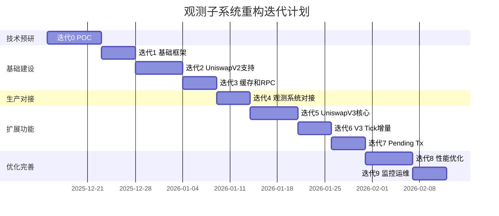

# 迭代计划

## 文档元信息

| 项目 | 内容 |
|------|------|
| 文档版本 | v1.0 |
| 创建日期 | 2025-12-12 |
| 最后更新 | 2025-12-12 |
| 文档状态 | 草稿 |
| 责任人 | 架构组 |

## 迭代总览



## 迭代 0：技术预研（POC）

详见 [10-技术预研方案](./10-technical-poc.md)

**目标**：验证核心技术假设  
**工期**：8 天  
**前置依赖**：无  

**关键交付物**：
- UniswapV2 Storage 直读 POC 代码
- UniswapV3 Storage 直读 POC 代码  
- 性能基准测试报告
- POC 可行性结论

**验收标准**：
- [ ] Storage 直读准确性 100%
- [ ] V2 批量读取（100 Pools）< 300ms
- [ ] V3 核心数据读取（100 Pools）< 500ms
- [ ] 72 小时稳定性测试通过

## 迭代 1：基础框架 + Pool Discovery

**目标**：搭建 Reth ExEx 基础框架，实现 Pool 自动发现  
**工期**：5 天  
**前置依赖**：迭代 0 POC 通过  

### 1.1 详细任务清单

| 任务 ID | 任务描述 | 工时 | 优先级 | 依赖 |
|---------|---------|------|--------|------|
| T1.1 | 创建 Reth ExEx 项目骨架 | 0.5d | P0 | 无 |
| T1.2 | 实现 ExEx Channel 订阅 | 1d | P0 | T1.1 |
| T1.3 | 实现 Pool Discovery 核心逻辑 | 1.5d | P0 | T1.2 |
| T1.4 | 实现 Pool Registry（内存 + RocksDB） | 1d | P0 | T1.3 |
| T1.5 | 单元测试和集成测试 | 1d | P0 | T1.4 |

### 1.2 实现指南（适合 Rust 初学者）

**步骤 1：创建项目**
```bash
cargo new observer-exex
cd observer-exex
```

添加依赖到 `Cargo.toml`：
- reth (ExEx 框架)
- tokio (异步运行时)
- rocksdb (持久化)

**步骤 2：实现 ExEx 基本结构**

参考框架（概念，非代码）：
- 定义 ExEx struct
- 实现 channel 订阅
- 处理新区块事件

**步骤 3：实现 Pool Discovery**

关键流程：
1. 监听 PoolCreated 事件
2. 解析事件参数
3. 去重并存储

**步骤 4：测试**
- 单元测试：事件解析逻辑
- 集成测试：连接测试网，发现真实 Pool

### 1.3 验收标准

- [ ] ExEx 可正常订阅新区块事件
- [ ] 自动发现 UniswapV2/V3 新 Pool
- [ ] Pool 数据持久化到 RocksDB
- [ ] 单元测试覆盖率 > 80%
- [ ] 集成测试通过（测试网）

### 1.4 风险点

| 风险 | 概率 | 影响 | 缓解措施 |
|------|------|------|---------|
| Reth API 不熟悉 | 高 | 中 | 阅读官方文档 + 示例代码 |
| RocksDB 集成问题 | 中 | 低 | 使用成熟的 Rust 库 |

## 迭代 2：UniswapV2 支持（State Tracker + Converter + Validator）

**目标**：完整实现 UniswapV2 的 State 获取、转换、验证  
**工期**：7 天  
**前置依赖**：迭代 1 完成  

### 2.1 详细任务清单

| 任务 ID | 任务描述 | 工时 | 优先级 | 依赖 |
|---------|---------|------|--------|------|
| T2.1 | 实现 V2 Storage Tracker | 1.5d | P0 | 迭代1 |
| T2.2 | 实现 V2 State Converter | 1d | P0 | T2.1 |
| T2.3 | 实现快速失败规则 | 1d | P0 | T2.2 |
| T2.4 | 实现完整验证器（eth_call） | 1.5d | P0 | T2.3 |
| T2.5 | 性能优化（并行、批量） | 1d | P1 | T2.4 |
| T2.6 | 测试和文档 | 1d | P0 | T2.5 |

### 2.2 实现指南

**Storage Tracker 实现**：
1. 计算 Slot 8 地址
2. 读取 32 bytes 原始数据
3. 解析 reserve0, reserve1, timestamp

**State Converter 实现**：
1. 提取 reserve 数值（位运算）
2. 查询 Token decimals
3. 计算价格

**Validator 实现**：
1. 快速失败：TVL 阈值、价格异常
2. 完整验证：eth_call getReserves() 对比

### 2.3 验收标准

- [ ] V2 State 读取延迟 < 3ms (P99, 单 Pool)
- [ ] 批量读取 100 Pools < 100ms (P99)
- [ ] 转换准确性 100%（与 eth_call 对比）
- [ ] 验证通过率 ~40%（符合预期）
- [ ] 快速失败过滤 ~60% Pool

### 2.4 风险点

| 风险 | 概率 | 影响 | 缓解措施 |
|------|------|------|---------|
| 位运算错误 | 中 | 高 | 单元测试 + 对比验证 |
| eth_call 延迟高 | 低 | 中 | 并行验证 |

## 迭代 3：State Cache + RPC 接口

**目标**：实现三层索引缓存和 gRPC 接口  
**工期**：5 天  
**前置依赖**：迭代 2 完成  

### 3.1 详细任务清单

| 任务 ID | 任务描述 | 工时 | 优先级 | 依赖 |
|---------|---------|------|--------|------|
| T3.1 | 实现三层索引数据结构 | 1d | P0 | 迭代2 |
| T3.2 | 实现 Reorg 处理逻辑 | 1d | P0 | T3.1 |
| T3.3 | 实现 LRU 内存管理 | 0.5d | P1 | T3.1 |
| T3.4 | 实现 gRPC Server | 1d | P0 | T3.1 |
| T3.5 | 实现查询接口 | 1d | P0 | T3.4 |
| T3.6 | 测试和文档 | 0.5d | P0 | T3.5 |

### 3.2 实现指南

**三层索引实现**：
- 第一层：BTreeMap<BlockNumber, BlockCache>
- 第二层：HashMap<PoolId, PoolStateList>  
- 第三层：Vec<TxState>（按 tx_index 排序）

**Reorg 处理**：
1. 检测 parent_hash 不匹配
2. 计算分叉点
3. 原子删除无效 Block
4. 重建 PoolLatestIndex

**gRPC 接口定义**（.proto 文件）：
- GetLatestState(pool_id)
- GetStateAtBlock(pool_id, block_number)
- GetBlockStates(block_number)

### 3.3 验收标准

- [ ] 查询最新 State 延迟 < 0.1ms
- [ ] 查询历史 State 延迟 < 1ms
- [ ] Reorg 处理正确（模拟测试）
- [ ] 内存占用 < 50MB（1万 Pools，64 Blocks）
- [ ] gRPC 接口可用（Go Client 测试）

### 3.4 风险点

| 风险 | 概率 | 影响 | 缓解措施 |
|------|------|------|---------|
| 索引一致性问题 | 中 | 高 | 单元测试 + 一致性检查 |
| gRPC 协议不熟 | 中 | 低 | 参考官方示例 |

## 迭代 4：观测系统对接

**目标**：与 Go Searcher 观测系统集成，验证端到端流程  
**工期**：5 天  
**前置依赖**：迭代 3 完成  

### 4.1 详细任务清单

| 任务 ID | 任务描述 | 工时 | 优先级 | 依赖 |
|---------|---------|------|--------|------|
| T4.1 | Go Client SDK 开发 | 1d | P0 | 迭代3 |
| T4.2 | 改造 Go Observer 调用新接口 | 1.5d | P0 | T4.1 |
| T4.3 | 端到端集成测试 | 1d | P0 | T4.2 |
| T4.4 | 性能测试（实际负载） | 1d | P0 | T4.3 |
| T4.5 | 部署和监控 | 0.5d | P1 | T4.4 |

### 4.2 实现指南

**Go Client SDK**：
- 封装 gRPC 调用
- 实现连接池
- 实现重试和超时

**Go Observer 改造**：
- 替换 eth_callSimulate 为 gRPC 调用
- 保留降级方案（RPC fallback）
- 添加性能监控

**集成测试**：
1. 启动 Reth + ExEx
2. 启动 Go Searcher
3. 验证套利流程完整性

### 4.3 验收标准

- [ ] Go Client 可正常调用 gRPC
- [ ] 端到端延迟 < 1s（100 Pools）
- [ ] 套利决策成功率无下降
- [ ] 7x24 稳定运行（测试 48 小时）

### 4.4 风险点

| 风险 | 概率 | 影响 | 缓解措施 |
|------|------|------|---------|
| Go/Rust 跨语言问题 | 低 | 中 | gRPC 屏蔽差异 |
| 生产环境问题 | 中 | 高 | 灰度发布 + 降级方案 |

## 迭代 5-9：扩展和优化（简化版）

### 迭代 5：UniswapV3 核心支持（7 天）
- V3 Storage Tracker
- V3 State Converter  
- V3 Validator
- 仅支持核心数据（无 Tick）

### 迭代 6：V3 Tick 增量更新（5 天）
- Tick 变化检测
- 增量读取 Tick  
- Tick 数据缓存

### 迭代 7：Pending Tx Simulator（5 天）
- Tx 解析和 Pool 识别
- V2/V3 Swap 模拟
- 模拟结果验证

### 迭代 8：性能优化（7 天）
- 批量操作优化
- 并行度调优
- 内存优化
- 缓存策略优化

### 迭代 9：监控和运维（5 天）
- Metrics 采集
- Grafana Dashboard
- 告警规则配置
- 运维手册编写

## 总结

| 迭代 | 目标 | 工期 | 关键风险 |
|------|------|------|---------|
| 0 | POC | 8d | 技术不可行 |
| 1 | 基础框架 | 5d | Rust 不熟 |
| 2 | V2 支持 | 7d | 准确性 |
| 3 | 缓存和 RPC | 5d | 索引一致性 |
| 4 | 系统对接 | 5d | 生产稳定性 |
| 5-9 | 扩展优化 | 29d | 性能不达标 |
| **总计** | - | **59d** | - |

---

**相关文档**：
- [10-技术预研](./10-technical-poc.md)
- [12-验收测试](./12-acceptance-testing.md)
