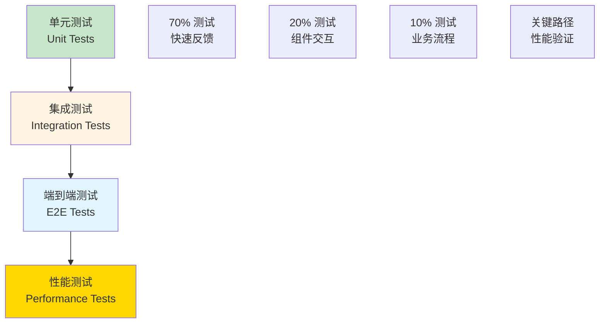
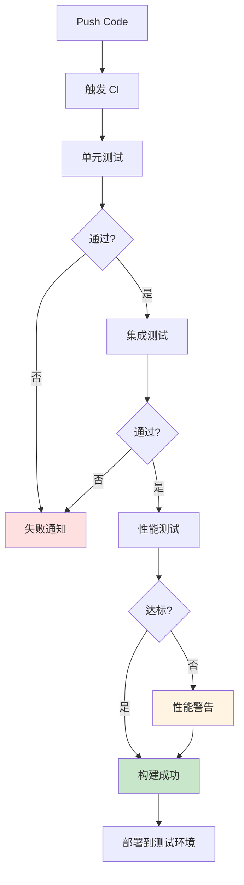

# 自动化验收方案

## 文档元信息

| 项目 | 内容 |
|------|------|
| 文档版本 | v1.0 |
| 创建日期 | 2025-12-12 |
| 最后更新 | 2025-12-12 |
| 文档状态 | 草稿 |
| 责任人 | 架构组 |

## 1. 验收测试框架设计

### 1.1 测试金字塔



### 1.2 测试工具栈

| 层级 | 工具 | 用途 |
|------|------|------|
| 单元测试 | cargo test | Rust 单元测试 |
| 集成测试 | cargo test --test | Rust 集成测试 |
| E2E 测试 | Go testing | 跨语言端到端 |
| 性能测试 | criterion.rs | 基准测试 |
| 覆盖率 | cargo-tarpaulin | 代码覆盖率 |
| 持续集成 | GitHub Actions | CI/CD |

## 2. 迭代验收测试清单

### 迭代 1：基础框架测试

**单元测试**：
- [ ] ExEx Channel 订阅测试
- [ ] Pool Discovery 事件解析测试
- [ ] Pool Registry 存储/查询测试
- [ ] RocksDB 读写测试

**集成测试**：
- [ ] ExEx 连接 Reth 节点测试
- [ ] 发现真实 Pool（测试网）
- [ ] 持久化和恢复测试

**验收脚本**（描述）：
```bash
# 1. 启动测试网 Reth 节点
# 2. 运行 ExEx  
# 3. 触发 PoolCreated 事件
# 4. 验证 Pool 被正确发现和存储
```

### 迭代 2：UniswapV2 测试

**单元测试**：
- [ ] Slot 8 解析测试（多个 test case）
- [ ] reserve 提取正确性测试
- [ ] 价格计算测试（不同 decimals）
- [ ] 快速失败规则测试（TVL, 价格异常）

**集成测试**：
- [ ] 100 个真实 V2 Pool Storage 读取
- [ ] 与 eth_call getReserves() 对比（100% 一致）
- [ ] 批量验证测试

**性能测试**：
- [ ] 单 Pool 读取 < 3ms (P99)
- [ ] 100 Pools 批量 < 100ms (P99)

**验收脚本**：
```bash
# 1. 选择 100 个主网 V2 Pool
# 2. Storage 直读获取 State
# 3. eth_call 获取对比数据
# 4. 验证准确性 100%
# 5. 验证性能指标
```

### 迭代 3：缓存和 RPC 测试

**单元测试**：
- [ ] BlockIndex 插入/查询测试
- [ ] PoolLatestIndex 更新测试
- [ ] Reorg 回滚测试（模拟）
- [ ] LRU 淘汰测试

**集成测试**：
- [ ] gRPC 接口测试（Go Client）
- [ ] 并发查询测试（10 并发）
- [ ] Reorg 场景测试（真实数据）

**性能测试**：
- [ ] 查询最新 State < 0.1ms
- [ ] 查询历史 State < 1ms
- [ ] 并发 1000 QPS 无压力

**验收脚本**：
```bash
# 1. 插入 10,000 Pools × 64 Blocks
# 2. 查询性能测试
# 3. 模拟 Reorg（回滚 10 Blocks）
# 4. 验证数据一致性
# 5. 验证内存占用 < 50MB
```

### 迭代 4：观测系统对接测试

**集成测试**：
- [ ] Go Client SDK 连接测试
- [ ] 替换 eth_callSimulate 测试
- [ ] 降级方案测试（ExEx 不可用）

**端到端测试**：
- [ ] 完整套利流程测试
- [ ] 性能对比测试（新旧方案）
- [ ] 稳定性测试（48 小时）

**验收脚本**：
```bash
# 1. 启动 Reth + ExEx
# 2. 启动 Go Searcher（新版本）
# 3. 触发套利场景
# 4. 验证端到端延迟 < 1s
# 5. 验证决策成功率无下降
```

## 3. 测试数据准备方案

### 3.1 测试数据类型

| 数据类型 | 来源 | 用途 |
|---------|------|------|
| 主网 Pool 列表 | Etherscan API | 真实 Pool 测试 |
| 历史区块数据 | Reth Archive Node | Reorg 测试 |
| 合成测试数据 | 脚本生成 | 边界情况测试 |

### 3.2 测试 Pool 选择策略

| Pool 类型 | 数量 | 选择标准 |
|----------|------|---------|
| 主流币对 | 10 | ETH/USDC, ETH/USDT 等 |
| 长尾币对 | 20 | TVL 100K-1M USD |
| 低流动性 | 10 | TVL < 10K USD |
| 异常 Pool | 5 | 已知有问题的 Pool |
| 随机 Pool | 55 | 随机选择 |

### 3.3 测试数据生成

**生成脚本**（概念）：
1. 从 Subgraph 获取 Pool 列表
2. 选择代表性 Pool
3. 记录 Block Number
4. 保存为测试 fixture

## 4. CI/CD 集成方案

### 4.1 GitHub Actions 流程



### 4.2 CI 配置（描述）

**触发条件**：
- Push 到 main 分支
- Pull Request 创建/更新

**测试步骤**：
1. 编译检查
2. 单元测试（并行）
3. 集成测试
4. 性能基准测试
5. 代码覆盖率检查

**失败处理**：
- 发送 Slack 通知
- 阻止 PR 合并
- 生成测试报告

## 5. 回归测试策略

### 5.1 回归测试触发条件

| 场景 | 回归测试范围 | 频率 |
|------|------------|------|
| 代码变更 | 相关模块 | 每次 PR |
| 重大重构 | 全量测试 | 手动触发 |
| 版本发布 | 全量测试 | 每个版本 |
| 定期检查 | 全量测试 | 每周 |

### 5.2 回归测试清单

**核心功能回归**：
- [ ] Pool Discovery 仍正常工作
- [ ] V2 State 读取准确性
- [ ] V3 State 读取准确性
- [ ] 缓存查询性能
- [ ] Reorg 处理正确性

**性能回归**：
- [ ] 延迟指标无退化（< 5%）
- [ ] 内存占用无增长（< 10%）
- [ ] CPU 使用率稳定

### 5.3 回归测试自动化

**测试套件组织**：
```
tests/
├── unit/               # 单元测试
├── integration/        # 集成测试
├── e2e/               # 端到端测试
├── benchmark/         # 性能测试
└── regression/        # 回归测试套件
    ├── core_features.rs
    ├── performance.rs
    └── compatibility.rs
```

## 6. 测试报告和指标

### 6.1 测试报告内容

| 报告项 | 内容 |
|-------|------|
| 测试覆盖率 | 单元测试覆盖率 > 80% |
| 测试通过率 | 100% 通过 |
| 性能基准 | 延迟 P50/P95/P99 |
| 失败分析 | 失败原因和修复建议 |

### 6.2 关键指标跟踪

| 指标 | 目标值 | 监控方式 |
|------|--------|---------|
| 单元测试覆盖率 | > 80% | cargo-tarpaulin |
| 集成测试通过率 | 100% | CI 报告 |
| 性能基准 | 无退化 | criterion.rs |
| 测试执行时间 | < 10 分钟 | CI 时间统计 |

---

**相关文档**：
- [11-迭代计划](./11-iteration-plan.md)
- [14-监控与运维](./14-monitoring.md)
