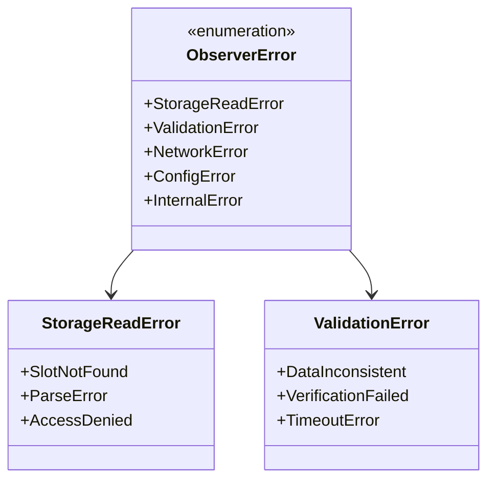
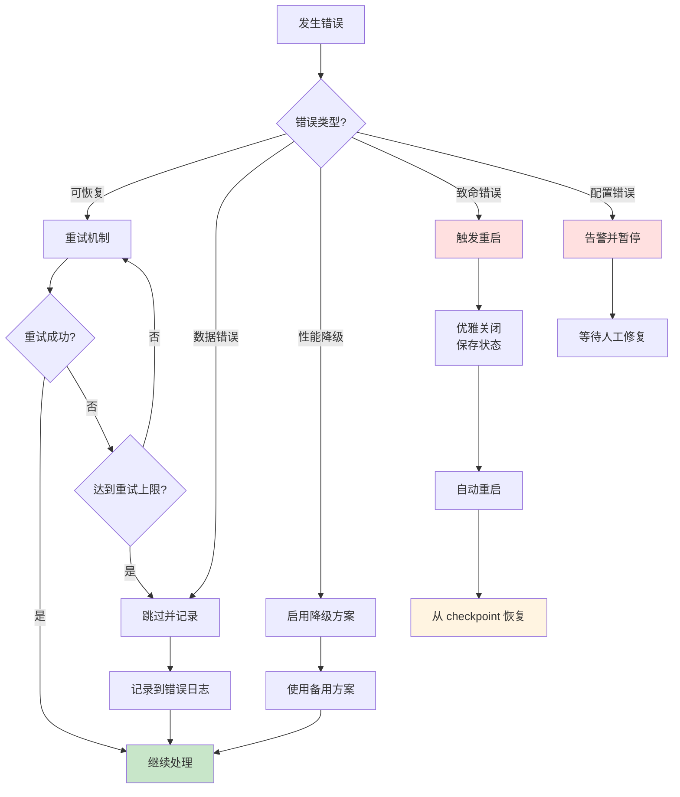
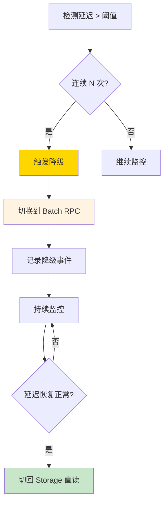
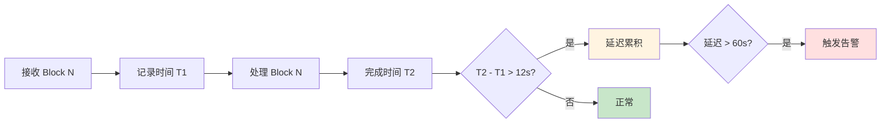
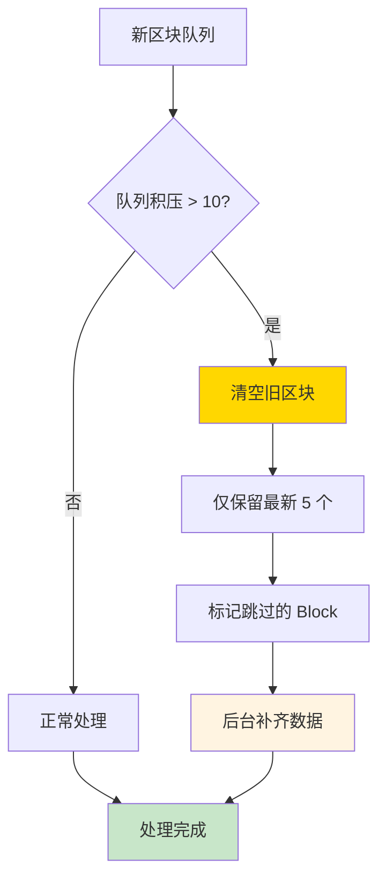
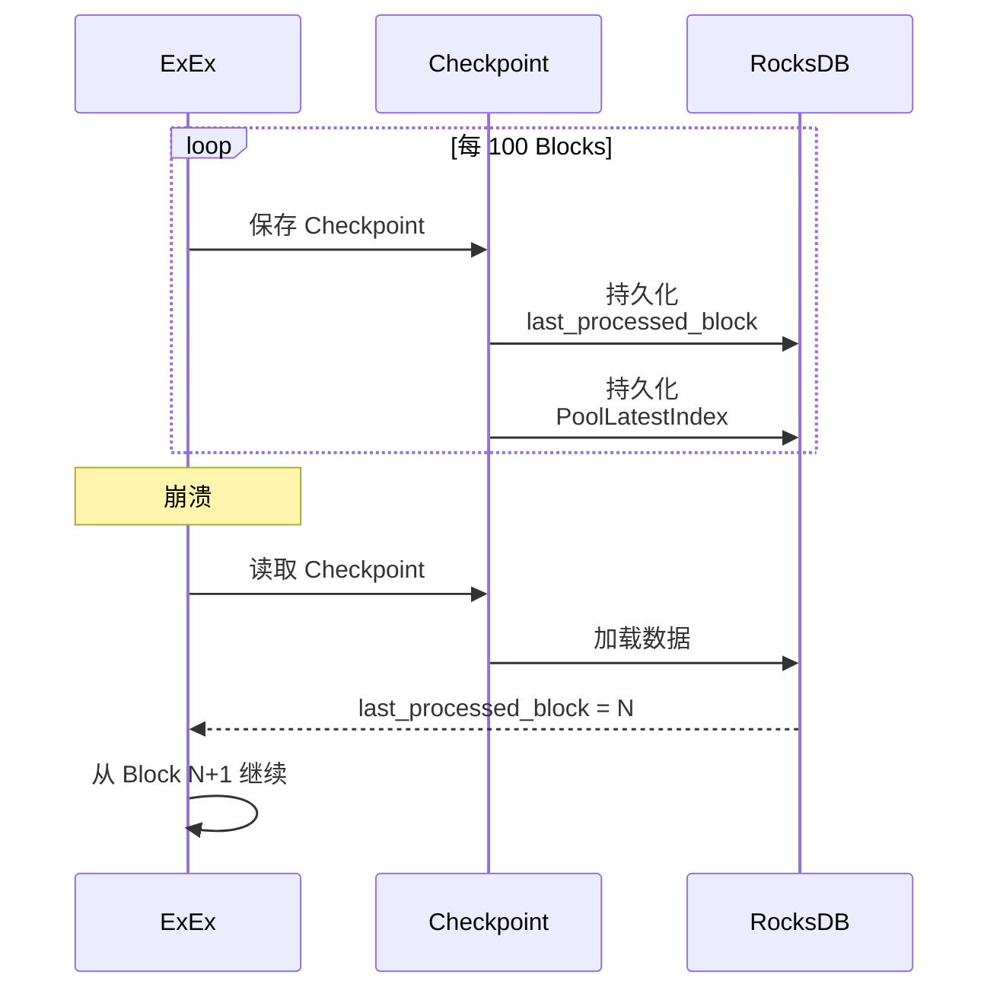
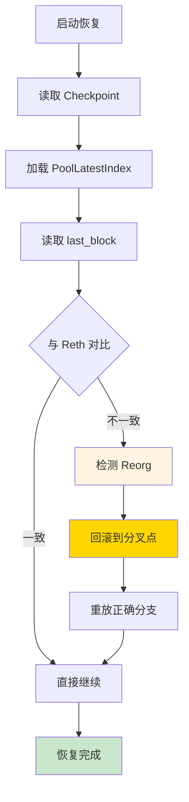
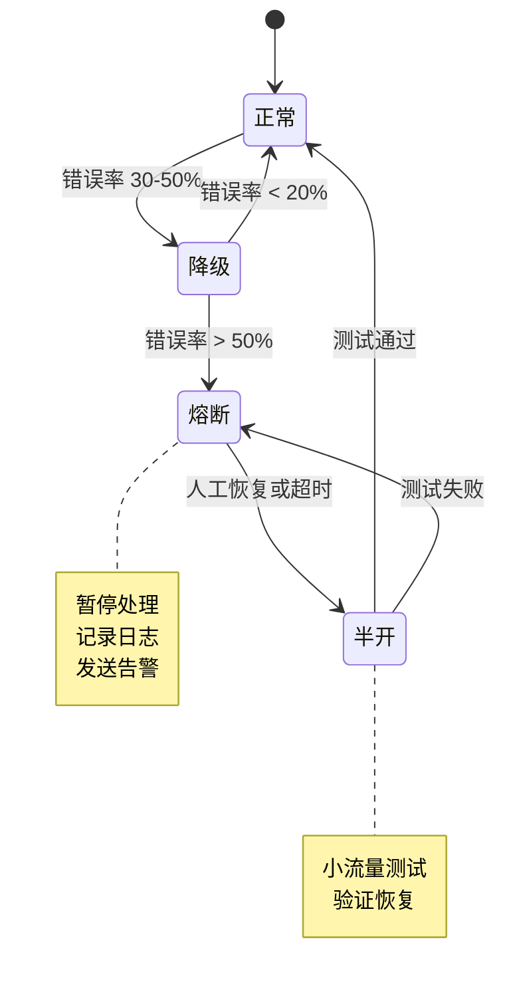

# 错误处理与降级策略

## 文档元信息

| 项目 | 内容 |
|------|------|
| 文档版本 | v1.0 |
| 创建日期 | 2025-12-12 |
| 最后更新 | 2025-12-12 |
| 文档状态 | 草稿 |
| 责任人 | 架构组 |

## 1. 错误分类体系

### 1.1 错误分类表

| 错误类别 | 严重级别 | 恢复策略 | 示例 |
|---------|---------|---------|------|
| **可恢复错误** | 低 | 重试 | 网络超时、临时性 RPC 错误 |
| **数据错误** | 中 | 跳过 | 无效 Pool 地址、解析失败 |
| **性能降级** | 中 | 降级处理 | Storage 读取慢、验证超时 |
| **致命错误** | 高 | 重启 | 内存溢出、Panic |
| **配置错误** | 高 | 人工介入 | 连接串错误、权限问题 |

### 1.2 错误代码设计



## 2. 错误处理流程

### 2.1 统一错误处理流程



### 2.2 重试策略

**指数退避重试**：

| 重试次数 | 等待时间 | 累计时间 |
|---------|---------|---------|
| 1 | 100ms | 100ms |
| 2 | 500ms | 600ms |
| 3 | 2s | 2.6s |
| 4 | 5s | 7.6s |
| 5 | 10s | 17.6s |

**重试条件**：

| 错误类型 | 是否重试 | 最大次数 |
|---------|---------|---------|
| 网络超时 | ✓ | 5 |
| RPC 限流 | ✓ | 3 |
| Storage 读取失败 | ✓ | 3 |
| 解析错误 | ✗ | 0 |
| 验证失败 | ✓ | 1 |

## 3. 降级策略

### 3.1 性能降级场景

**场景 1：Storage 直读延迟高**



**降级触发条件**：

| 场景 | 触发条件 | 降级方案 |
|------|---------|---------|
| Storage 读取慢 | P99 > 10ms，持续 1 分钟 | 降级到 Batch RPC |
| 验证超时 | P99 > 1s，持续 5 分钟 | 减少验证采样率 |
| 内存压力 | 使用率 > 90% | 触发 LRU 清理 |
| ExEx 不稳定 | 崩溃 > 3 次/小时 | 降级到 Geth RPC |

### 3.2 ExEx 处理速度跟不上出块速度

**问题描述**：ExEx 处理一个 Block 耗时 > 12s（出块间隔）

**检测方法**：



**应对策略**：

| 策略 | 说明 | 效果 |
|------|------|------|
| **优先级队列** | 优先处理最新 Block，跳过部分历史 | 保证实时性 |
| **批量处理** | 合并处理多个 Block | 提升吞吐量 |
| **异步验证** | 验证不阻塞主流程 | 减少延迟 |
| **降级** | 暂停 Pending Tx 模拟 | 释放资源 |
| **扩容** | 增加机器资源 | 根本解决 |

**优先级队列实现**：



## 4. 故障恢复方案

### 4.1 故障类型和恢复

| 故障类型 | 恢复方法 | RTO | RPO |
|---------|---------|-----|-----|
| **进程崩溃** | 自动重启 + Checkpoint 恢复 | < 30s | 0 |
| **数据损坏** | 从持久化层恢复 | < 5min | 最后一次同步 |
| **节点故障** | 切换到备节点 | < 10s | 0 |
| **网络分区** | 等待网络恢复 | 取决于网络 | 0 |

### 4.2 Checkpoint 机制



**Checkpoint 内容**：

| 数据项 | 说明 |
|-------|------|
| last_processed_block | 最后处理的区块号 |
| PoolLatestIndex | 最新 State 索引 |
| 统计信息 | 处理的 Pool 数量等 |

### 4.3 数据一致性恢复

**恢复流程**：



## 5. 熔断机制

### 5.1 熔断触发条件

| 指标 | 阈值 | 熔断动作 |
|------|------|---------|
| 错误率 | > 50% | 暂停处理，等待人工介入 |
| 验证失败率 | > 90% | 停止验证，仅做 Storage 读取 |
| 内存使用 | > 95% | 触发紧急清理 |
| CPU 使用 | > 95% 持续 5 分钟 | 限流 |

### 5.2 熔断状态机



### 5.3 熔断恢复

**自动恢复条件**：
- 错误率降低到阈值以下
- 资源使用率恢复正常
- 连续 N 次检查通过

**人工介入场景**：
- 配置错误
- 外部依赖不可用（Reth 节点）
- 数据损坏

## 6. 监控和告警

### 6.1 错误监控指标

| 指标 | 告警级别 | 阈值 |
|------|---------|------|
| 错误率 | 警告 | > 10% |
| 错误率 | 严重 | > 30% |
| 致命错误 | 严重 | > 0 |
| 降级事件 | 警告 | 发生时 |
| 熔断事件 | 严重 | 发生时 |

### 6.2 告警通知

**通知渠道**：
- Slack 告警频道
- 邮件
- PagerDuty（严重级别）

**告警内容**：
- 错误类型和数量
- 影响范围
- 建议的处理步骤

## 7. 日志记录

### 7.1 日志级别

| 级别 | 用途 | 示例 |
|------|------|------|
| ERROR | 错误事件 | Storage 读取失败 |
| WARN | 警告事件 | 验证失败率高 |
| INFO | 关键信息 | Block 处理完成 |
| DEBUG | 调试信息 | State 详细数据 |
| TRACE | 详细追踪 | 函数调用链 |

### 7.2 错误日志格式

**结构化日志示例**（JSON 格式）：
```json
{
  "timestamp": "2025-12-12T10:30:00Z",
  "level": "ERROR",
  "component": "StateTracker",
  "error_code": "STORAGE_READ_FAILED",
  "message": "Failed to read storage slot",
  "context": {
    "pool_id": "0x1234...",
    "block_number": 20000000,
    "slot": 8,
    "retry_count": 3
  }
}
```

---

**相关文档**：
- [14-监控与运维](./14-monitoring.md)
- [03-总体架构](./03-architecture-overview.md)
