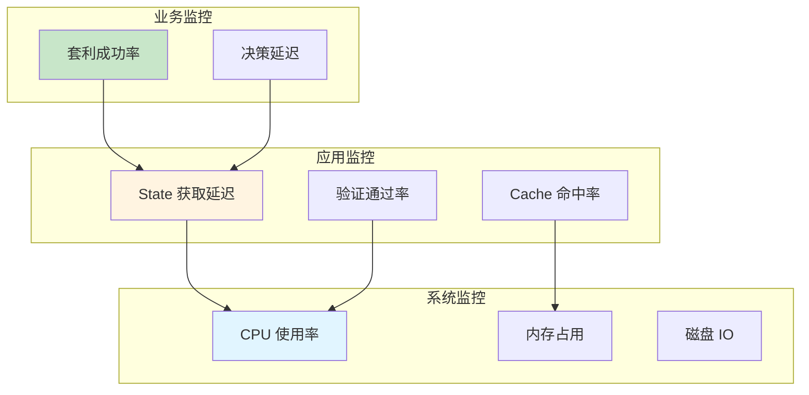
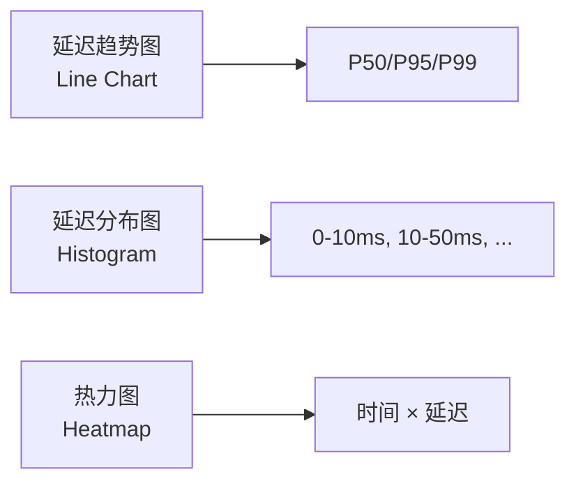
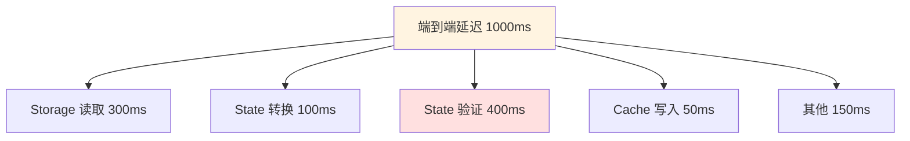
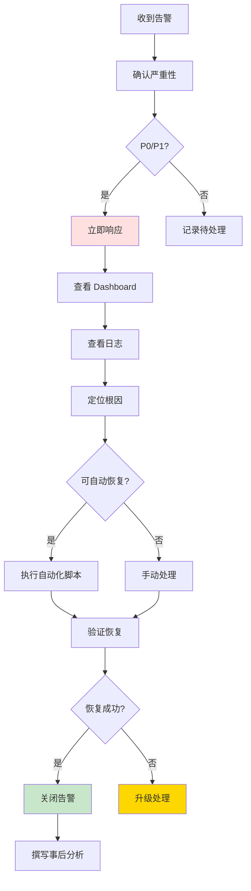
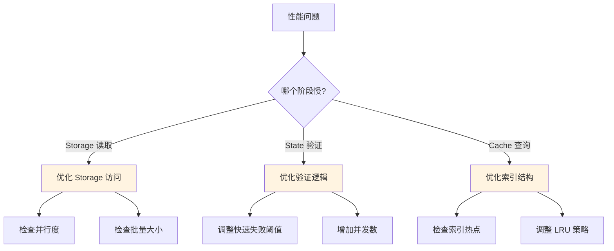
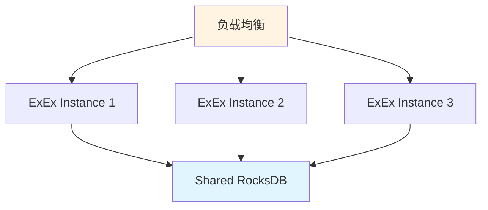

# 监控与运维

## 文档元信息

| 项目 | 内容 |
|------|------|
| 文档版本 | v1.0 |
| 创建日期 | 2025-12-12 |
| 最后更新 | 2025-12-12 |
| 文档状态 | 草稿 |
| 责任人 | 架构组 |

## 1. 监控体系设计

### 1.1 监控层级

### 1.2 监控工具栈

| 工具 | 用途 |
|------|------|
| Prometheus | 指标采集和存储 |
| Grafana | 可视化 Dashboard |
| Loki | 日志聚合 |
| Jaeger | 分布式追踪 |
| Alertmanager | 告警管理 |

## 2. 关键监控指标

### 2.1 延迟指标

| 指标名称 | 说明 | 告警阈值 (P99) |
|---------|------|---------------|
| `state_read_latency` | Storage 读取延迟 | > 10ms |
| `state_convert_latency` | State 转换延迟 | > 5ms |
| `state_validate_latency` | State 验证延迟 | > 200ms |
| `cache_query_latency` | 缓存查询延迟 | > 1ms |
| `end_to_end_latency` | 端到端延迟（100 Pools） | > 1s |

**Grafana Panel 设计**：

### 2.2 吞吐量指标

| 指标名称 | 说明 | 告警阈值 |
|---------|------|---------|
| `blocks_processed_total` | 处理的区块总数 | < 1/12s (跟不上出块) |
| `pools_discovered_rate` | Pool 发现速率 | < 1/小时 (异常低) |
| `states_cached_rate` | State 缓存速率 | 趋势下降 |
| `validations_per_second` | 每秒验证数 | < 10 (性能下降) |

### 2.3 成功率指标

| 指标名称 | 说明 | 告警阈值 |
|---------|------|---------|
| `validation_pass_rate` | 验证通过率 | < 30% 或 > 60% |
| `fast_fail_filter_rate` | 快速失败过滤率 | < 50% |
| `storage_read_success_rate` | Storage 读取成功率 | < 95% |
| `cache_hit_rate` | 缓存命中率 | < 80% |

### 2.4 资源使用指标

| 指标名称 | 说明 | 告警阈值 |
|---------|------|---------|
| `memory_usage_bytes` | 内存占用 | > 500MB |
| `cpu_usage_percent` | CPU 使用率 | > 80% |
| `disk_io_ops` | 磁盘 IO 操作数 | > 1000 IOPS |
| `network_bytes_sent` | 网络发送字节 | 异常飙升 |

### 2.5 错误指标

| 指标名称 | 说明 | 告警阈值 |
|---------|------|---------|
| `storage_read_errors_total` | Storage 读取错误数 | > 10/分钟 |
| `validation_errors_total` | 验证错误数 | > 50/分钟 |
| `reorg_count` | Reorg 次数 | > 10/小时 |
| `rpc_timeout_rate` | RPC 超时比例 | > 5% |

## 3. Grafana Dashboard 设计

### 3.1 概览 Dashboard

**面板布局**：

| 位置 | 面板 | 指标 |
|------|------|------|
| 左上 | 关键指标（Single Stat） | 端到端延迟 P99, 验证通过率 |
| 右上 | 吞吐量（Graph） | Blocks/s, Pools/s |
| 左下 | 延迟分布（Histogram） | Storage 读取、验证延迟 |
| 右下 | 错误率（Graph） | 各类错误趋势 |

### 3.2 性能 Dashboard

**延迟分解**：

**面板设计**：
- 瀑布图：展示各阶段延迟占比
- 趋势图：P50/P95/P99 延迟随时间变化
- 对比图：新旧架构延迟对比

### 3.3 业务 Dashboard

**关键业务指标**：

| 指标 | 可视化 | 说明 |
|------|--------|------|
| 套利成功率 | Gauge | 目标 > 80% |
| 日均套利次数 | Counter | 目标 > 100 |
| 平均单笔利润 | Stat | 目标 > 50 USD |
| 验证失败分布 | Pie Chart | 分析失败原因 |

## 4. 告警规则

### 4.1 告警级别定义

| 级别 | 说明 | 响应时间 | 通知方式 |
|------|------|---------|---------|
| **P0-致命** | 系统不可用 | 立即 | PagerDuty + Slack + 电话 |
| **P1-严重** | 功能受损 | 5 分钟 | Slack + 邮件 |
| **P2-警告** | 性能下降 | 30 分钟 | Slack |
| **P3-信息** | 潜在问题 | 工作时间 | 邮件 |

### 4.2 核心告警规则

**P0 告警**：

| 告警名称 | 条件 | 持续时间 |
|---------|------|---------|
| ExEx 进程不可用 | process_up == 0 | 1 分钟 |
| 端到端延迟过高 | P99 > 5s | 5 分钟 |
| 错误率极高 | error_rate > 50% | 2 分钟 |
| 内存即将耗尽 | memory_usage > 95% | 1 分钟 |

**P1 告警**：

| 告警名称 | 条件 | 持续时间 |
|---------|------|---------|
| 处理速度跟不上出块 | block_lag > 60s | 5 分钟 |
| Storage 读取成功率低 | success_rate < 90% | 10 分钟 |
| 验证通过率异常 | < 20% 或 > 80% | 10 分钟 |
| CPU 持续高负载 | cpu_usage > 90% | 10 分钟 |

**P2 告警**：

| 告警名称 | 条件 | 持续时间 |
|---------|------|---------|
| 延迟超标 | P99 > 2s | 15 分钟 |
| Cache 命中率低 | < 70% | 30 分钟 |
| RPC 超时率高 | > 10% | 15 分钟 |

### 4.3 告警抑制规则

**避免告警风暴**：

| 场景 | 抑制策略 |
|------|---------|
| ExEx 进程不可用 | 抑制所有子系统告警（依赖不可用） |
| Reth 节点故障 | 抑制 Storage 读取告警 |
| 计划维护 | 临时禁用相关告警 |

### 4.4 告警恢复通知

**恢复条件**：
- 指标恢复正常且持续 N 分钟
- N = 告警持续时间 × 2

**通知内容**：
- 告警名称
- 恢复时间
- 持续时长
- 根因分析（如有）

## 5. 故障处理手册

### 5.1 常见故障和处理

| 故障 | 症状 | 处理步骤 |
|------|------|---------|
| **ExEx 崩溃** | process_up == 0 | 1. 查看崩溃日志 2. 重启 ExEx 3. 验证恢复 |
| **延迟飙升** | P99 > 5s | 1. 检查 Reth 节点负载 2. 检查验证队列积压 3. 考虑降级 |
| **内存泄漏** | memory 持续增长 | 1. 触发 LRU 清理 2. 重启 ExEx 3. 分析内存 dump |
| **验证失败率高** | > 90% | 1. 检查 RPC 是否正常 2. 检查快速失败规则 3. 分析失败原因 |

### 5.2 故障处理 SOP

**标准操作流程**：

### 5.3 故障升级路径

| 场景 | 一线处理 | 二线处理 | 三线处理 |
|------|---------|---------|---------|
| 常规故障 | On-call 工程师 | - | - |
| 复杂故障 | On-call 工程师（30min） | 架构师 | - |
| 架构性问题 | On-call（15min） | 架构师（30min） | CTO |

## 6. 性能调优指南

### 6.1 性能瓶颈定位

**定位流程**：

### 6.2 调优参数表

| 参数 | 默认值 | 调优建议 | 影响 |
|------|--------|---------|------|
| `batch_size` | 100 | 根据延迟调整（50-200） | 延迟 vs 吞吐量 |
| `parallel_degree` | 10 | 根据 CPU 核数（5-50） | CPU 使用率 |
| `cache_size` | 10000 Pools | 根据内存（5K-50K） | 内存占用 vs 命中率 |
| `validation_sampling_rate` | 100% | 降低到 50%-80% | 验证延迟 |
| `fast_fail_tvl_threshold` | 1000 USD | 根据业务（500-5000） | 验证通过率 |

### 6.3 性能调优 Checklist

**Storage 读取优化**：
- [ ] 批量读取 > 单次读取
- [ ] 并行度与 CPU 核数匹配
- [ ] 缓存热点 Pool

**验证优化**：
- [ ] 快速失败过滤 > 50%
- [ ] 并行验证
- [ ] 抽样验证（降低采样率）

**缓存优化**：
- [ ] LRU 阈值合理
- [ ] 索引结构优化
- [ ] 预取策略

## 7. 容量规划

### 7.1 资源需求估算

| 指标 | 当前 | 3 个月 | 6 个月 |
|------|------|--------|--------|
| Pool 数量 | 10K | 15K | 20K |
| 内存需求 | 50MB | 75MB | 100MB |
| CPU 需求 | 30% | 40% | 50% |
| 磁盘空间 | 10GB | 20GB | 30GB |

### 7.2 扩容策略

**垂直扩容**（单机）：

| 资源 | 当前配置 | 扩容配置 |
|------|---------|---------|
| CPU | 4 核 | 8 核 |
| 内存 | 8GB | 16GB |
| 磁盘 | NVMe 100GB | NVMe 500GB |

**水平扩容**（多实例）：

## 8. 日常运维任务

### 8.1 日常检查清单

**每日任务**：
- [ ] 检查 Dashboard 关键指标
- [ ] 查看告警记录
- [ ] 检查日志错误数
- [ ] 验证数据一致性

**每周任务**：
- [ ] 分析性能趋势
- [ ] 清理过期数据
- [ ] 更新黑名单 Pool
- [ ] 回归测试

**每月任务**：
- [ ] 容量规划评估
- [ ] 性能调优
- [ ] 安全审计
- [ ] 文档更新

### 8.2 备份和恢复

**备份策略**：

| 数据 | 频率 | 保留期 |
|------|------|--------|
| RocksDB | 每天 | 7 天 |
| 配置文件 | 每次变更 | 永久 |
| 日志 | 实时 | 30 天 |

---

**相关文档**：
- [13-错误处理](./13-error-handling.md)
- [12-验收测试](./12-acceptance-testing.md)
