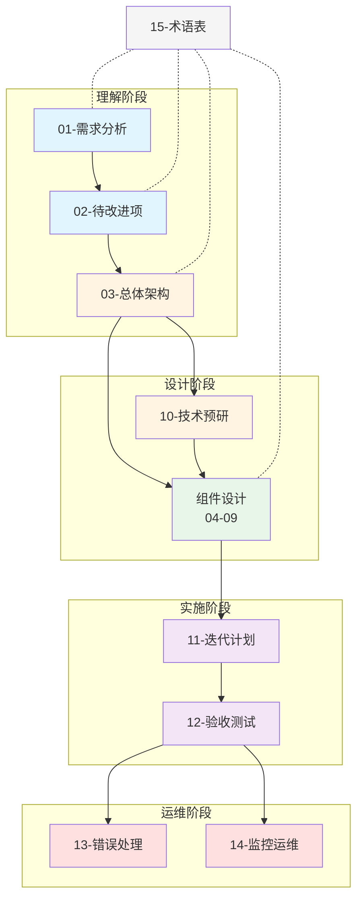

# 观测子系统架构设计文档索引

## 文档概述

本文档集描述了 MEV Searcher 观测子系统的重构架构设计，旨在全面提升**全、准、快**三项核心指标。

## 阅读指南

### 快速入门路径

如果你是首次阅读，建议按照以下顺序：

1. **理解业务需求** → [01-需求分析](./01-requirements.md)
2. **了解现有问题** → [02-待改进项](./02-improvements.md)
3. **掌握整体架构** → [03-总体架构设计](./03-architecture-overview.md)
4. **查看技术验证** → [10-技术预研方案](./10-technical-poc.md)
5. **理解实施路径** → [11-迭代计划](./11-iteration-plan.md)

### 深入研究路径

如果你需要深入了解某个组件的设计细节：

**数据获取流程**：
- [04-Pool Discovery](./04-component-pool-discovery.md) → [05-State Tracker](./05-component-state-tracker.md) → [06-State Converter](./06-component-state-converter.md)

**数据质量保障**：
- [07-State Validator](./07-component-state-validator.md) → [08-State Cache](./08-component-state-cache.md)

**Pending Tx 处理**：
- [09-Pending Tx Simulator](./09-component-pending-tx-simulator.md)

### 运维和测试路径

如果你负责系统运维或测试：

1. **测试方案** → [12-自动化验收方案](./12-acceptance-testing.md)
2. **异常处理** → [13-错误处理与降级策略](./13-error-handling.md)
3. **监控运维** → [14-监控与运维](./14-monitoring.md)
4. **术语查询** → [15-术语表](./15-glossary.md)

## 文档结构

```
docs/observer/
├── README.md                           # 本文件：文档索引和阅读指南
│
├── 01-requirements.md                  # 需求分析
│   ├── 业务目标
│   ├── 三大评价指标（全、准、快）
│   ├── 关键业务约束
│   └── 性能要求
│
├── 02-improvements.md                  # 待改进项分析
│   ├── 现有系统问题
│   ├── 性能瓶颈根因
│   └── 改进目标
│
├── 03-architecture-overview.md         # 总体架构设计
│   ├── 技术选型：Reth ExEx
│   ├── 整体架构图
│   ├── 架构设计原则
│   ├── 新旧架构对比
│   └── 性能指标对比
│
├── 04-component-pool-discovery.md      # 组件设计：Pool Discovery
│   ├── 职责和接口
│   ├── 数据结构
│   ├── 工作流程图
│   └── 初始化导入流程
│
├── 05-component-state-tracker.md       # 组件设计：State Tracker
│   ├── 职责和接口
│   ├── 数据流设计
│   ├── UniswapV2/V3 读取策略
│   └── 批量优化策略
│
├── 06-component-state-converter.md     # 组件设计：State Converter
│   ├── 职责和接口
│   ├── 接口设计
│   ├── UniswapV2/V3 转换逻辑
│   └── 验证策略
│
├── 07-component-state-validator.md     # 组件设计：State Validator
│   ├── 职责和接口
│   ├── 验证流程图
│   ├── 性能优化策略
│   └── 快速失败规则
│
├── 08-component-state-cache.md         # 组件设计：State Cache
│   ├── 职责和接口
│   ├── 数据结构
│   ├── 索引结构（三层）
│   ├── 一致性保证
│   └── 内存管理
│
├── 09-component-pending-tx-simulator.md # 组件设计：Pending Tx Simulator
│   ├── 职责和接口
│   ├── 工作流程
│   └── 性能优化（10ms 目标）
│
├── 10-technical-poc.md                 # 技术预研方案
│   ├── UniswapV2 storage 直读 POC
│   ├── UniswapV3 storage 直读 POC
│   ├── 性能基准测试
│   └── 降级方案
│
├── 11-iteration-plan.md                # 迭代计划
│   ├── 迭代 0：技术预研
│   ├── 迭代 1：基础框架
│   ├── 迭代 2-9：逐步实现
│   └── 每个迭代的详细任务
│
├── 12-acceptance-testing.md            # 自动化验收方案
│   ├── 验收测试框架
│   ├── 各迭代测试清单
│   ├── 测试数据准备
│   └── CI/CD 集成
│
├── 13-error-handling.md                # 错误处理与降级策略
│   ├── 错误分类
│   ├── 处理流程图
│   ├── 降级策略
│   └── 故障恢复
│
├── 14-monitoring.md                    # 监控与运维
│   ├── 监控指标
│   ├── 告警规则
│   ├── 故障处理手册
│   └── 性能调优指南
│
└── 15-glossary.md                      # 术语表
    └── 所有关键术语定义
```

## 文档关系图



## 文档约定

### 语言规范

- **文档正文**：简体中文
- **文件名**：英文（kebab-case）
- **图表标识符**：英文（camelCase 或 snake_case）
- **术语**：首次出现时使用中英文对照，如"执行扩展（Execution Extension, ExEx）"

### 图表规范

本文档集使用 Mermaid 绘制所有图表：

| 图表类型 | Mermaid 类型 | 用途 |
|---------|-------------|------|
| 架构图 | `graph TB` | 展示系统组件关系 |
| 时序图 | `sequenceDiagram` | 展示组件交互顺序 |
| 流程图 | `flowchart TD` | 展示业务处理流程 |
| 状态图 | `stateDiagram-v2` | 展示状态转换 |
| 类图 | `classDiagram` | 展示数据结构关系 |

### 表格规范

接口定义、数据结构、配置参数等使用 Markdown 表格：

| 字段名 | 类型 | 必选 | 说明 |
|-------|------|------|------|
| ... | ... | ✓/✗ | ... |

### 性能指标规范

性能相关数据使用表格展示，包含 P50/P95/P99 分位数：

| 指标 | 目标值 | 当前值 | 改进比例 |
|-----|--------|--------|----------|
| ... | ... | ... | ... |

## 文档维护

### 版本历史

| 版本 | 日期 | 作者 | 变更说明 |
|------|------|------|----------|
| v1.0 | 2025-12-12 | 架构组 | 初始版本 |

### 反馈和贡献

如果你发现文档中的问题或有改进建议：

1. 对于架构设计问题，请在团队讨论中提出
2. 对于文档格式问题，请直接提交修改
3. 对于术语定义问题，请参考 [15-术语表](./15-glossary.md)

### 文档更新流程

1. **架构变更** → 更新相关设计文档 → 更新迭代计划
2. **实现反馈** → 记录到待改进项 → 规划后续迭代
3. **运维经验** → 更新监控和错误处理文档

## 关键决策记录

以下是架构设计中的关键技术决策：

| 决策项 | 选择 | 原因 | 文档位置 |
|-------|------|------|----------|
| 技术框架 | Reth ExEx | 非侵入、高性能、直接访问 Storage | [03-架构概览](./03-architecture-overview.md) |
| 数据读取 | Storage 直读 | 消除 RPC 开销，延迟可控 | [05-State Tracker](./05-component-state-tracker.md) |
| 验证策略 | 100% 强制验证 | 保证数据准确性 | [07-State Validator](./07-component-state-validator.md) |
| 缓存设计 | 三层索引 | 支持多维查询，Reorg 原子性 | [08-State Cache](./08-component-state-cache.md) |
| 实现语言 | Rust | 与 Reth 生态一致，性能保证 | [11-迭代计划](./11-iteration-plan.md) |

## 附录

### 相关资源

- [Reth ExEx 官方文档](https://paradigmxyz.github.io/reth/developers/exex.html)
- [Uniswap V2 Core 合约](https://github.com/Uniswap/v2-core)
- [Uniswap V3 Core 合约](https://github.com/Uniswap/v3-core)
- [EigenPhi MEV 分析平台](https://eigenphi.io/)

### 工具链

- **图表工具**：Mermaid Live Editor (https://mermaid.live/)
- **Rust 开发**：VS Code + rust-analyzer
- **性能分析**：cargo flamegraph, perf

---

**最后更新时间**：2025-12-12  
**文档维护者**：架构组
